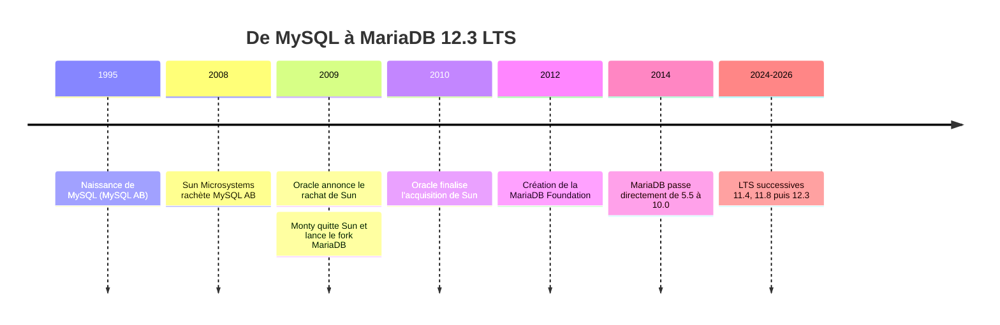

🔝 Retour au [Sommaire](/SOMMAIRE.md)

# 1.2 — Histoire et différences avec MySQL

> 🧭 Cette section retrace l'origine de MariaDB en tant que fork de MySQL, puis détaille ce qui sépare aujourd'hui les deux systèmes. La politique de versions proprement dite est traitée en §1.5, et la migration au chapitre 19.

## La genèse : de MySQL à MariaDB

L'histoire de MariaDB est indissociable de celle de **MySQL**. Créé en 1995 par Michael « Monty » Widenius, David Axmark et Allan Larsson au sein de la société suédoise **MySQL AB**, MySQL est rapidement devenu la base de données open source la plus populaire du web, brique du célèbre acronyme « LAMP » (Linux, Apache, MySQL, PHP).

Le tournant survient au croisement de deux acquisitions. En 2008, **Sun Microsystems** rachète MySQL AB pour environ un milliard de dollars. Puis, en 2009, **Oracle** annonce le rachat de Sun — acquisition finalisée début 2010. MySQL passe ainsi sous le contrôle d'Oracle, par ailleurs éditeur d'une base de données propriétaire concurrente.

Craignant que MySQL ne soit plus développé de façon ouverte, ou qu'il soit relégué au profit des produits Oracle, **Monty Widenius quitte Sun dès 2009** et fonde *Monty Program Ab*. Entouré de plusieurs développeurs historiques de MySQL, il lance un **fork** : une branche dérivée du code, libre et indépendante, baptisée **MariaDB** d'après le prénom de l'une de ses filles, Maria.

## La chronologie en un coup d'œil

## Un projet pensé pour rester ouvert

Là où MySQL est désormais piloté par une entreprise unique et distribué sous **double licence** (une version open source GPL et une licence commerciale Oracle), MariaDB a fait de l'ouverture sa raison d'être. Le serveur reste publié sous **GPL v2**, sans version « fermée » du cœur du produit.

Pour garantir durablement cette indépendance, la **MariaDB Foundation** est créée en 2012. Cette organisation à but non lucratif veille à ce que le code reste libre et accessible à la communauté, tandis qu'une entité commerciale distincte (MariaDB Corporation / MariaDB plc) propose support et produits aux entreprises. Cette séparation est l'une des différences philosophiques majeures avec MySQL.

## Une numérotation qui raconte la divergence

Aux débuts, MariaDB **suivait fidèlement** la numérotation de MySQL pour rester un remplacement direct : MariaDB 5.1, 5.2, 5.3, puis 5.5 correspondaient aux versions MySQL équivalentes.

À partir de 2014, MariaDB choisit de marquer son autonomie : plutôt que de poursuivre en 5.6 (la version MySQL du moment), le projet saute directement à la version **10.0**. Depuis, les chemins sont totalement distincts :

- **MariaDB** : 10.x → 11.x → **12.x** (version de référence de cette formation : 12.3 LTS) ;
- **MySQL** : 5.6 → 5.7 → 8.x → 9.x.

Les numéros de version des deux produits ne se correspondent donc plus du tout : un « MariaDB 12 » n'a aucun équivalent direct dans la numérotation MySQL.

## Les principales différences techniques

Au-delà de l'histoire et de la licence, les deux systèmes ont accumulé des différences concrètes. Le tableau suivant résume les plus structurantes :

| Aspect | MariaDB | MySQL (Oracle) |
|--------|---------|----------------|
| Licence | GPL v2, entièrement open source | Double licence : GPL + licence commerciale |
| Gouvernance | MariaDB Foundation (communauté) | Oracle Corporation |
| Numérotation actuelle | 11.x → 12.x | 8.x → 9.x |
| Type JSON | Alias de `LONGTEXT` avec contrôle de validité | Type binaire natif |
| Authentification par défaut | `mysql_native_password` (root local : `unix_socket`) | `caching_sha2_password` (MySQL 8) |
| Moteurs additionnels en standard | Aria, ColumnStore, Spider, CONNECT, S3, Vector… | Offre plus restreinte |
| Haute disponibilité native | Galera Cluster intégré | Group Replication / InnoDB Cluster |
| Thread pool | Inclus en édition communautaire | Édition Enterprise uniquement |

Quelques points méritent d'être soulignés :

- **Le type JSON** illustre bien la divergence : MySQL le stocke dans un format binaire optimisé, tandis que MariaDB le conserve comme du texte (`LONGTEXT`) assorti d'un contrôle de validité. Le comportement est globalement compatible, mais ce détail d'implémentation peut compter lors d'une migration (voir le chapitre 4 pour le JSON).
- **L'authentification** a longtemps été une source de friction : MySQL 8 a adopté `caching_sha2_password` par défaut, là où MariaDB s'appuie par défaut sur `mysql_native_password` (et sur `unix_socket` pour le compte `root` local sous Linux), tout en proposant l'algorithme moderne `ed25519` en option. Les versions récentes de MariaDB (série 12.x) ajoutent désormais la prise en charge de `caching_sha2_password` pour faciliter la compatibilité (voir §10.5.5).
- **Des fonctionnalités propres à MariaDB** se sont développées au fil des versions : tables temporelles (*system-versioned tables*), périodes applicatives, séquences (`CREATE SEQUENCE`), recherche vectorielle pour l'IA, entre autres — abordées dans les chapitres suivants.
- **La haute disponibilité** repose sur des technologies distinctes : Galera Cluster, intégré côté MariaDB, contre Group Replication / InnoDB Cluster côté Oracle.

À l'inverse, de nombreuses fonctionnalités sont aujourd'hui **communes aux deux** (expressions de table communes, fonctions de fenêtrage, colonnes générées…), car les deux projets ont continué d'évoluer en parallèle.

## Compatibilité et migration aujourd'hui

Pendant des années, MariaDB a pu se présenter comme un **remplacement direct** (*drop-in replacement*) de MySQL : il suffisait, en pratique, de pointer son application vers le nouveau serveur. Avec la divergence des deux projets — en particulier l'arrivée de MySQL 8 — cette compatibilité n'est plus automatique et une migration demande désormais de l'attention (formats JSON, authentification, fonctions GIS, etc.).

C'est précisément pour réduire ces frictions que MariaDB renforce, version après version, sa **compatibilité avec MySQL 8** (authentification `caching_sha2_password`, nouvelles fonctions spatiales…). Le détail des points d'attention et des outils de migration est traité au **chapitre 19** (§19.1).

## À retenir

MariaDB est né en 2009 d'un **fork de MySQL**, lancé par les créateurs d'origine pour préserver une base de données relationnelle **libre et indépendante**, après le rachat de MySQL par Oracle. Les deux systèmes partagent un socle commun mais ont **divergé** : numérotation autonome (10.x → 12.x face à 8.x → 9.x), gouvernance ouverte via la MariaDB Foundation, moteurs de stockage et fonctionnalités spécifiques, et différences notables sur le JSON et l'authentification. La compatibilité historique « drop-in » s'est estompée, mais MariaDB continue de rapprocher ses fonctionnalités de celles de MySQL pour faciliter les migrations.

---

**Navigation** : [⬆️ Chapitre 1 — Introduction et Fondamentaux](README.md) · Section précédente : [1.1 Qu'est-ce que MariaDB ?](01-quest-ce-que-mariadb.md) · Section suivante → [1.3 Cas d'usage et écosystème](03-cas-usage-et-ecosysteme.md)

⏭️ [Cas d'usage et écosystème](/01-introduction-fondamentaux/03-cas-usage-et-ecosysteme.md)
