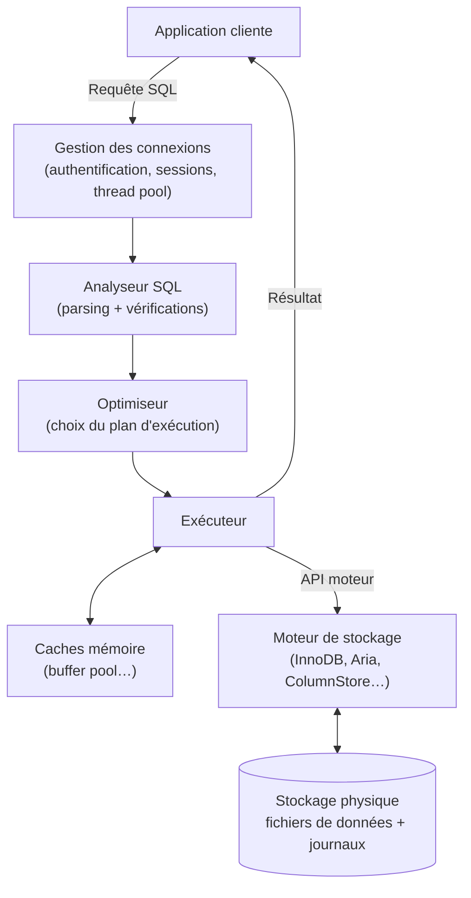

🔝 Retour au [Sommaire](/SOMMAIRE.md)

# 1.4 — Architecture générale d'un SGBD relationnel

> 🧭 Cette section pose le modèle mental de fonctionnement d'un SGBD relationnel comme MariaDB : le modèle relationnel, l'architecture client-serveur, le cheminement d'une requête et la place des moteurs de stockage. Les concepts évoqués sont approfondis plus loin (SQL au chapitre 2, transactions au chapitre 6, moteurs au chapitre 7).

## Le modèle relationnel

Un **SGBD relationnel** (SGBDR) organise les données selon le *modèle relationnel*, formalisé par Edgar F. Codd en 1970. Dans ce modèle, les données sont structurées en **tables** (les *relations*), chaque table étant composée de **lignes** (les enregistrements) et de **colonnes** (les attributs, qui portent un nom et un type).

L'intérêt majeur de ce modèle est de pouvoir **relier** les tables entre elles. Une colonne d'une table peut référencer une colonne d'une autre table : c'est le principe des **clés**. La *clé primaire* identifie de façon unique chaque ligne d'une table, tandis qu'une *clé étrangère* établit un lien vers la clé primaire d'une autre table. Ces relations permettent d'éviter la duplication des données et de garantir leur cohérence.

Concrètement, imaginons deux tables. D'abord `client` :

| id (PK) | nom    |
|---------|--------|
| 1       | Dupont |
| 2       | Martin |

…puis `commande`, dont la colonne `client_id` **référence** `client.id` :

| id | client_id (FK) | montant |
|----|----------------|---------|
| 10 | 1              | 59.90   |
| 11 | 1              | 120.00  |
| 12 | 2              | 15.50   |

`client.id` est la **clé primaire** (l'identifiant unique de chaque client). Dans `commande`, `client_id` est une **clé étrangère** qui pointe vers `client.id` : les commandes 10 et 11 reviennent ainsi au client *Dupont*, la 12 au client *Martin*. Plutôt que de recopier le nom du client dans chaque commande, on ne stocke qu'une **référence** — ce qui évite la redondance et empêche qu'une commande renvoie à un client inexistant (l'**intégrité référentielle**).

L'ensemble de ces tables, colonnes et relations constitue le **schéma** de la base. Un même serveur héberge **plusieurs bases de données** indépendantes, chacune regroupant ses propres tables — et, sous MariaDB, les termes *base de données* et *schéma* sont **synonymes** (à la différence d'autres SGBD comme Oracle ou PostgreSQL, où ils désignent des niveaux distincts). Pour définir ce schéma puis interroger et manipuler les données, on utilise un langage unique et standardisé : **SQL** (*Structured Query Language*), introduit au chapitre 2. Les clés et contraintes sont détaillées en §2.5.

## Une architecture client-serveur

MariaDB fonctionne selon une **architecture client-serveur**. D'un côté, un processus **serveur** (le démon `mariadbd`, anciennement `mysqld`) s'exécute en permanence : c'est lui qui détient les données et traite les requêtes. De l'autre, des **clients** — une application web, un script, un outil graphique, le client en ligne de commande — se connectent à ce serveur pour lui adresser des requêtes et en recevoir les résultats.

La connexion s'établit soit via le **réseau** (TCP/IP, sur le port 3306 par défaut), soit en local via un *socket* Unix. Une session typique suit toujours le même cycle : connexion, **authentification** (vérification de l'identité, voir le chapitre 10), exécution d'une ou plusieurs requêtes, puis déconnexion. Le serveur étant conçu pour la **concurrence**, il gère simultanément de nombreuses connexions clientes.

## Le cheminement d'une requête

Lorsqu'une requête SQL atteint le serveur, elle traverse plusieurs **couches** successives, depuis la réception jusqu'à l'accès aux données sur le disque :

Concrètement, on distingue :

- **La gestion des connexions** : authentification des clients, ouverture des sessions et répartition du travail entre les threads (voir le *thread pool*, §11.10).
- **Le traitement SQL** : l'**analyseur** (*parser*) vérifie la syntaxe et transforme la requête en une structure interne ; l'**optimiseur** détermine le meilleur plan d'exécution (quels index utiliser, dans quel ordre joindre les tables) ; l'**exécuteur** applique ce plan. L'optimisation des requêtes est approfondie au chapitre 5 et au chapitre 15.
- **Les caches mémoire** : pour éviter de lire systématiquement le disque, le serveur conserve en mémoire les données et index les plus utilisés (par exemple le *buffer pool* d'InnoDB, §7.2.2).
- **Le moteur de stockage** : c'est lui qui lit et écrit physiquement les données, via une interface standardisée.
- **Le stockage physique** : les fichiers de données et les **journaux** (*logs*) résidant sur le disque.

## La spécificité MariaDB : les moteurs de stockage enfichables

L'un des traits distinctifs de MariaDB, hérité de MySQL, est son architecture à **moteurs de stockage enfichables** (*pluggable storage engines*). Le **cœur du serveur** — qui gère les connexions, l'analyse et l'optimisation SQL — est nettement **séparé** de la couche qui stocke réellement les données. Les deux communiquent par une **API interne standardisée**.

Conséquence remarquable : on peut choisir un **moteur différent table par table**, selon les besoins. Le moteur par défaut, **InnoDB**, est transactionnel et adapté à la grande majorité des usages ; mais une table d'archives pourra utiliser un autre moteur, une table analytique s'appuyer sur **ColumnStore**, etc. Cette modularité, sans équivalent direct dans beaucoup de SGBD, fait l'objet du **chapitre 7**.

## Mémoire et persistance

Pour concilier **performance** et **durabilité**, un SGBDR combine deux mondes. En **mémoire vive**, des structures comme le *buffer pool* accélèrent les accès en gardant à portée les données fréquemment sollicitées. Sur le **disque**, on trouve les fichiers de données proprement dits, mais aussi plusieurs **journaux** : le *redo log* et l'*undo log* d'InnoDB (qui assurent la reprise après incident et le contrôle de concurrence, chapitre 6 et §7.2.3) ainsi que le *binary log* au niveau du serveur (utilisé notamment pour la réplication, §11.5 et chapitre 13).

C'est cette mécanique de journalisation qui permet de garantir les propriétés **ACID** d'une transaction — même en cas de coupure de courant, les données validées ne sont jamais perdues. Ces notions sont développées au chapitre 6.

## À retenir

Un SGBD relationnel comme MariaDB repose sur le **modèle relationnel** (tables, lignes, colonnes, clés) et une **architecture client-serveur**, où un serveur central traite les requêtes SQL de multiples clients. Chaque requête traverse des **couches** successives — connexions, analyse, optimisation, exécution, caches, moteur de stockage, disque. MariaDB se distingue par ses **moteurs de stockage enfichables**, choisis table par table, et par une **gestion mémoire/disque** appuyée sur des journaux qui assurent performance et durabilité (ACID).

---

**Navigation** : [⬆️ Chapitre 1 — Introduction et Fondamentaux](README.md) · Section précédente : [1.3 Cas d'usage et écosystème](03-cas-usage-et-ecosysteme.md) · Section suivante → [1.5 Politique de versions : LTS vs Rolling releases](05-politique-versions-lts-rolling.md)

⏭️ [Politique de versions : LTS (11.4, 11.8, 12.3) vs Rolling releases (12.x, 13.0)](/01-introduction-fondamentaux/05-politique-versions-lts-rolling.md)
