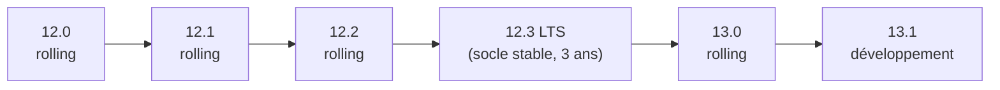

🔝 Retour au [Sommaire](/SOMMAIRE.md)

# 1.5 — Politique de versions : LTS vs Rolling releases

> 🧭 Cette section explique les deux types de versions de MariaDB et comment choisir. Le **cycle de support** est détaillé en §1.6, et la **roadmap** en §1.7. Le tableau complet des versions figure en [annexe G](../annexes/g-versions-reference/README.md).

## Deux familles de versions

Depuis la série 11.x, MariaDB publie ses versions selon **deux rythmes complémentaires** :

- les versions **LTS** (*Long Term Support*), stables et maintenues longtemps ;
- les versions **rolling** (« au fil de l'eau »), plus fréquentes et tournées vers la nouveauté.

Comprendre cette distinction est essentiel pour choisir la version adaptée à un projet — et pour situer la **12.3 LTS**, version de référence de cette formation.

## Les versions LTS (Long Term Support)

Une version **LTS** est pensée pour la **production durable**. Elle paraît environ **une fois par an** et bénéficie d'un **support long** : depuis la 11.8, la durée de maintenance est de **3 ans** (les LTS antérieures — 10.6, 10.11 et 11.4 — bénéficiaient, elles, de 5 ans).

Pendant toute cette période, la version reçoit des **mises à jour de maintenance** — corrections de bugs et correctifs de sécurité — **mais pas de nouvelles fonctionnalités**. C'est précisément ce qui en fait un socle fiable : le comportement reste prévisible dans le temps. Les LTS récentes sont **11.4** (mai 2024), **11.8** (juin 2025) et **12.3** (mai 2026).

## Les versions Rolling

Une version **rolling** suit la logique inverse : la **fraîcheur** plutôt que la stabilité au long cours. Elle paraît de façon **trimestrielle** (tous les trois mois environ) et **embarque les nouvelles fonctionnalités** dès qu'elles sont prêtes.

En contrepartie, chaque version rolling n'est supportée que **jusqu'à la parution de la suivante** : sa durée de vie est donc courte. Suivre la branche rolling impose de **mettre à jour fréquemment**, ce qui convient mal à un service de production que l'on souhaite laisser tourner longtemps. Ces versions s'adressent plutôt à ceux qui veulent **tester ou adopter tôt** les nouveautés. Exemples : **12.0, 12.1, 12.2** puis **13.0**.

## LTS et rolling en un coup d'œil

| | **LTS** | **Rolling** |
|--|---------|-------------|
| Cadence de sortie | Annuelle | Trimestrielle |
| Durée de support | 3 ans (depuis 11.8) | Jusqu'à la version suivante |
| Nouvelles fonctionnalités | Figées (corrections uniquement) | À chaque version |
| Usage recommandé | Production durable | Tests, accès anticipé aux nouveautés |
| Exemples | 11.4, 11.8, 12.3 | 12.0, 12.1, 12.2, 13.0 |

## Comment les deux s'articulent

Les versions rolling et LTS ne sont pas indépendantes : elles forment un **cycle**. Les fonctionnalités introduites au fil des versions rolling d'une série sont périodiquement **consolidées** dans une version LTS, qui les fige pour le long terme. Une fois cette LTS publiée, une nouvelle série rolling démarre.

Concrètement, dans la série 12.x : les versions rolling **12.0 → 12.1 → 12.2** ont apporté progressivement les nouveautés, que la **12.3 LTS** vient consolider. Ensuite, la **13.0** (rolling) ouvre le cycle suivant, tandis que la **13.1** est une version de **développement** (pré-version, non destinée à la production).

## Repère : la numérotation des versions

Une version MariaDB s'écrit sous la forme **`MAJEUR.MINEUR.CORRECTIF`** (par exemple `12.3.2`). Les **deux premiers nombres** identifient la *série* (ici 12.3) ; le **troisième** correspond à une **mise à jour de maintenance** au sein de cette série (`12.3.0`, `12.3.1`, `12.3.2`…).

On rencontre aussi le sigle **GA** (*General Availability*) : il désigne la première version d'une série jugée **prête pour la production**. Pour la 12.3, la version GA est la **12.3.2** (la 12.3.1 n'étant qu'une *release candidate*, c'est-à-dire une version candidate en phase finale de test).

## Tableau des versions récentes

| Version | Type | GA | Support jusqu'à |
|---------|------|-----|-----------------|
| 13.1 🧪 | Développement | — | — |
| 13.0 | Rolling | RC — GA à venir | Version rolling suivante |
| **12.3** ⭐ | LTS | Mai 2026 | **Juin 2029** |
| 12.0 → 12.2 | Rolling | 2025–2026 | Consolidées dans 12.3 |
| **11.8** | LTS | Juin 2025 | 2028 |
| **11.4** | LTS | Mai 2024 | 2029 |
| 10.11 | LTS | Fév 2023 | 2028 |
| 10.6 | LTS | Juil 2021 | 2026 |

*(Tableau complet et commenté en [annexe G](../annexes/g-versions-reference/README.md).)*

## Quelle version choisir ?

La règle est simple : **pour la production, privilégiez une version LTS**. Elle offre la stabilité et la durée de support nécessaires à un service que l'on veut faire vivre plusieurs années sans mises à jour majeures fréquentes. C'est le choix de cette formation, qui s'appuie sur la **12.3 LTS**.

Les versions **rolling** ne se justifient que dans des contextes particuliers : bancs d'essai, projets souhaitant exploiter immédiatement une nouveauté, ou veille technologique. Elles supposent alors d'accepter des mises à jour trimestrielles.

## À retenir

MariaDB publie deux types de versions : les **LTS** (annuelles, supportées 3 ans depuis la 11.8, sans nouvelles fonctionnalités pendant leur maintenance) et les **rolling** (trimestrielles, riches en nouveautés mais supportées seulement jusqu'à la version suivante). Les nouveautés des versions rolling d'une série sont **consolidées** dans une LTS : ainsi 12.0 → 12.2 (rolling) aboutissent à la **12.3 LTS**, avant que la 13.0 (rolling) n'ouvre le cycle suivant. Pour un usage en production, la **version LTS est le choix par défaut** — ici la 12.3.

---

**Navigation** : [⬆️ Chapitre 1 — Introduction et Fondamentaux](README.md) · Section précédente : [1.4 Architecture générale d'un SGBD relationnel](04-architecture-generale-sgbd.md) · Section suivante → [1.6 Cycle de support : 3 ans LTS, rolling trimestriel](06-cycle-support-lts.md)

⏭️ [Cycle de support : 3 ans LTS (depuis 11.8), rolling trimestriel](/01-introduction-fondamentaux/06-cycle-support-lts.md)
