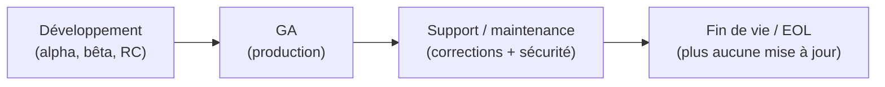
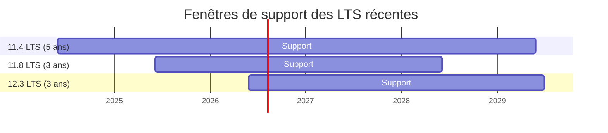

🔝 Retour au [Sommaire](/SOMMAIRE.md)

# 1.6 — Cycle de support : 3 ans LTS, rolling trimestriel

> 🧭 Après avoir distingué les types de versions (§1.5), cette section détaille leur **cycle de support** : ce que recouvre le « support », combien de temps il dure et ce qu'implique la fin de vie d'une version. La trajectoire vers la série 13.x est traitée en §1.7.

## Ce que recouvre le « support » d'une version

Tant qu'une version est **supportée**, l'éditeur publie pour elle des **mises à jour de maintenance** : corrections de bugs et **correctifs de sécurité**. En revanche — c'est un point capital — **aucune nouvelle fonctionnalité** n'est ajoutée à une version déjà publiée. Le comportement reste donc stable tout au long de la période de support.

Ces mises à jour se matérialisent par l'incrément du **troisième numéro** de version (`12.3.2` → `12.3.3` → `12.3.4`…) et paraissent à intervalles réguliers, généralement **trimestriels**.

## Le cycle de vie d'une version

Une version MariaDB traverse plusieurs étapes, de sa conception à sa fin de vie :

- **Développement** : versions de pré-publication (*alpha*, *bêta*, puis *release candidate*), réservées aux tests. Pour la 12.3, ce furent par exemple les `12.3.0` et `12.3.1` (RC).
- **GA** (*General Availability*) : première version jugée prête pour la production. Elle **déclenche le compte à rebours** de la période de support. Pour la 12.3, il s'agit de la `12.3.2`, fin mai 2026.
- **Support / maintenance** : la version reçoit ses mises à jour régulières.
- **Fin de vie** (*End of Life*, EOL) : le support s'arrête.

## Le support des versions LTS : 3 ans

Depuis la **11.8**, une version **LTS** est supportée pendant **3 ans** à compter de sa GA. Les LTS antérieures — 10.6, 10.11 et **11.4** — bénéficiaient, elles, d'un support de **5 ans** : la **11.4** est ainsi la dernière LTS à profiter de cette fenêtre étendue. Concrètement :

- **11.4** : GA mai 2024 → support jusqu'en **mai 2029** (5 ans, ancienne politique) ;
- **11.8** : GA juin 2025 → support jusqu'en **juin 2028** (3 ans, première LTS concernée) ;
- **12.3** : GA mai 2026 → support jusqu'en **juin 2029** (3 ans).

Comme une nouvelle LTS paraît environ chaque année alors que leur support s'étend sur plusieurs années, les **fenêtres de support se chevauchent**. À un instant donné, plusieurs LTS sont donc simultanément supportées — ce qui laisse une **marge confortable pour migrer** d'une LTS à la suivante.

*(La ligne verticale « aujourd'hui » illustre qu'à ce jour, ces trois LTS sont toutes encore supportées.)*

## Le support des versions Rolling : jusqu'à la suivante

Pour une version **rolling**, la logique est bien plus courte : elle n'est supportée que **jusqu'à la parution de la version rolling suivante**, soit environ **trois mois**. Dès qu'une nouvelle version paraît, la précédente n'est plus maintenue.

La conséquence est directe : **rester supporté sur la branche rolling impose de se mettre à jour chaque trimestre**. C'est tenable pour un environnement de test, beaucoup moins pour un service de production stable — d'où la recommandation d'utiliser une LTS en production (§1.5).

## La fin de vie (EOL) et ses implications

Atteindre l'**EOL** ne signifie pas qu'une version cesse de fonctionner : elle continue de tourner. Mais elle ne reçoit **plus aucune mise à jour, y compris de sécurité**. Faire tourner une version en fin de vie expose donc à :

- des **vulnérabilités** non corrigées ;
- des problèmes de **conformité** (normes, audits, exigences réglementaires) ;
- une difficulté croissante à obtenir de l'aide, la communauté se concentrant sur les versions supportées.

Il est donc essentiel de **planifier la mise à jour avant l'échéance**. Par exemple, la **10.6** arrivant en fin de support en 2026, les déploiements concernés doivent prévoir une migration vers une LTS plus récente.

## Planifier en fonction du support

En pratique, la bonne approche pour la production consiste à :

1. choisir une version **LTS** comme socle ;
2. surveiller sa **date de fin de support** ;
3. profiter du **chevauchement** des fenêtres pour migrer sereinement vers la LTS suivante avant l'EOL.

Les chemins de mise à jour et les stratégies d'*upgrade* sont détaillés au **chapitre 19** (notamment §19.4 pour les *upgrade paths* et §19.10 pour la migration 11.8 → 12.3).

## À retenir

Le **support** d'une version garantit des **corrections et correctifs de sécurité** (jamais de nouvelles fonctionnalités), livrés par des mises à jour de maintenance généralement trimestrielles. Une version suit le cycle **développement → GA → maintenance → EOL**, la GA déclenchant le compteur de support. Les **LTS** sont supportées **3 ans** (depuis la 11.8 ; la 11.4 et les LTS antérieures conservaient 5 ans), avec des fenêtres qui se **chevauchent** et facilitent la migration ; les **rolling** ne le sont que **jusqu'à la version suivante** (~3 mois). Une version en **fin de vie** ne reçoit plus de correctifs de sécurité : il faut donc **planifier sa mise à jour** avant l'échéance.

---

**Navigation** : [⬆️ Chapitre 1 — Introduction et Fondamentaux](README.md) · Section précédente : [1.5 Politique de versions : LTS vs Rolling releases](05-politique-versions-lts-rolling.md) · Section suivante → [1.7 Roadmap : 12.3 LTS → série 13.x](07-roadmap-serie-13.md)

⏭️ [Roadmap : 12.3 LTS (socle actuel) → série 13.x (13.0 en préversion/RC, 13.1 dev)](/01-introduction-fondamentaux/07-roadmap-serie-13.md)
