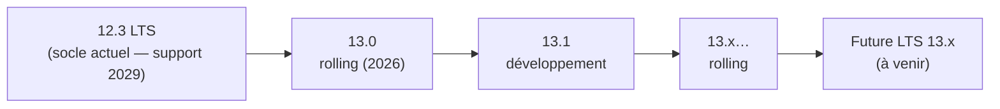

🔝 Retour au [Sommaire](/SOMMAIRE.md)

# 1.7 — Roadmap : 12.3 LTS → série 13.x

> 🧭 Cette section situe la version de référence dans la trajectoire du projet : où en est MariaDB aujourd'hui, et ce qui s'annonce ensuite. Les types de versions sont expliqués en §1.5, et leur support en §1.6.

## Aujourd'hui : 12.3 LTS, le socle actuel

À la date de cette formation, la version stable de référence est la **12.3 LTS**. Publiée en GA fin mai 2026 et **supportée jusqu'en juin 2029**, elle consolide l'ensemble des nouveautés apportées par la série rolling 12.0 → 12.2 (voir §1.5). C'est la version recommandée pour la production, et celle sur laquelle s'appuie tout le contenu qui suit.

En d'autres termes, **« vous êtes ici »** : un palier stable, récent et durablement maintenu, qui sert de point d'ancrage avant l'ouverture du cycle suivant.

## La série 13.x ouvre le cycle suivant

Conformément au modèle de versions de MariaDB (§1.5), une fois la 12.3 LTS publiée, une nouvelle **série rolling** démarre — la série **13.x** :

- **13.0** est la **première version rolling** de ce cycle (2026) ; à la mi-2026, elle est encore en phase de préversion (*release candidate*), la 12.3 venant tout juste de paraître. Comme toute version rolling, elle introduit de nouvelles fonctionnalités mais n'est supportée que jusqu'à la version suivante.
- **13.1** est, à ce stade, une **version de développement** (🧪) : une pré-version destinée aux tests, non publiée pour la production.

La trajectoire d'ensemble peut se résumer ainsi :

Au fil des versions rolling 13.x, les nouveautés s'accumuleront jusqu'à être **consolidées dans une future LTS de la série 13.x**, qui deviendra alors le prochain socle stable — exactement comme la 12.3 a clôturé la série 12.x.

## Que va apporter la série 13.x ?

Le **détail des fonctionnalités** de la série 13.x **n'est pas figé** : par nature, une roadmap évolue, et le contenu précis des futures versions reste susceptible de changer. Il serait donc hasardeux d'en dresser une liste définitive.

En toute logique, la série 13.x **prolongera les grandes orientations** déjà engagées dans la série 12.x, parmi lesquelles :

- l'amélioration des **performances** (dans la lignée du binlog réécrit, §11.5.4) ;
- le **contrôle fin de l'optimiseur** (Optimizer Hints, §15.15) ;
- la **compatibilité avec Oracle et MySQL** (§3.7.1, §10.5.5, chapitre 19) ;
- les capacités d'**IA et de recherche vectorielle** (§18.10, §15.16) ;
- l'intégration **cloud-native** (packaging, Kubernetes — §14.2.5 et chapitre 16).

Ces axes donnent une idée de la **direction** prise par le projet, sans préjuger des fonctionnalités exactes à venir. Le récapitulatif des nouveautés 12.x figure en [annexe F](../annexes/f-nouveautes-12-3/README.md).

## Comment se projeter

Pour la très grande majorité des usages — et pour cette formation — la recommandation est claire : **rester sur la 12.3 LTS**. Elle offre un socle stable jusqu'en 2029, sans imposer de mises à jour fréquentes.

La série **13.x** n'intéresse, pour l'instant, que ceux qui souhaitent **suivre ou tester en avance** les nouveautés, en acceptant le rythme des versions rolling. Le moment venu, la **future LTS 13.x** constituera la **cible de migration naturelle** depuis la 12.3 ; il conviendra alors de planifier cette transition avant la fin de support de la 12.3 (juin 2029), en s'appuyant sur les stratégies du **chapitre 19**.

## À retenir

La **12.3 LTS** est le **socle stable du moment** (support jusqu'en juin 2029) et la référence de cette formation. Elle clôt la série 12.x, après quoi la **série 13.x** ouvre le cycle suivant : **13.0** en version rolling, **13.1** en développement. Au fil des versions rolling 13.x, les nouveautés seront un jour **consolidées dans une future LTS 13.x**, prochain palier stable. Le contenu précis de la série 13.x **n'est pas figé**, mais devrait prolonger les orientations de la 12.x (performances, optimiseur, compatibilité, IA/vectoriel, cloud-native). En pratique : **rester sur la 12.3 LTS aujourd'hui**, et viser la future LTS 13.x comme prochaine étape.

---

**Navigation** : [⬆️ Chapitre 1 — Introduction et Fondamentaux](README.md) · Section précédente : [1.6 Cycle de support : 3 ans LTS, rolling trimestriel](06-cycle-support-lts.md) · Section suivante → [1.8 Installation et configuration initiale](08-installation-configuration.md)

⏭️ [Installation et configuration initiale](/01-introduction-fondamentaux/08-installation-configuration.md)
