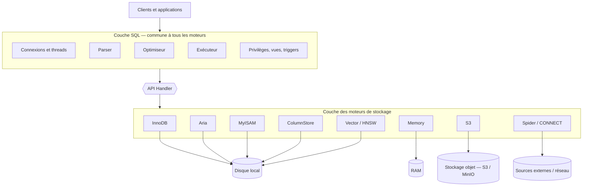

🔝 Retour au [Sommaire](/SOMMAIRE.md)

# 7.1 Vue d'ensemble : Architecture Pluggable Storage Engine

> **Chapitre 7 — Moteurs de Stockage** · MariaDB 12.3 LTS

## Le principe : séparer le « quoi » du « comment »

Dans un système de gestion de bases de données, deux préoccupations bien distinctes coexistent. La première concerne le **langage et la logique** : analyser une requête SQL, vérifier les droits, choisir un plan d'exécution, gérer les transactions du point de vue de l'utilisateur, exposer les vues et les déclencheurs. La seconde concerne le **stockage physique** : comment les lignes sont organisées sur le disque, comment les index sont structurés, comment les verrous sont posés, comment l'intégrité est garantie après un arrêt brutal.

MariaDB sépare ces deux responsabilités. La logique SQL est traitée par une **couche commune**, identique quel que soit le support de stockage. Le stockage physique, lui, est délégué à des **moteurs de stockage interchangeables** : c'est l'architecture *pluggable storage engine*. Concrètement, le serveur dit au moteur « insère cette ligne », « donne-moi la ligne suivante », « pose un verrou ici » — sans se soucier de la façon dont le moteur s'y prend réellement.

Cette séparation est ce qui permet de choisir, **table par table**, le moteur le mieux adapté à un besoin, et d'introduire de nouveaux moteurs (comme le moteur orienté vecteurs pour l'IA) sans toucher au cœur SQL du serveur.

## L'architecture en couches de MariaDB

On peut représenter le serveur comme un empilement de couches. Au sommet, les clients (applications, outils CLI) envoient des requêtes. Celles-ci traversent la couche SQL — gestion des connexions et des threads, analyseur, optimiseur, exécuteur, contrôle des privilèges — qui est totalement agnostique du moteur. Cette couche dialogue ensuite avec le moteur de stockage retenu pour chaque table à travers une interface unique : **l'API *handler***. Le moteur, enfin, lit et écrit les données là où elles résident : disque local, RAM, stockage objet ou source externe.



Tout ce qui se trouve **au-dessus** de l'API handler est partagé : c'est pourquoi une même requête SQL, une même syntaxe de jointure ou une même gestion des privilèges fonctionne de manière homogène, indépendamment du moteur des tables concernées. Tout ce qui se trouve **en dessous** est spécifique au moteur : le format de stockage, le type de verrouillage, le support ou non des transactions, etc.

## La couche moteur de stockage et l'API handler

Du point de vue technique, un moteur de stockage est un composant qui implémente une interface commune — la classe *handler* — et s'enregistre auprès du serveur via une structure dite *handlerton* (le « handler singleton » du moteur). Le serveur appelle des méthodes normalisées de cette interface pour réaliser les opérations élémentaires : ouvrir une table, parcourir des lignes, insérer, mettre à jour, supprimer, gérer les index, démarrer ou valider une transaction lorsque le moteur le permet.

Un moteur est ainsi responsable de plusieurs aspects, qui varient d'un moteur à l'autre :

- l'**organisation physique** des données (par lignes, par colonnes, en mémoire, déportée…) ;
- la **structure des index** et leur prise en charge (B-Tree, hash, full-text, spatial, HNSW…) ;
- la **granularité des verrous** (au niveau ligne pour InnoDB, au niveau table pour MyISAM) ;
- le **support transactionnel** : ACID, validation, annulation, points de sauvegarde — ou leur absence ;
- la **récupération après incident** (crash recovery) ;
- les **statistiques** fournies à l'optimiseur pour estimer le coût des plans d'exécution.

Ce dernier point illustre bien la coopération entre les couches : l'optimiseur, situé dans la couche SQL, interroge le moteur pour estimer le nombre de lignes, la sélectivité d'un index ou le coût d'un accès. Le moteur ne décide pas du plan, mais il l'informe.

## Moteurs intégrés et moteurs sous forme de plugin

Tous les moteurs ne sont pas embarqués de la même manière. Certains sont **compilés directement dans le serveur** (built-in) et toujours disponibles : c'est le cas d'InnoDB, d'Aria, de MyISAM, de Memory (anciennement HEAP), de CSV, de MERGE ou encore du moteur SEQUENCE. D'autres sont fournis sous forme de **plugins**, c'est-à-dire de bibliothèques partagées chargées à la demande : CONNECT, Spider, le moteur S3, ou encore ColumnStore (souvent distribué comme paquet séparé en raison de sa nature analytique).

Les plugins se chargent dynamiquement et se déchargent de la même façon :

```sql
-- Charger un moteur fourni en plugin (la bibliothèque contient le moteur)
INSTALL SONAME 'ha_connect';                 -- moteur CONNECT
INSTALL PLUGIN spider SONAME 'ha_spider.so'; -- moteur Spider

-- Décharger un moteur préalablement installé
UNINSTALL PLUGIN spider;
```

Pour qu'un moteur soit disponible automatiquement au démarrage, on peut aussi le déclarer dans le fichier de configuration :

```ini
[mariadb]
plugin-load-add = ha_connect.so
```

Les noms exacts de bibliothèques, ainsi que la disponibilité d'un moteur, dépendent du **système d'exploitation et du paquet installé**. Un moteur lourd comme ColumnStore, par exemple, n'est pas présent dans toutes les distributions et fait l'objet d'une installation dédiée.

## Découvrir les moteurs disponibles

Pour savoir quels moteurs sont présents sur une instance et de quelles capacités ils disposent, deux commandes équivalentes existent :

```sql
-- Vue synthétique
SHOW ENGINES;

-- Même information via INFORMATION_SCHEMA, exploitable en SQL
SELECT ENGINE, SUPPORT, TRANSACTIONS, XA, SAVEPOINTS
FROM INFORMATION_SCHEMA.ENGINES
ORDER BY ENGINE;
```

La sortie ressemble à ceci (exemple **illustratif et abrégé** ; le contenu réel dépend du build et des plugins chargés) :

| ENGINE  | SUPPORT  | TRANSACTIONS | XA  | SAVEPOINTS |
|---------|----------|--------------|-----|------------|
| InnoDB  | DEFAULT  | YES          | YES | YES        |
| Aria    | YES      | NO           | NO  | NO         |
| MyISAM  | YES      | NO           | NO  | NO         |
| MEMORY  | YES      | NO           | NO  | NO         |
| CSV     | YES      | NO           | NO  | NO         |

La colonne **`SUPPORT`** mérite une lecture attentive. Elle peut prendre les valeurs suivantes : `DEFAULT` (moteur disponible et défini comme moteur par défaut), `YES` (disponible), `NO` (non disponible), `DISABLED` (compilé mais désactivé dans la configuration). Les colonnes `TRANSACTIONS`, `XA` et `SAVEPOINTS` annoncent quant à elles les capacités transactionnelles du moteur — un indicateur immédiat de ce qui distingue, par exemple, InnoDB des moteurs non transactionnels.

## Choisir le moteur d'une table

Le moteur se choisit au moment de la création de la table, via la clause `ENGINE` :

```sql
CREATE TABLE commandes (
  id          BIGINT UNSIGNED PRIMARY KEY AUTO_INCREMENT,
  client_id   BIGINT UNSIGNED NOT NULL,
  montant     DECIMAL(10,2)   NOT NULL,
  creee_le    DATETIME        NOT NULL DEFAULT CURRENT_TIMESTAMP
) ENGINE = InnoDB;
```

Lorsqu'aucune clause `ENGINE` n'est précisée, MariaDB applique le **moteur par défaut**, gouverné par la variable système `default_storage_engine` (de portée à la fois globale et session) :

```sql
-- Consulter le moteur par défaut courant
SELECT @@default_storage_engine;

-- Le modifier pour la session en cours
SET SESSION default_storage_engine = InnoDB;
```

Depuis de nombreuses versions, **InnoDB est le moteur par défaut** de MariaDB, ce qui en fait le choix de référence pour la grande majorité des charges de travail transactionnelles.

> 🆕 **Note de version (12.x).** L'ancien alias `storage_engine`, déprécié de longue date, a été **retiré** dans la série 12.x (voir §11.2.3). Utilisez exclusivement `default_storage_engine`.

Le moteur d'une table existante peut par ailleurs être changé après coup avec `ALTER TABLE … ENGINE`. Cette opération de conversion — avec ses précautions et ses conséquences — fait l'objet de la **§7.9**.

## Mélanger les moteurs dans une même base

Parce que la couche SQL est agnostique, rien n'empêche d'avoir, au sein d'une même base, des tables utilisant des moteurs différents, ni d'écrire une **jointure entre deux tables de moteurs distincts** : l'exécuteur récupère les lignes de chaque table via leur handler respectif, puis les combine. C'est l'un des grands avantages de l'architecture.

Cette liberté impose toutefois quelques précautions, car certaines garanties dépendent du moteur :

- **Transactions hétérogènes.** Mélanger un moteur transactionnel (InnoDB) et un moteur non transactionnel (MyISAM, Aria) dans une même transaction est risqué : un `ROLLBACK` n'annulera que les modifications du moteur transactionnel et laissera les autres en l'état, généralement avec un avertissement. La cohérence atomique n'est alors plus garantie sur l'ensemble.
- **Clés étrangères.** L'intégrité référentielle par clés étrangères est portée par le moteur. InnoDB la prend en charge ; les moteurs non transactionnels ignorent (ou n'appliquent pas) les contraintes `FOREIGN KEY`. Une clé étrangère ne peut donc pas relier des tables de moteurs incompatibles.
- **Réplication et sauvegarde.** Le comportement vis-à-vis du *binary log* et des outils de sauvegarde peut varier selon le caractère transactionnel du moteur, ce qui mérite attention dans les environnements de production.

En pratique, on réserve le mélange de moteurs à des cas réfléchis (par exemple une table d'archives ou une table en mémoire à côté de tables InnoDB), en gardant InnoDB comme socle transactionnel par défaut.

## Pourquoi cette architecture ? Forces et limites

L'architecture enfichable confère à MariaDB une **flexibilité** rare : on adapte le moteur à la charge plutôt que de plier la charge au moteur. Elle favorise aussi l'**évolution** du produit — l'ajout de capacités majeures, comme la recherche vectorielle pour l'IA, s'intègre sous forme de moteur ou de couche de stockage spécialisée sans réécrire le cœur SQL. Elle ouvre enfin un **écosystème** de moteurs couvrant des besoins très variés : transactionnel, analytique, en mémoire, distribué, archivage cloud, accès à des données externes.

Cette puissance a sa contrepartie. Les **fonctionnalités ne sont pas uniformes** d'un moteur à l'autre : transactions, clés étrangères, type de verrouillage ou full-text dépendent du moteur retenu, ce qui exige de bien connaître les capacités de chacun avant de choisir. La diversité des moteurs introduit aussi une certaine **complexité opérationnelle** (configuration, sauvegarde, supervision propres à chaque moteur). Le bon réflexe est donc de partir d'InnoDB par défaut et de n'introduire un autre moteur que lorsqu'un besoin précis le justifie.

## Ce qu'il faut retenir

- MariaDB sépare la **couche SQL** (commune, agnostique) de la **couche de stockage** (assurée par des moteurs interchangeables), reliées par l'**API handler**.
- Le moteur prend en charge le stockage physique, les index, le verrouillage, l'éventuel support transactionnel, la récupération après incident et les statistiques pour l'optimiseur.
- Certains moteurs sont **intégrés** au serveur, d'autres sont des **plugins** chargés à la demande (`INSTALL PLUGIN` / `INSTALL SONAME`, `plugin-load-add`).
- On découvre les moteurs et leurs capacités via `SHOW ENGINES` ou `INFORMATION_SCHEMA.ENGINES`.
- Le moteur se choisit par table avec la clause `ENGINE` ; à défaut, c'est `default_storage_engine` qui s'applique (`storage_engine` ayant été retiré en 12.x).
- Mélanger des moteurs est possible et utile, mais demande de la prudence sur les transactions hétérogènes, les clés étrangères et la réplication.

Les sections suivantes détaillent chaque moteur, en commençant par le moteur par défaut : **InnoDB** (§7.2).

⏭️ [InnoDB : Le moteur par défaut](/07-moteurs-de-stockage/02-innodb.md)
