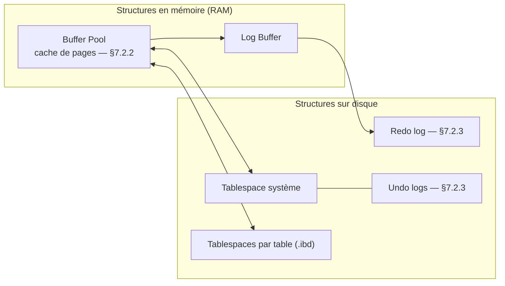

🔝 Retour au [Sommaire](/SOMMAIRE.md)

# 7.2 InnoDB : Le moteur par défaut

> **Chapitre 7 — Moteurs de Stockage** · MariaDB 12.3 LTS

## Le moteur de référence de MariaDB

InnoDB est le **moteur de stockage par défaut** de MariaDB, et de très loin le plus utilisé. C'est le moteur que l'on retrouve sous la grande majorité des applications transactionnelles : sites web, applications métier, services exposant une API, systèmes de commande ou de facturation. S'il occupe cette place centrale, c'est qu'il combine deux qualités souvent difficiles à concilier : la **fiabilité** — transactions ACID, récupération automatique après incident — et la **concurrence** — verrouillage au niveau ligne et contrôle multi-version (MVCC) permettant à de nombreuses sessions de lire et d'écrire simultanément sans se bloquer inutilement.

En pratique, la règle est simple : **on part d'InnoDB par défaut**, et l'on n'envisage un autre moteur que lorsqu'un besoin précis le justifie (analytique massive, données en mémoire, archivage froid, recherche vectorielle). Cette section présente le moteur dans son ensemble ; ses caractéristiques détaillées et son fonctionnement interne font l'objet des sous-sections 7.2.1 à 7.2.4.

## Un peu d'histoire

InnoDB a été développé par la société finlandaise **Innobase Oy**, fondée par Heikki Tuuri, puis racheté par **Oracle en 2005**. Il s'est imposé comme le moteur transactionnel de référence de l'écosystème MySQL au point d'en devenir le moteur par défaut à partir de **MySQL 5.5**.

Du côté de MariaDB, le parcours a connu un détour. Pendant plusieurs années, MariaDB a livré par défaut **XtraDB**, une variante d'InnoDB maintenue par Percona, jugée alors plus performante. À partir de la **version 10.2**, MariaDB est revenue au moteur **InnoDB amont** (abandon de XtraDB), l'écart de performance s'étant résorbé et le moteur d'origine ayant repris l'avantage. Depuis, InnoDB est continuellement amélioré et reste le socle transactionnel de MariaDB, y compris dans la série 12.x.

## Le modèle de stockage : des tables organisées par index

Pour comprendre InnoDB, il faut saisir un point fondamental : dans InnoDB, **les données d'une table sont physiquement organisées selon la clé primaire**. On parle d'*index clustered* (ou de table « organisée par index »). Concrètement, les lignes ne sont pas stockées dans un tas désordonné à côté d'un index : elles sont rangées **dans les feuilles de l'arbre B-Tree de la clé primaire**, triées selon celle-ci.

Cette organisation a deux conséquences importantes :

- Les **index secondaires** ne pointent pas directement vers un emplacement physique, mais contiennent la **valeur de la clé primaire** comme localisateur de ligne. Accéder à une ligne via un index secondaire implique donc, en général, une seconde recherche dans l'index clustered.
- Le choix de la clé primaire devient une **décision de conception majeure**. Une clé primaire compacte et croissante de façon monotone (par exemple un `BIGINT AUTO_INCREMENT`) limite la fragmentation, réduit la taille des index secondaires et favorise les insertions en fin d'arbre.

Si aucune clé primaire n'est définie, InnoDB en désigne une implicitement : il utilise le premier index `UNIQUE NOT NULL` disponible, ou, à défaut, génère une clé interne cachée (un identifiant de ligne de 6 octets). Il est presque toujours préférable de définir explicitement une clé primaire plutôt que de s'en remettre à ce mécanisme.

```sql
-- Une table InnoDB typique, dotée d'une clé primaire compacte et croissante
CREATE TABLE factures (
  id          BIGINT UNSIGNED PRIMARY KEY AUTO_INCREMENT,  -- clé clustered
  client_id   BIGINT UNSIGNED NOT NULL,
  numero      VARCHAR(32)     NOT NULL,
  montant_ht  DECIMAL(12,2)   NOT NULL,
  emise_le    DATETIME        NOT NULL DEFAULT CURRENT_TIMESTAMP,
  UNIQUE KEY uq_numero (numero),      -- index secondaire : référence la clé primaire
  KEY idx_client (client_id)          -- index secondaire : référence la clé primaire
) ENGINE = InnoDB;
```

Côté fichiers, InnoDB range les tables dans des **tablespaces**. Le mode **un fichier par table** (`innodb_file_per_table`), activé par défaut, crée un fichier `.ibd` distinct par table, ce qui facilite la gestion de l'espace et les opérations de maintenance. La configuration fine de ces aspects est traitée en §7.2.4.

## Architecture en bref : structures en mémoire et sur disque

InnoDB répartit son fonctionnement entre des **structures en mémoire**, qui assurent la rapidité, et des **structures sur disque**, qui assurent la durabilité. Le schéma ci-dessous en donne une carte volontairement simplifiée ; chaque composant est détaillé dans les sous-sections indiquées.



Du côté de la mémoire, le **Buffer Pool** est la pièce maîtresse : il met en cache les pages de données et d'index, de sorte que la plupart des accès se font en RAM plutôt que sur disque. C'est généralement le paramètre de tuning le plus déterminant d'une instance InnoDB (voir §7.2.2). Le **Log Buffer** accumule temporairement les enregistrements de journalisation avant leur écriture.

Du côté du disque, les données résident dans les **tablespaces** (système et par table), tandis que deux journaux assurent la cohérence : le **redo log**, qui rejoue les modifications validées en cas de redémarrage brutal (récupération après incident), et les **undo logs**, qui conservent les versions antérieures des lignes nécessaires à l'annulation des transactions et au fonctionnement du MVCC. Ces journaux et leur rôle sont détaillés en §7.2.3. La taille de page par défaut d'InnoDB est de 16 Ko (`innodb_page_size`).

## Pourquoi InnoDB est le bon choix par défaut

InnoDB est, par construction, **complet et sûr**. Il est pleinement transactionnel (ACID), gère l'**intégrité référentielle par clés étrangères**, pratique un **verrouillage au niveau ligne** et offre le **MVCC** pour la lecture concurrente — autant de caractéristiques détaillées en §7.2.1. Au-delà des index B-Tree classiques, il prend également en charge l'indexation **full-text** et **spatiale**, ce qui en fait un moteur polyvalent capable de couvrir la plupart des besoins sans changer de moteur.

Cette combinaison le rend particulièrement adapté aux charges **OLTP** (nombreuses transactions courtes et concurrentes) ainsi qu'aux charges **mixtes**. Pour la grande majorité des projets, c'est le choix qui demande le moins de compromis.

## Quand envisager un autre moteur

InnoDB n'est pas universel pour autant. Certains profils de charge sont mieux servis par des moteurs spécialisés :

- **Analytique massive / OLAP** : pour des agrégations sur de très grands volumes, le stockage en colonnes de **ColumnStore** est nettement plus efficace (§7.5).
- **Données volatiles en mémoire** : pour un cache ou des tables temporaires sans besoin de durabilité, le moteur **Memory** peut convenir (§7.10.1).
- **Archivage de données froides** : pour des données peu consultées et en lecture seule, le moteur **S3** (§7.6) ou le moteur **Archive** (§7.10.2) réduisent l'empreinte de stockage.
- **Recherche vectorielle pour l'IA** : pour la similarité sémantique et le RAG, on se tourne vers le support **Vector/HNSW** (§7.7).

Même dans ces architectures, InnoDB reste le plus souvent la **colonne vertébrale transactionnelle**, les moteurs spécialisés intervenant en complément. La grille de décision complète est présentée en §7.8.

## Ce que couvrent les sections suivantes

Les sous-sections suivantes approfondissent InnoDB sous chacun de ses angles :

- **7.2.1 — [Caractéristiques : ACID, FK, Row-level locking](02.1-innodb-caracteristiques.md)** — ce qui fait d'InnoDB un moteur transactionnel : conformité ACID, clés étrangères, verrouillage au niveau ligne.
- **7.2.2 — [Buffer Pool et gestion mémoire](02.2-innodb-buffer-pool.md)** — le cache central d'InnoDB et son dimensionnement.
- **7.2.3 — [Redo Log et Undo Log](02.3-innodb-redo-undo-log.md)** — les journaux qui garantissent durabilité, récupération et MVCC.
- **7.2.4 — [Configuration avancée](02.4-innodb-configuration.md)** — les principaux paramètres pour adapter InnoDB à une charge donnée.

## À noter pour MariaDB 12.3 LTS 🆕

Deux comportements d'InnoDB méritent d'être signalés dès maintenant, leur détail relevant d'autres chapitres :

- **Isolation par instantané activée par défaut** (`innodb_snapshot_isolation = ON`), qui renforce le comportement du niveau d'isolation `REPEATABLE READ` (voir §6.9). ⚠️ Ce n'est **pas** une nouveauté de la 12.3 : ce défaut est en place **depuis MariaDB 11.6**, donc déjà en 11.8 LTS comme en 12.3.
- 🆕 **Binary log intégré à InnoDB** (vraie nouveauté de la 12.3) : il supprime la coûteuse synchronisation entre le moteur et le journal binaire — MariaDB le présente comme la plus importante amélioration de performance OLTP de la 12.3. C'est une fonctionnalité **optionnelle**, à activer explicitement (voir §11.5.4).

Pour une migration **11.8 → 12.3**, seul le binary log intégré constitue un véritable changement (l'isolation par instantané étant déjà active en 11.8) ; les changements de comportement sont récapitulés en §19.10.

## Liens avec d'autres chapitres

- Les fondements transactionnels d'InnoDB — **ACID, MVCC, niveaux d'isolation, verrous, deadlocks** — sont traités au chapitre 6.
- Le **tuning d'InnoDB** (dimensionnement du buffer pool, configuration I/O, partitionnement) est approfondi au chapitre 15 (*Performance et Tuning*).
- Le fonctionnement général des **index** est couvert au chapitre 5.

## Ce qu'il faut retenir

- InnoDB est le **moteur par défaut** de MariaDB et le choix de référence pour les charges transactionnelles et mixtes.
- Ses tables sont **organisées par index (clustered)** sur la clé primaire : le choix d'une clé primaire compacte et croissante est déterminant, et les index secondaires référencent la clé primaire.
- Son fonctionnement repose sur des **structures en mémoire** (Buffer Pool, Log Buffer) et **sur disque** (tablespaces, redo log, undo logs), détaillées en §7.2.2 et §7.2.3.
- Il combine **fiabilité** (ACID, récupération après incident) et **concurrence** (verrouillage ligne, MVCC) — caractéristiques approfondies en §7.2.1.
- On choisit un autre moteur uniquement pour des besoins spécialisés (OLAP, mémoire, archivage, vecteurs), InnoDB restant souvent le socle transactionnel.

⏭️ [Caractéristiques : ACID, FK, Row-level locking](/07-moteurs-de-stockage/02.1-innodb-caracteristiques.md)
