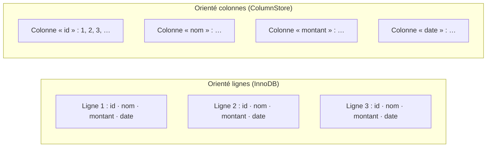

🔝 Retour au [Sommaire](/SOMMAIRE.md)

# 7.5 ColumnStore : Analytique et OLAP

> **Chapitre 7 — Moteurs de Stockage** · MariaDB 12.3 LTS

## Le moteur columnar pour l'analytique

ColumnStore est le moteur de stockage **en colonnes** de MariaDB, optimisé pour les charges **OLAP** (*Online Analytical Processing*). Là où InnoDB excelle en **OLTP** — de nombreuses petites transactions concurrentes —, ColumnStore est taillé pour l'inverse : balayer et agréger de **très grands volumes** de données. Il apporte un stockage columnar **distribué** et une architecture **MPP** (*massively parallel processing*) *shared-nothing*, qui transforme MariaDB en **entrepôt de données** (standalone ou distribué) pour des requêtes ad hoc et de l'analytique avancée — et cela **sans avoir besoin de créer d'index**.

ColumnStore est le **composant analytique** de la stratégie **HTAP** (*Hybrid Transactional/Analytical Processing*) de MariaDB : il permet de faire de l'analytique à grande échelle aux côtés de tables transactionnelles InnoDB, dans le même serveur.

## Stockage en colonnes : pourquoi c'est rapide en analytique

La différence fondamentale avec InnoDB tient à l'organisation physique des données. InnoDB est **orienté lignes** : les valeurs d'une même ligne sont stockées ensemble. ColumnStore est **orienté colonnes** : les valeurs d'une même colonne sont stockées ensemble.



Cette organisation change tout pour l'analytique. Une requête d'agrégation typique (par exemple `SELECT SUM(montant) … GROUP BY mois`) ne lit que **quelques colonnes** sur un très grand nombre de lignes. En stockage columnar, seules les colonnes concernées sont lues : on évite de parcourir les colonnes inutiles, ce qui réduit drastiquement les I/O. De plus, comme une colonne contient des données **homogènes**, elle se **compresse** très bien.

Enfin, ColumnStore découpe les données en **extents** et conserve, par colonne et par extent, des valeurs minimales et maximales. Lorsqu'une requête filtre sur une plage de valeurs, il peut **éliminer les extents** qui ne peuvent pas contenir de résultats (*extent elimination*) — un mécanisme proche de l'élagage de partitions, qui dispense de créer des index pour obtenir de bonnes performances.

## Architecture et déploiement

Le ColumnStore moderne s'**intègre au serveur MariaDB comme un plugin de moteur de stockage** (les anciennes versions 1.x reposaient sur un serveur patché distinct). Il se déploie selon deux topologies :

- **mononœud** (*single-node*) : un entrepôt columnar sur une seule machine, sans haute disponibilité, adapté au développement, aux tests ou à des volumes analytiques modérés ;
- **multinœud** (*multi-node*) : un déploiement distribué et MPP, avec haute disponibilité, pour un véritable entrepôt de données en production. Le travail des requêtes est réparti entre les nœuds (architecture *shared-nothing*).

La gestion d'un cluster ColumnStore s'appuie sur **CMAPI** (*Cluster Management API*), qui prend en charge, dans les versions récentes, les opérations de sauvegarde et de restauration.

Point important sur la **disponibilité** : ColumnStore est distribué **séparément** du serveur (il n'est pas inclus dans l'installation par défaut) et fonctionne aussi bien avec **MariaDB Community Server** qu'avec **Enterprise Server**. Ses versions suivent un **versionnage calendaire** (la plus récente étant 25.10) et sont **alignées sur des versions précises du serveur**, en particulier les lignes LTS. Avant de planifier un déploiement, vérifiez donc qu'une version de ColumnStore **compatible avec votre version exacte de MariaDB** est disponible. Les aspects conteneurisation/Kubernetes (image officielle, *operator*) sont traités au chapitre 16, et l'usage entrepôt de données en §20.3.

## Charger les données : `cpimport`

Avec ColumnStore, **le chargement en masse est la voie efficace**. L'outil dédié est `cpimport`, un utilitaire en ligne de commande conçu pour ingérer rapidement de gros volumes :

```bash
# Chargement en masse depuis un fichier TSV
cpimport -s '\t' entrepot faits_ventes /tmp/faits_ventes.tsv

# Import direct depuis une autre base, par un pipe
mariadb --quick --skip-column-names \
  --execute="SELECT * FROM oltp.ventes" \
  | cpimport -s '\t' entrepot faits_ventes
```

Les instructions `LOAD DATA INFILE` et `INSERT … SELECT` peuvent être **automatiquement routées** vers `cpimport` :

```sql
SET columnstore_use_import_for_batchinsert = ALWAYS;
```

À l'inverse, les `INSERT` ligne par ligne sont **inefficaces** sur ColumnStore : on privilégie systématiquement le chargement par lots.

## Caractéristiques et limites

ColumnStore est un moteur très spécialisé, dont les choix de conception sont l'opposé de ceux d'InnoDB :

- **pas de transactions** au sens d'InnoDB (ACID, `COMMIT`/`ROLLBACK` multi-instructions) ni de **clés étrangères** : ce n'est pas un moteur OLTP ;
- **aucun index à créer** : l'élimination d'extents et le stockage columnar remplacent l'indexation classique ;
- **DML orienté lots** : excellent en chargement en masse et en lecture analytique, mauvais en écritures petites et fréquentes ;
- **compression élevée** et performances remarquables sur les **agrégations et balayages** de grands volumes ;
- **jointures inter-moteurs** possibles avec InnoDB : on peut croiser une table ColumnStore et une table InnoDB dans une même requête, ce qui est au cœur de l'approche HTAP.

## Exemple de table

```sql
CREATE TABLE faits_ventes (
  date_vente DATE          NOT NULL,
  produit_id INT           NOT NULL,
  magasin_id INT           NOT NULL,
  quantite   INT           NOT NULL,
  montant    DECIMAL(12,2) NOT NULL
) ENGINE = ColumnStore;   -- aucun index secondaire à définir
```

On notera l'absence de stratégie d'index : on décrit les colonnes du fait analytique, et ColumnStore se charge du reste.

## Quand utiliser ColumnStore — et quand non

ColumnStore est le bon choix pour un **entrepôt de données**, des tableaux de bord et du **reporting**, de **grosses agrégations** et, plus largement, des charges OLAP, y compris en complément analytique d'une base transactionnelle (HTAP). En revanche :

- pour de l'**OLTP**, de la **forte concurrence en écriture** ou de l'**intégrité référentielle**, c'est **InnoDB** (§7.2) ;
- pour de l'**archivage froid en lecture seule**, voir le moteur **S3** (§7.6) ;
- pour de la **recherche vectorielle**, voir §7.7.

La grille de décision complète entre tous les moteurs figure en §7.8.

## Liens avec d'autres chapitres

- Le contraste **OLTP vs OLAP** est posé en §20.1, et le **data warehousing avec ColumnStore** détaillé en §20.3.
- Le moteur transactionnel de référence, **InnoDB**, est traité en §7.2.
- Le **déploiement** (Docker, Kubernetes, *operator*) est abordé au chapitre 16.
- La **comparaison des moteurs** (§7.8) et la **conversion entre moteurs** (§7.9) complètent le tableau.

## Ce qu'il faut retenir

- ColumnStore est le moteur **columnar, MPP et distribué** de MariaDB, dédié à l'**OLAP** et composant analytique de l'approche **HTAP**.
- Le **stockage en colonnes** ne lit que les colonnes utiles, **compresse** fortement et s'appuie sur l'**élimination d'extents** — d'où d'excellentes performances analytiques **sans index**.
- Il se déploie en **mononœud** ou **multinœud**, comme **plugin** du serveur, et se charge en masse avec **`cpimport`** (les `INSERT` unitaires sont à proscrire).
- Ce n'est **pas un moteur OLTP** : ni transactions ni clés étrangères ; pour cela, on garde **InnoDB**.
- ColumnStore s'installe **séparément** (Community ou Enterprise), avec un versionnage calendaire aligné sur des versions précises du serveur : **vérifiez la compatibilité** avec votre version de MariaDB.

⏭️ [Moteur S3 : Archivage données froides sur AWS S3/MinIO](/07-moteurs-de-stockage/06-moteur-s3.md)
