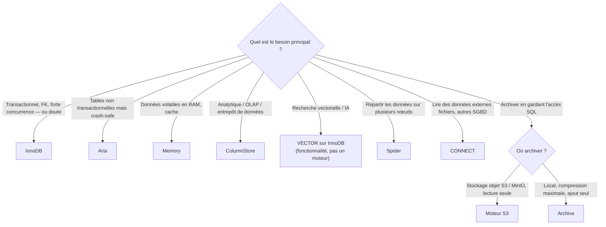

🔝 Retour au [Sommaire](/SOMMAIRE.md)

# 7.8 Comparaison et choix du moteur approprié

> **Chapitre 7 — Moteurs de Stockage** · MariaDB 12.3 LTS

Après avoir parcouru les principaux moteurs, cette section les met en regard et propose une méthode de décision. La règle de fond a déjà été énoncée et mérite d'ouvrir le chapitre de synthèse : **on part d'InnoDB par défaut**, et l'on ne choisit un autre moteur que lorsqu'un besoin précis le justifie.

## Le principe directeur : InnoDB par défaut

InnoDB est le moteur par défaut de MariaDB parce qu'il offre le meilleur équilibre pour la grande majorité des cas : **transactions ACID**, **clés étrangères**, **verrouillage au niveau ligne** et **MVCC** pour la concurrence, **récupération après incident**, et un éventail de fonctionnalités (index B-Tree, full-text, spatial). Pour une application transactionnelle ou à charge mixte, c'est presque toujours le bon choix — et c'est aussi celui qui demande le moins de compromis et d'efforts d'exploitation.

Rappelons par ailleurs que MariaDB permet de **mélanger les moteurs table par table** (§7.1) : rien n'empêche d'avoir une table d'archives Archive ou une table en mémoire Memory à côté de tables InnoDB. Cette liberté impose toutefois des précautions (transactions hétérogènes, clés étrangères inter-moteurs impossibles) déjà détaillées en §7.1.

## Tableau comparatif

| Moteur | Transactions (ACID) | Clés étrangères | Crash-safe | Cas d'usage principal |
|--------|:---:|:---:|:---:|---|
| **InnoDB** | ✅ | ✅ | ✅ | OLTP et charges mixtes — **le moteur par défaut** |
| **Aria** | ❌ | ❌ | ✅ | tables non transactionnelles ; tables système et temporaires |
| **MyISAM** | ❌ | ❌ | ❌ | *legacy* uniquement (à migrer) |
| **Memory** | ❌ | ❌ | ❌ (volatile) | données temporaires en RAM, caches |
| **Archive** | ❌ | ❌ | — | archivage très compressé, `INSERT`/`SELECT` seulement |
| **ColumnStore** | ❌ | ❌ | — | OLAP, entrepôt de données, analytique |
| **S3** | lecture seule | ❌ | — | archivage froid sur stockage objet (S3/MinIO) |

Trois moteurs ou fonctionnalités ne se résument pas bien à ces colonnes et relèvent d'usages particuliers :

- **Spider** : non pas un format de stockage local, mais un moteur de **répartition** des données sur plusieurs serveurs (sharding/fédération) — voir §7.10.3.
- **CONNECT** : un moteur d'**accès à des données externes** (fichiers CSV/XML/JSON, autres SGBD…) — voir §7.10.4.
- **Vector/HNSW** : rappelons-le (§7.7), ce **n'est pas un moteur** mais une **fonctionnalité** (type `VECTOR` + index HNSW) posée sur une table InnoDB.

## Lire le tableau : les critères qui comptent

Quelques axes structurent le choix :

- **Transactions et clés étrangères** : seul **InnoDB** les offre. Dès qu'on a besoin d'atomicité, d'intégrité référentielle ou de `ROLLBACK`, le débat est clos.
- **Résistance aux pannes** : InnoDB et **Aria** sont *crash-safe* ; **MyISAM** ne l'est pas (corruption possible) ; **Memory** est volatil (les données disparaissent au redémarrage).
- **Concurrence** : InnoDB pratique un **verrouillage au niveau ligne**, gage de forte concurrence en écriture ; MyISAM, Aria et Memory verrouillent au **niveau table**, ce qui sérialise les écrivains.
- **Schéma d'écriture** : certains moteurs sont spécialisés — **ColumnStore** privilégie le **chargement en masse**, **Archive** n'accepte que l'**ajout** (`INSERT`/`SELECT`), **S3** est en **lecture seule**.
- **Lieu de stockage** : disque local (la plupart), **RAM** (Memory), **stockage objet** (S3), **réparti sur plusieurs nœuds** (Spider), **source externe** (CONNECT).
- **Disponibilité** : InnoDB, Aria, MyISAM et Memory sont **intégrés** au serveur (toujours disponibles) ; **Archive** est un **plugin fourni avec le serveur** mais pas toujours chargé par défaut (selon la distribution — par exemple l'image Docker officielle exige `INSTALL SONAME 'ha_archive'`) ; **ColumnStore**, **S3**, **Spider** et **CONNECT** nécessitent une **installation/activation** supplémentaire (paquet séparé ou plugin).

## Arbre de décision

## Guide de choix par besoin

- **Application transactionnelle, intégrité référentielle, forte concurrence, ou simple doute** → **InnoDB** (§7.2).
- **Tables non transactionnelles que l'on veut résistantes aux pannes** (références, données de travail) → **Aria** (§7.4).
- **Données temporaires ou cache à durée de vie courte, en mémoire** → **Memory** (§7.10.1).
- **Analytique massive, agrégations sur de très grands volumes, entrepôt de données** → **ColumnStore** (§7.5).
- **Archivage froid devant rester interrogeable, sur stockage objet bon marché** → **moteur S3** (§7.6).
- **Archivage local très compressé en ajout seul** (journaux, historiques figés) → **Archive** (§7.10.2).
- **Répartition des données sur plusieurs serveurs (sharding)** → **Spider** (§7.10.3).
- **Accès en SQL à des données externes** (fichiers, autres bases) → **CONNECT** (§7.10.4).
- **Recherche sémantique, RAG, recommandation** → la **fonctionnalité `VECTOR`** sur une table InnoDB (§7.7), et non un moteur dédié.
- **MyISAM** : à réserver à l'existant *legacy* ; pour tout nouveau besoin non transactionnel, **Aria** le remplace avantageusement (§7.3).

## Mélanger les moteurs et convertir

Le choix n'est pas définitif : on convertit une table d'un moteur à un autre avec `ALTER TABLE … ENGINE = …`, dont les précautions sont détaillées en §7.9. En pratique, une architecture saine garde **InnoDB comme socle transactionnel** et n'introduit des moteurs spécialisés (Memory, Archive, ColumnStore, S3…) que là où un besoin précis l'exige, en gardant à l'esprit les limites du mélange de moteurs (§7.1).

## Liens avec d'autres chapitres

- Chaque moteur a sa section : **InnoDB** (§7.2), **MyISAM** (§7.3), **Aria** (§7.4), **ColumnStore** (§7.5), **S3** (§7.6), **Vector** (§7.7), et les **moteurs spécialisés** Memory/Archive/Spider/CONNECT (§7.10).
- Les principes de l'**architecture enfichable** et du **mélange de moteurs** sont en §7.1, la **conversion** en §7.9.
- Le contraste **OLTP vs OLAP** est posé en §20.1, et le **tuning** des moteurs au chapitre 15.

## Ce qu'il faut retenir

- **InnoDB par défaut** : transactions, FK, verrouillage ligne et crash-safety en font le bon choix pour la grande majorité des cas.
- Seul **InnoDB** offre transactions et clés étrangères ; **Aria** est le choix non transactionnel **crash-safe** (et le successeur de MyISAM, lui *legacy*).
- Les moteurs spécialisés répondent à des besoins ciblés : **Memory** (RAM volatile), **Archive** (compression en ajout seul), **ColumnStore** (OLAP), **S3** (archivage objet en lecture seule), **Spider** (répartition), **CONNECT** (données externes).
- **Vector/HNSW** n'est pas un moteur mais une fonctionnalité sur InnoDB (§7.7).
- On **mélange** les moteurs table par table (avec précautions, §7.1) et on **convertit** via `ALTER TABLE … ENGINE` (§7.9), en gardant InnoDB comme socle transactionnel.

⏭️ [Conversion entre moteurs (ALTER TABLE ENGINE)](/07-moteurs-de-stockage/09-conversion-entre-moteurs.md)
