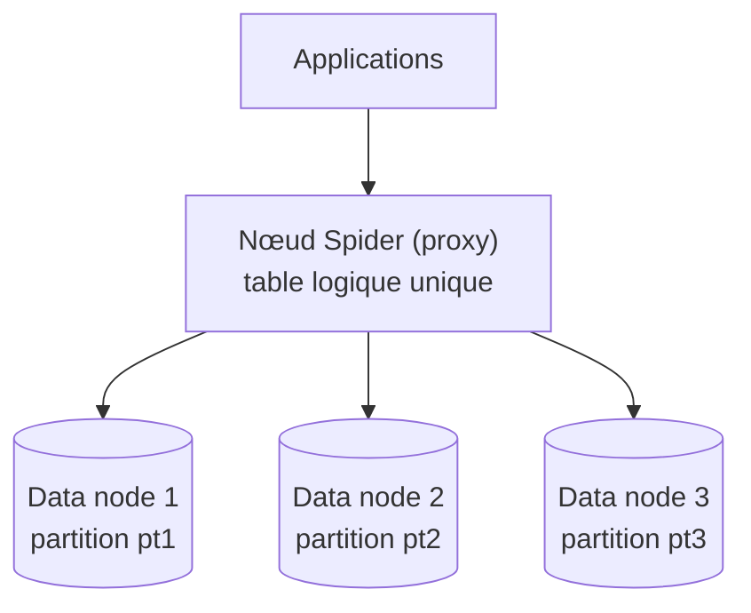

🔝 Retour au [Sommaire](/SOMMAIRE.md)

# 7.10.3 Spider : Sharding distribué

> **Chapitre 7 — Moteurs de Stockage** · MariaDB 12.3 LTS

## Un moteur de sharding et de fédération

**Spider** est un moteur de stockage d'un genre particulier : il ne stocke pas les données localement, mais **les répartit sur plusieurs serveurs** (sharding) et/ou **accède à des tables distantes comme si elles étaient locales** (fédération). Du point de vue de l'application, toute une grappe de serveurs apparaît comme **une seule table logique** — « toutes les bases utilisées comme une seule ».

Techniquement, Spider est une implémentation de la norme **SQL/MED** (ISO/IEC 9075-9, *SQL Management of External Data*). C'est un **plugin**, **intégré à MariaDB depuis la 10.0**, qui prend en charge le **partitionnement** et les **transactions XA**.

## Le principe : une table locale, des données distantes

Quand on crée une table avec le moteur Spider sur le serveur local (le nœud Spider, qui joue un rôle de proxy), cette table **établit un lien vers une ou plusieurs tables sur des serveurs distants** (les *data nodes*). La table distante peut utiliser **n'importe quel moteur**. Le lien est concrètement une **connexion** du serveur local vers le serveur distant, **partagée** entre toutes les tables d'une même transaction.



Spider sert ainsi deux usages complémentaires :

- la **fédération** : accéder de façon transparente à des tables hébergées sur d'autres serveurs MariaDB/MySQL (voire Oracle) ;
- le **sharding** : découper une grande table sur plusieurs serveurs, en s'appuyant sur le **partitionnement**.

## Installation

Spider est livré avec MariaDB mais doit être **activé** en exécutant le script `install_spider.sql` (présent dans le répertoire `share`) :

```bash
# Installer le plugin Spider (le chemin peut varier selon la distribution)
mariadb -u root -p < /usr/share/mysql/install_spider.sql
```

## Définir les serveurs distants

On déclare chaque *data node* avec `CREATE SERVER`, ce qui factorise les informations de connexion :

```sql
CREATE SERVER backend1 FOREIGN DATA WRAPPER mysql OPTIONS (
  HOST '192.168.0.202', DATABASE 'backend',
  USER 'spider_user', PASSWORD '…', PORT 3306
);
CREATE SERVER backend2 FOREIGN DATA WRAPPER mysql OPTIONS (
  HOST '192.168.0.203', DATABASE 'backend',
  USER 'spider_user', PASSWORD '…', PORT 3306
);
```

## Répartir les données : le sharding par partitionnement

Le sharding s'obtient en combinant le moteur Spider et le **partitionnement** : chaque **partition** est associée à un serveur distant via son `COMMENT`. Les lignes sont alors distribuées entre les *data nodes* selon la clé de partitionnement :

```sql
CREATE TABLE ventes (
  id        BIGINT UNSIGNED NOT NULL AUTO_INCREMENT,
  client_id INT             NOT NULL,
  montant   DECIMAL(12,2)   NOT NULL,
  PRIMARY KEY (id)
) ENGINE = spider COMMENT='wrapper "mysql", table "ventes"'
PARTITION BY KEY (id) (
  PARTITION pt1 COMMENT = 'srv "backend1"',
  PARTITION pt2 COMMENT = 'srv "backend2"'
);
```

Pour de la **fédération** simple (une seule table distante, sans répartition), la connexion se passe dans le `COMMENT` (ou la clause `CONNECTION`). On peut même **omettre les définitions de colonnes** : Spider les récupère depuis le *data node*.

```sql
CREATE TABLE clients_distants
ENGINE = spider
COMMENT = 'table "clients", database "crm", host "192.168.0.50",
           port "3306", user "spider_user", password "…"';
```

## Cohérence, transactions et tolérance aux pannes

Lorsqu'une écriture touche **plusieurs serveurs**, Spider recourt au **commit en deux phases (2PC)** pour **préserver la cohérence** des écritures, et prend en charge les **transactions XA** (§6.8). Spider offre également des fonctionnalités de **redondance par partition** — une partition peut viser plusieurs *data nodes* avec bascule en cas de défaillance — et permet d'**interroger les fragments en parallèle**.

## Performance : pushdown et latence réseau

La performance d'une architecture Spider dépend de sa capacité à **rapprocher le traitement des données**. Spider cherche donc à **pousser les opérations vers les *data nodes*** (*engine condition pushdown*, mises à jour et agrégations directes) afin de **réduire le volume de données transférées** sur le réseau. Deux facteurs restent toutefois à surveiller :

- **la latence réseau** : chaque accès traverse le réseau, et les allers-retours multiples pénalisent les requêtes mal optimisées ;
- **la répartition des données** : un mauvais choix de clé de partitionnement peut entraîner une **distribution déséquilibrée** entre les *data nodes*.

De nombreuses variables `spider_*` permettent d'ajuster ces comportements (connexions, *pushdown*, etc.).

## Quand utiliser Spider — et les alternatives

Spider répond à deux besoins précis : **passer à l'échelle horizontalement** en répartissant une grande table sur plusieurs serveurs (sharding), et **fédérer** des tables distantes au sein d'une vue unifiée. C'est une solution puissante, mais une architecture distribuée **ajoute de la complexité**, une **dépendance au réseau** et une charge d'exploitation : il faut s'assurer qu'elle répond à un besoin réel.

Attention à ne pas confondre les objectifs : Spider sert à **distribuer/fédérer**, **pas à assurer la haute disponibilité** — pour cela, on se tourne vers **Galera** (§14.2) ou la **réplication** (chapitre 13). Pour bien d'autres cas, la montée en charge verticale, un buffer pool InnoDB plus grand ou des réplicas de lecture sont des réponses plus simples. Les approches de **sharding et de distribution horizontale** sont mises en perspective en §15.11, et la grille de choix des moteurs en §7.8.

## Liens avec d'autres chapitres

- La **catégorie** des moteurs spécialisés est introduite en §7.10 ; le moteur **CONNECT** (§7.10.4) répond, lui, à l'accès à des **données externes** (fichiers, autres SGBD) plutôt qu'au sharding entre serveurs MariaDB.
- Le **sharding et la distribution horizontale** sont approfondis en §15.11.
- La **haute disponibilité** (Galera) relève de §14.2, la **réplication** du chapitre 13, et les **transactions XA** de §6.8.
- La **comparaison des moteurs** figure en §7.8.

## Ce qu'il faut retenir

- **Spider** répartit une table sur **plusieurs serveurs** (sharding) et/ou accède à des **tables distantes** (fédération), présentées comme **une seule table logique** ; c'est une implémentation de **SQL/MED**, livrée en **plugin** (à activer via `install_spider.sql`).
- Une table Spider **lie** des tables distantes (de n'importe quel moteur) ; on déclare les *data nodes* avec **`CREATE SERVER`** et on porte la connexion dans le **`COMMENT`** (ou `CONNECTION`).
- Le **sharding** s'obtient par **partitionnement**, chaque partition pointant vers un serveur ; la cohérence des écritures multi-serveurs est assurée par **2PC** (et les transactions **XA**).
- La performance repose sur le ***pushdown*** des opérations vers les *data nodes* et sur un bon **choix de clé de partitionnement**, la **latence réseau** étant le facteur limitant.
- Spider sert à **distribuer/fédérer**, **non** à la haute disponibilité (pour cela : **Galera**, §14.2, ou la **réplication**, chapitre 13).

⏭️ [CONNECT : Accès données externes](/07-moteurs-de-stockage/10.4-connect.md)
