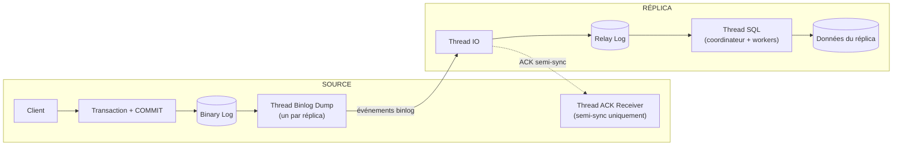

🔝 Retour au [Sommaire](/SOMMAIRE.md)

# 13.1 — Concepts de réplication : Asynchrone vs Semi-synchrone

> **Chapitre 13 — Réplication** · Version de référence : **MariaDB 12.3 LTS**

---

## Introduction

Toute réplication MariaDB repose sur un même mécanisme de fond : la source consigne ses modifications dans son **binary log**, et chaque réplica récupère puis rejoue ce flux d'événements. Ce qui distingue les différents **modes de réplication**, c'est le **degré de synchronisation** entre la source et ses réplicas : la source attend-elle, ou non, une confirmation des réplicas avant de considérer une transaction comme terminée ?

Cette question gouverne le compromis fondamental de toute architecture distribuée : **performance** d'un côté, **durabilité / cohérence** de l'autre. MariaDB propose deux modes natifs de réplication par flux binlog — **asynchrone** (le défaut) et **semi-synchrone** — auxquels s'ajoute la réplication **synchrone** offerte par Galera Cluster (chapitre 14).

Cette section pose les concepts et les compromis. La mise en place pratique d'une topologie source-réplica est traitée en **13.2**, et la configuration détaillée du mode semi-synchrone en **13.9**.

---

## Rappel : le mécanisme de réplication sous-jacent

Avant de comparer les modes, il faut comprendre le chemin parcouru par une transaction, identique dans les grandes lignes pour tous les modes.

Les étapes :

1. **Côté source** — une transaction est exécutée puis validée (`COMMIT`). La source écrit les événements correspondants dans son **binary log**.
2. Un **thread Binlog Dump** (il en existe un par réplica connecté) lit le binary log et envoie les événements sur le réseau.
3. **Côté réplica** — le **thread IO** reçoit ces événements et les écrit, à l'identique, dans son **relay log** local.
4. Le **thread SQL** (ou un coordinateur accompagné de plusieurs *workers* en réplication parallèle) lit le relay log et **applique** les événements aux données du réplica.

Les flèches en pointillé du schéma représentent le canal d'**acquittement** propre au mode semi-synchrone, sur lequel nous revenons plus bas.

> 💡 **Point clé :** le binary log est la **source de vérité** de toute la réplication. Sa configuration (format `ROW`/`STATEMENT`/`MIXED`, rétention, synchronisation sur disque) impacte directement le comportement et la fiabilité de la réplication. Voir le chapitre 11.5 pour le détail du binlog, et 13.3/13.4 pour le positionnement (coordonnées vs GTID).

---

## La réplication asynchrone (mode par défaut)

C'est le mode historique et le comportement par défaut de MariaDB.

### Principe

La source **ne s'occupe pas** de l'état de ses réplicas. Dès qu'une transaction est validée localement et écrite dans le binary log, la source **rend la main au client immédiatement**. La propagation vers les réplicas se fait « au fil de l'eau », sans aucune attente : les réplicas tirent les événements quand ils sont prêts.

Concrètement, du point de vue du client, le `COMMIT` se termine sans qu'aucun réplica n'ait nécessairement reçu — et encore moins appliqué — la transaction.

### Avantages

- **Performance maximale en écriture** : la latence perçue par le client ne dépend que de la source. Le nombre de réplicas et leur état n'ont aucun impact sur le temps de réponse.
- **Découplage total** : un réplica lent, surchargé ou momentanément déconnecté ne ralentit jamais la source.
- **Simplicité** : c'est le mode par défaut, sans paramétrage particulier au-delà de la mise en place de la réplication.
- **Tolérance aux liens lents** : adapté à la réplication sur de longues distances (géo-distribution), où la latence réseau rendrait toute attente synchrone prohibitive.

### Inconvénients et risques

- **Retard du réplica (*replication lag*)** : un réplica peut accuser un retard de quelques millisecondes à plusieurs minutes (voire davantage) selon la charge. Une lecture sur un réplica peut donc renvoyer des données **périmées** (cohérence à terme, *eventual consistency*).
- **Risque de perte de données au *failover*** : si la source tombe en panne alors que certaines transactions validées n'ont pas encore été transmises aux réplicas, ces transactions sont **perdues** lors de la promotion d'un réplica. La fenêtre de perte correspond, au pire, au lag du réplica le plus à jour.

L'asynchrone privilégie donc résolument le **débit** au prix d'une **garantie de durabilité plus faible** en cas de bascule.

---

## La réplication semi-synchrone

La réplication semi-synchrone est un compromis qui réduit la fenêtre de perte de données, sans payer le coût d'une synchronisation complète. Sous MariaDB, **la fonctionnalité est intégrée au serveur et toujours disponible** : depuis MariaDB 10.3.3, il n'est **plus nécessaire d'installer un plugin** (contrairement aux anciennes versions et à certains tutoriels qui montrent encore un `plugin_load_add`). Il suffit d'activer les variables système adéquates.

### Principe

Lors du `COMMIT`, la source **attend qu'au moins un réplica accuse réception** de la transaction (réception **et** écriture dans son relay log) avant de confirmer la validation au client. On ne garantit donc pas que le réplica a *appliqué* la transaction, seulement qu'il l'a **reçue et journalisée** durablement — d'où le terme « semi ».

Côté source, un thread dédié, l'**ACK Receiver Thread**, collecte les accusés de réception (*ACK*) envoyés par les réplicas. **L'acquittement d'un seul réplica suffit à débloquer la source.** Contrairement à MySQL (qui propose `rpl_semi_sync_master_wait_for_slave_count` pour exiger *N* accusés), **MariaDB ne dispose pas de cette variable** — l'attente porte toujours sur **un** ACK (le portage demandé par MDEV-18983 n'est pas implémenté en 12.3 : `SELECT @@rpl_semi_sync_master_wait_for_slave_count` renvoie *Unknown system variable*).

### Le point d'attente : AFTER_COMMIT vs AFTER_SYNC

Le moment exact où la source attend l'acquittement est déterminant. Il est contrôlé par la variable `rpl_semi_sync_master_wait_point`, qui admet deux valeurs aux propriétés très différentes.

**`AFTER_COMMIT` — valeur par défaut sous MariaDB**

1. Prépare la transaction dans le moteur de stockage.
2. Synchronise la transaction dans le binary log.
3. **Valide (commit)** la transaction dans le moteur de stockage.
4. **Attend l'acquittement** d'un réplica.
5. Retourne la confirmation au client.

Comme le commit local précède l'attente, **d'autres clients peuvent voir la transaction validée sur la source avant qu'un réplica l'ait acquittée**. En cas de crash de la source suivi d'un *failover*, ces clients peuvent constater une « disparition » de données qu'ils avaient pourtant vues : c'est le risque dit des lectures *fantômes* à la bascule.

**`AFTER_SYNC` — semi-sync « sans perte » (*lossless*)**

1. Prépare la transaction dans le moteur de stockage.
2. Synchronise la transaction dans le binary log.
3. **Attend l'acquittement** d'un réplica.
4. **Valide (commit)** la transaction dans le moteur de stockage.
5. Retourne la confirmation au client.

Ici, le commit local n'a lieu **qu'après** qu'un réplica a confirmé détenir la transaction. Aucun client ne peut donc voir sur la source une donnée qu'aucun réplica ne possède : si la source tombe avant le commit, la transaction n'a été vue par personne, et le réplica peut être promu sans incohérence. C'est la variante à privilégier pour la **durabilité**.

> ⚠️ **Spécificité MariaDB 12.x — binlog intégré à InnoDB :** dans sa **première implémentation** (12.3), le **binary log intégré à InnoDB** (cf. 11.5.4) **ne prend pas en charge la réplication semi-synchrone** : activer `rpl_semi_sync_master_enabled` renvoie `ERROR 4248 (Semi-synchronous replication is not yet supported with --binlog-storage-engine)`. La suppression du commit en deux phases entre binlog et InnoDB — sur lequel reposait `AFTER_SYNC` — interdit d'emblée ce point d'attente, et cette première version ne gère aucun mode semi-synchrone. **Qui a besoin de la semi-synchrone doit conserver le binlog traditionnel** (basé sur fichiers) — un arbitrage à connaître face au gain d'environ 4× en écriture du binlog InnoDB.

### Le repli automatique vers l'asynchrone (timeout)

La semi-synchrone ne doit jamais bloquer indéfiniment la production. Si aucun réplica n'acquitte une transaction dans le délai imparti — fixé par `rpl_semi_sync_master_timeout`, **par défaut 10 000 ms (10 secondes)** — la source **bascule automatiquement en réplication asynchrone** et reprend son fonctionnement normal. La variable d'état `Rpl_semi_sync_master_status` passe alors à `OFF`.

Dès qu'un réplica semi-synchrone se reconnecte et rattrape son retard, la source **rebascule en mode semi-synchrone** et `Rpl_semi_sync_master_status` repasse à `ON`. Ce mécanisme garantit la disponibilité au prix d'une dégradation temporaire et silencieuse de la garantie de durabilité — un comportement qu'il faut **surveiller** (voir 13.7).

### Principales variables et indicateurs

| Élément | Rôle |
|---------|------|
| `rpl_semi_sync_master_enabled` | Active la semi-synchrone côté source (`OFF` par défaut). |
| `rpl_semi_sync_slave_enabled` | Active la semi-synchrone côté réplica. |
| `rpl_semi_sync_master_wait_point` | Point d'attente : `AFTER_COMMIT` (défaut) ou `AFTER_SYNC`. |
| `rpl_semi_sync_master_timeout` | Délai (ms) avant repli en asynchrone — défaut 10 000. |
| `rpl_semi_sync_master_wait_no_slave` | Si `ON` (défaut), la source continue d'attendre un ACK même quand aucun réplica n'est connecté (jusqu'au timeout), plutôt que de basculer aussitôt en asynchrone. |
| `Rpl_semi_sync_master_status` *(statut)* | `ON` si la semi-synchrone est effectivement active. |
| `Rpl_semi_sync_master_clients` *(statut)* | Nombre de réplicas semi-synchrones connectés. |

> 🧩 **À noter :** les variables conservent la terminologie historique `master`/`slave`, là où ce support privilégie « source/réplica » dans le texte. La configuration complète de ce mode est détaillée en 13.9.

### Avantages

- **Fenêtre de perte de données fortement réduite** : au moins un réplica détient chaque transaction confirmée (et avec `AFTER_SYNC`, aucune donnée visible n'est exclusive à la source).
- **Bascule plus sûre** : un *failover* vers un réplica acquitté n'entraîne pas (ou peu) de perte.
- **Activation dynamique** : peut être activée/désactivée à chaud avec `SET GLOBAL`, sans redémarrage.

### Inconvénients

- **Latence d'écriture accrue** : chaque transaction subit au minimum un aller-retour réseau vers un réplica. L'impact croît avec la latence du lien — d'où l'inadéquation pour des réplicas géographiquement très éloignés.
- **Débit potentiellement réduit** sous forte charge en écriture.
- **Garantie non absolue** : en cas de timeout, la source repasse en asynchrone et la protection est temporairement perdue ; il ne s'agit donc pas d'une garantie « zéro perte » inconditionnelle.

---

## Et la réplication synchrone ?

Pour mémoire, il existe un troisième point sur le spectre : la réplication **synchrone**, où **tous** les nœuds doivent appliquer une transaction pour qu'elle soit validée. Sous MariaDB, ce modèle est fourni par **Galera Cluster** (réplication multi-maître à base de certification), traité en détail au **chapitre 14**. Il offre la cohérence la plus forte au prix d'un couplage maximal entre les nœuds, et relève d'une architecture distincte de la réplication par flux binlog décrite ici.

---

## Tableau comparatif

| Critère | Asynchrone | Semi-synchrone | Synchrone (Galera) |
|---------|-----------|----------------|--------------------|
| **Attente de la source** | Aucune | ACK d'≥ 1 réplica (réception) | Tous les nœuds (application) |
| **Latence d'écriture** | Minimale | Modérée (≥ 1 aller-retour) | Élevée |
| **Risque de perte au failover** | Élevé (= lag) | Faible (nul avec `AFTER_SYNC`) | Nul |
| **Cohérence des lectures** | À terme | À terme | Forte |
| **Sensibilité à la latence réseau** | Faible | Forte | Très forte |
| **Adapté à la longue distance** | Oui | Limité | Non |
| **Mode MariaDB par défaut** | ✅ Oui | Non | Non (architecture dédiée) |

---

## Comment choisir ?

Le choix dépend de la priorité métier — débit ou durabilité — et de la topologie réseau.

- **Réplication asynchrone** lorsque la **performance** prime, que des lectures légèrement périmées sont acceptables, ou que les réplicas sont **distants** (géo-distribution, *disaster recovery*, réplicas de reporting). C'est le choix par défaut, qui convient à la majorité des déploiements.
- **Réplication semi-synchrone** lorsqu'on veut **minimiser la perte de données** lors d'un *failover* (données sensibles : finance, commandes, transactions critiques), avec des réplicas **proches** (même région, faible latence). Privilégier `AFTER_SYNC` quand l'implémentation le permet — en gardant à l'esprit la restriction liée au binlog InnoDB en 12.x.
- **Réplication synchrone (Galera)** lorsque la **cohérence forte** et l'absence totale de perte sont impératives, sur un réseau **à faible latence** (chapitre 14).

En pratique, ces modes se combinent : par exemple une paire source/réplica **semi-synchrone** proche pour la haute disponibilité, complétée de réplicas **asynchrones** distants pour la reprise après sinistre et le reporting.

---

## Idées clés à retenir

- Tous les modes reposent sur le même socle : **binary log → relay log → application** par les threads IO et SQL.
- L'**asynchrone** (défaut) maximise le débit mais expose à un **lag** et à une **perte au failover**.
- La **semi-synchrone** attend l'**accusé de réception** d'au moins un réplica : perte fortement réduite, au prix d'un aller-retour réseau.
- Le **point d'attente** distingue `AFTER_COMMIT` (défaut MariaDB) de `AFTER_SYNC` (« sans perte ») ; **le binlog InnoDB (12.3) ne prend en charge aucune semi-synchrone** dans sa première implémentation (ERROR 4248) — conserver le binlog fichiers pour la semi-sync.
- Un **timeout** (10 s par défaut) fait **basculer la semi-synchrone en asynchrone** pour préserver la disponibilité : un comportement à surveiller.
- La réplication **synchrone** (Galera) constitue le troisième point du spectre, avec la cohérence la plus forte.

---

## Pour aller plus loin

- **13.2** — [Réplication Master-Slave (Source-Replica)](02-replication-master-slave.md) : mise en place pratique d'une topologie source-réplica.
- **13.7** — [Monitoring et troubleshooting](07-monitoring-troubleshooting.md) : surveiller le lag et l'état de la semi-synchrone.
- **13.9** — [Réplication semi-synchrone](09-replication-semi-synchrone.md) : configuration détaillée du mode semi-synchrone.
- **Chapitre 11.5** — [Binary logs et logs de transactions](../11-administration-configuration/05-binary-logs.md) : le journal qui alimente toute la réplication.
- **Chapitre 14** — [Haute Disponibilité](../14-haute-disponibilite/README.md) : Galera et la réplication synchrone.

⏭️ [Réplication Master-Slave (Source-Replica)](/13-replication/02-replication-master-slave.md)
