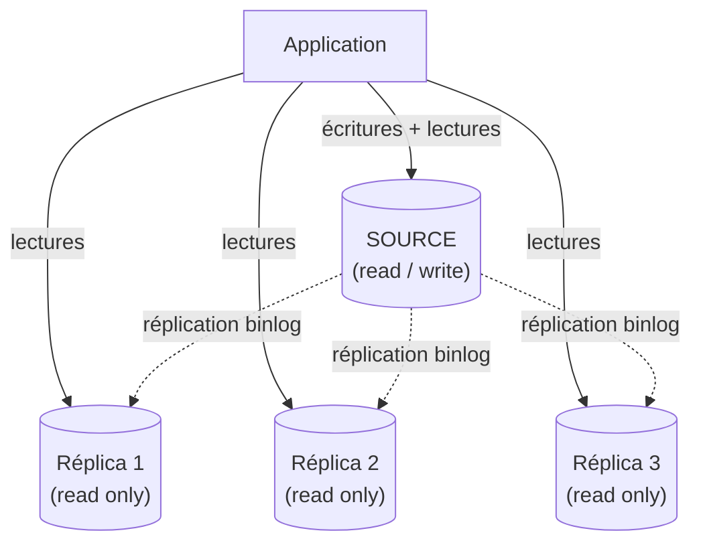
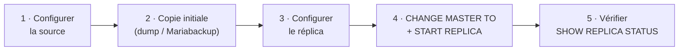

🔝 Retour au [Sommaire](/SOMMAIRE.md)

# 13.2 — Réplication Master-Slave (Source-Replica)

> **Chapitre 13 — Réplication** · Version de référence : **MariaDB 12.3 LTS**

---

## Introduction

La réplication **source-réplica** (historiquement *master-slave*) est la topologie la plus répandue, et la **brique de base** dont dérivent toutes les autres : un serveur **source** centralise les écritures, et un ou plusieurs **réplicas** en maintiennent une copie alimentée par le flux du binary log. Les topologies plus élaborées — multi-source (13.5), en cascade (13.6) ou clusters (chapitre 14) — ne sont que des assemblages de ce schéma fondamental.

Cette section présente l'**architecture** source-réplica, le rôle de ses composants et une **vue d'ensemble de la mise en place**. Les trois étapes de configuration sont ensuite détaillées dans les sous-sections : paramétrage de la source (13.2.1), du réplica (13.2.2), puis établissement du lien de réplication (13.2.3).

> 🧩 **Terminologie :** ce support emploie « source » et « réplica », mais MariaDB conserve aussi le vocabulaire historique *master*/*slave* dans ses commandes (`CHANGE MASTER TO`, `START SLAVE`…) et dans de nombreuses variables. Les deux formes coexistent et sont équivalentes (voir 13.2.3 et le chapitre 13 — README).

---

## Architecture source-réplica

Dans cette topologie, **un seul serveur accepte les écritures** (la source) ; les réplicas sont des copies **destinées à la lecture**.

- **La source** traite l'intégralité du trafic d'écriture (`INSERT`, `UPDATE`, `DELETE`, DDL) et journalise chaque modification dans son binary log.
- **Les réplicas** rejouent ce flux pour rester synchronisés et servent le trafic de **lecture**, déchargeant ainsi la source.
- La répartition du trafic entre source et réplicas peut être gérée côté application, ou déléguée à un routeur tel que **MaxScale** ou **ProxySQL** (chapitre 14), qui dirige automatiquement les écritures vers la source et les lectures vers les réplicas (*read/write split*).

> ⚠️ **Cohérence à terme :** la réplication par défaut étant asynchrone (13.1), une lecture sur un réplica peut renvoyer des données légèrement en retard. À prendre en compte pour les traitements exigeant une cohérence immédiate après écriture (*read-your-writes*).

---

## Pourquoi cette topologie ?

| Bénéfice | Détail |
|----------|--------|
| **Montée en charge en lecture** | Les lectures se répartissent sur N réplicas ; la source se concentre sur les écritures. |
| **Haute disponibilité** | Un réplica à jour peut être promu source en cas de panne (*failover*, 13.8). |
| **Sauvegardes sans impact** | Un réplica dédié porte la charge des sauvegardes (chapitre 12). |
| **Reporting / analytique** | Une charge OLAP est isolée sur un réplica, sans concurrencer l'OLTP de la source. |
| **Fondation extensible** | Sert de base aux topologies multi-source, en cascade et aux migrations sans interruption (chapitre 19). |

---

## Le rôle des composants

La plupart de ces éléments ont été introduits en 13.1 ; voici leur rôle dans la topologie source-réplica.

- **`server_id`** — identifiant **unique** pour chaque serveur de la topologie. Deux serveurs partageant le même `server_id` provoquent des erreurs de réplication ; c'est le tout premier prérequis à vérifier.
- **Binary log (source)** — le journal des modifications, point de départ de toute la réplication (chapitre 11.5). Il doit être activé sur la source.
- **Utilisateur de réplication** — un compte dédié, doté du privilège `REPLICATION SLAVE`, que le réplica utilise pour se connecter à la source et tirer le flux binlog.
- **Relay log (réplica)** — le journal local dans lequel le réplica recopie les événements reçus avant de les appliquer.
- **Threads IO et SQL (réplica)** — le thread IO reçoit et journalise, le thread SQL (ou ses *workers* en réplication parallèle) applique.
- **Position de départ** — pour démarrer, le réplica doit savoir **à partir d'où** lire le flux : soit par **coordonnées binlog** (fichier + offset, 13.3), soit par **GTID** (13.4), nettement plus robuste pour les bascules.

---

## Vue d'ensemble de la mise en place

Établir une réplication source-réplica suit toujours la même logique. Le détail de chaque commande est traité dans les sous-sections indiquées.

1. **Configurer la source** — activer le binary log, définir un `server_id` unique, créer l'utilisateur de réplication (`REPLICATION SLAVE`). → **13.2.1**
2. **Provisionner le réplica avec une copie initiale** — la réplication ne *crée* pas les données existantes : le réplica doit d'abord recevoir un **instantané cohérent** de la source, pris à une position binlog (ou un GTID) connue. On utilise pour cela `mariadb-dump` (avec `--single-transaction` et l'option enregistrant la position) ou **Mariabackup** pour les gros volumes (chapitre 12).
3. **Configurer le réplica** — définir son propre `server_id` unique et ses paramètres de réplication. → **13.2.2**
4. **Établir le lien de réplication** — indiquer au réplica l'adresse de la source, les identifiants et la position de départ via `CHANGE MASTER TO` (options `MASTER_*` — MariaDB n'a pas de `CHANGE REPLICATION SOURCE TO`, propre à MySQL), puis démarrer avec `START REPLICA` (alias `START SLAVE`). → **13.2.3**
5. **Vérifier** — contrôler l'état avec `SHOW REPLICA STATUS` (alias `SHOW SLAVE STATUS`) : les threads IO et SQL doivent être actifs et le retard maîtrisé. → **13.7**

---

## Protéger le réplica : `read_only`

Pour éviter qu'un réplica ne **diverge** de la source, on empêche toute écriture directe par les applications ou les utilisateurs :

- **`read_only = ON`** : bloque les écritures des utilisateurs ordinaires, tout en autorisant la réplication et les comptes dotés du privilège `READ ONLY ADMIN` (ex-`SUPER`).
- **Verrouiller aussi les comptes privilégiés** : MariaDB n'ayant pas de `super_read_only` (variable propre à MySQL), on **révoque le privilège `READ ONLY ADMIN`** des comptes concernés (cf. 13.2.2).

Une écriture appliquée directement sur un réplica peut entrer en conflit avec le flux répliqué et **casser la réplication** (erreur de duplicata, ligne introuvable…). La mise en lecture seule des réplicas est donc une **bonne pratique systématique**.

---

## Prérequis

- **Connectivité réseau** entre réplica et source sur le port MariaDB (3306 par défaut), avec les règles de pare-feu adéquates.
- **`server_id` unique** sur chaque serveur de la topologie.
- **Binary log activé** sur la source.
- **Compatibilité des versions** : un réplica doit exécuter une version **identique ou plus récente** que la source. La réplication est conçue dans le sens source → réplica de version supérieure (propriété exploitée lors des montées de version, chapitre 19), mais pas l'inverse.
- **Cohérence des formats** : format de binlog adapté (souvent `ROW` ou `MIXED`, chapitre 11.5) et jeux de caractères cohérents entre serveurs.
- Idéalement, **GTID activé** (13.4) pour des bascules et reconfigurations robustes.

---

## Plan de la section

- **13.2.1** — [Configuration du Primary (binlog)](02.1-configuration-primary.md) : activation et paramétrage du binary log, `server_id`, création de l'utilisateur de réplication côté source.
- **13.2.2** — [Configuration du Replica](02.2-configuration-replica.md) : paramètres du réplica, prise en compte de l'instantané initial, mise en lecture seule.
- **13.2.3** — [CHANGE MASTER TO / CHANGE REPLICATION SOURCE](02.3-change-master-to.md) : établissement du lien de réplication. Inclut la nouveauté 12.x permettant de **configurer des valeurs par défaut pour les options `MASTER_SSL_*`**, afin de simplifier la mise en place d'une réplication chiffrée. 🆕

---

## Pour aller plus loin

- **13.1** — [Concepts de réplication : Asynchrone vs Semi-synchrone](01-concepts-replication.md) : les modes et leurs compromis.
- **13.3** — [Réplication basée sur les positions](03-replication-positions.md) et **13.4** — [GTID](04-gtid.md) : les deux méthodes de positionnement.
- **13.7** — [Monitoring et troubleshooting](07-monitoring-troubleshooting.md) : vérifier l'état et le retard d'un réplica.
- **Chapitre 12** — [Sauvegarde et Restauration](../12-sauvegarde-restauration/README.md) : produire l'instantané initial du réplica.
- **Chapitre 14** — [Haute Disponibilité](../14-haute-disponibilite/README.md) : MaxScale, ProxySQL et le *read/write split*.

⏭️ [Configuration du Primary (binlog)](/13-replication/02.1-configuration-primary.md)
