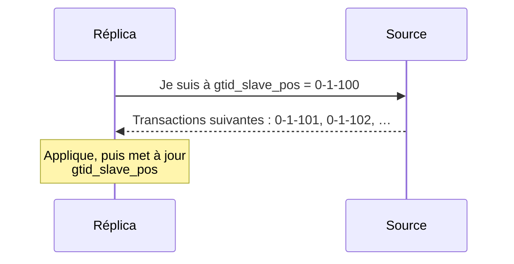

🔝 Retour au [Sommaire](/SOMMAIRE.md)

# 13.4 — GTID (Global Transaction Identifier)

> **Chapitre 13 — Réplication** · Version de référence : **MariaDB 12.3 LTS**

---

## Introduction

Un **GTID** (Global Transaction Identifier) est un **identifiant unique et global** attribué à chaque transaction, reconnu par **tous les serveurs** d'une topologie de réplication. Là où la réplication par coordonnées (13.3) demande « où en suis-je dans *le fichier de ce serveur* ? », le GTID permet de raisonner en termes de « *quelles transactions ai-je déjà appliquées* ? » — une question dont la réponse a le même sens partout.

Introduit dès MariaDB 10.0.2, le GTID est aujourd'hui la **méthode de positionnement recommandée** : il résout d'un coup les principales faiblesses des coordonnées (fragilité aux bascules, positions locales au serveur, absence de robustesse au crash). Il est de surcroît **obligatoire** avec le binlog intégré à InnoDB, l'une des nouveautés phares de la 12.3 (cf. 13.2.1).

Cette section présente le **concept** et le **format** du GTID. Sa **configuration** est détaillée en 13.4.1, et ses **avantages pour le failover** en 13.4.2.

---

## 1. Le problème que résout le GTID

En réplication par coordonnées, une position `(fichier, offset)` n'a de sens que sur le serveur qui l'a générée. Conséquences (vues en 13.3) :

- lors d'un **failover**, il faut retrouver à la main, sur le nouveau serveur source, la coordonnée équivalente pour chaque réplica restant ;
- le suivi de position (`master.info`, `relay-log.info`) n'est **pas *crash-safe***.

Le GTID lève ces obstacles : puisque chaque transaction porte un identifiant **valable sur tous les serveurs**, un réplica peut simplement annoncer sa position GTID, et toute source légitime sait quelles transactions lui envoyer ensuite — sans dépendre d'un nom de fichier ni d'un offset.

---

## 2. Anatomie d'un GTID

Un GTID s'écrit sous la forme de **trois nombres séparés par des tirets** :

```
        0     -     1     -     100
        │           │           │
     domaine     serveur     séquence
   (domain_id)  (server_id)   (seq_no)
```

| Composant | Taille | Rôle |
|-----------|--------|------|
| **`domain_id`** | 32 bits | Identifie un **domaine de réplication** — un flux indépendant. Vaut `0` dans les topologies simples ; indispensable en multi-source et pour le parallélisme *hors ordre* (voir §6). |
| **`server_id`** | 32 bits | Le `server_id` du serveur qui a **généré** la transaction à l'origine. |
| **`seq_no`** | 64 bits | Un **numéro de séquence** qui croît à chaque groupe d'événements écrit dans le binary log du serveur d'origine. |

Une **position GTID** (telle que `gtid_slave_pos`) peut contenir **un GTID par domaine**, par exemple :

```
0-1-100,1-5-42
```

ce qui signifie : « domaine 0 jusqu'à la séquence 100 (du serveur 1), domaine 1 jusqu'à la séquence 42 (du serveur 5) ».

---

## 3. Comment fonctionne la réplication GTID (vue conceptuelle)



1. Chaque transaction validée sur la source reçoit un **GTID**, journalisé dans le binary log (un événement de type *GTID list* y consigne l'état courant : le dernier GTID vu pour chaque domaine).
2. Le réplica **mémorise** les GTID qu'il a déjà appliqués.
3. À la connexion, le réplica **annonce sa position** ; la source lui envoie **toutes les transactions postérieures**, sans qu'il soit nécessaire de préciser un fichier ou un offset. C'est le principe du **positionnement automatique**.

---

## 4. Les variables de position GTID

MariaDB expose plusieurs variables pour décrire l'état GTID d'un serveur :

| Variable | Signification |
|----------|---------------|
| **`gtid_binlog_pos`** | GTID du **dernier groupe d'événements écrit dans le binlog** (donc exécuté localement). |
| **`gtid_slave_pos`** | GTID de la **dernière transaction appliquée par les threads de réplication**. Stockée dans la table `mysql.gtid_slave_pos` (InnoDB) → ***crash-safe*** (cf. 13.2.2). |
| **`gtid_current_pos`** | **Union** de `gtid_slave_pos` et `gtid_binlog_pos` : le GTID le plus récent exécuté sur le serveur, qu'il ait agi comme source ou comme réplica. |
| **`gtid_binlog_state`** | État interne du binlog : le dernier GTID journalisé pour **chaque combinaison** `domain_id` + `server_id`. |
| **`gtid_domain_id`** | Domaine attribué aux transactions **générées localement** sur ce serveur. |

> 💡 Pour la règle exacte de composition de `gtid_current_pos` et la configuration de ces variables, voir 13.4.1.

---

## 5. `slave_pos` ou `current_pos` ?

Le choix se fait via l'option `MASTER_USE_GTID` de `CHANGE MASTER TO` (cf. 13.2.3) :

- **`slave_pos`** : le réplica se positionne sur `gtid_slave_pos`. **Recommandé**, surtout pour un réplica en **lecture seule**.
- **`current_pos`** : positionnement sur `gtid_current_pos` (l'union). À **éviter** si des transactions locales peuvent être écrites sur le réplica : de nouveaux GTID locaux y fausseraient la position et provoqueraient des erreurs au redémarrage.

C'est une raison supplémentaire de **maintenir les réplicas en lecture seule** (13.2.2).

---

## 6. Le rôle du domaine de réplication (`domain_id`)

Le `domain_id` distingue des **flux de réplication indépendants** :

- en **réplication multi-source** (13.5), on attribue un domaine distinct à chaque source, afin que leurs séquences ne se mélangent pas ;
- des transactions de **domaines différents** peuvent être appliquées **en parallèle et hors ordre** sur le réplica, ce qui aide à réduire le lag ;
- dans une topologie simple à une seule source, on conserve le **domaine 0** par défaut.

> ✅ Il est recommandé d'activer le **`gtid_strict_mode`**, qui impose des numéros de séquence **strictement croissants** au sein de chaque domaine et aide à détecter les incohérences (détails en 13.4.1).

---

## 7. GTID MariaDB vs GTID MySQL

Les deux SGBD proposent des GTID, mais selon des **formats incompatibles** :

| | MariaDB | MySQL |
|---|---------|-------|
| **Format** | `domain-server-séquence` (ex. `0-1-100`) | `uuid:numéro` en ensembles (ex. `3E11FA47-…:1-5`) |
| **Activation** | options GTID + `MASTER_USE_GTID` | `gtid_mode=ON` + `enforce_gtid_consistency` |

Cette différence est un **point d'attention majeur lors d'une migration** depuis MySQL (cf. 19.1) : les positions GTID ne sont pas transposables telles quelles d'un moteur à l'autre.

---

## 8. GTID et le binlog InnoDB (12.3)

Le binlog intégré à InnoDB (13.2.1) **impose le mode GTID** : le positionnement par offset n'y a plus cours. Dans ce mode, l'**état GTID** est inscrit périodiquement sous forme d'enregistrements d'état **à l'intérieur du binlog** (intervalle réglé par `innodb_binlog_state_interval`), et la **récupération de la position** après un arrêt s'effectue en repartant du dernier enregistrement d'état. Adopter ce binlog — gain d'écriture important et robustesse accrue — suppose donc une topologie **entièrement en GTID**.

---

## Avantages en bref

Le GTID apporte notamment :

- des **bascules (failover / switchover) simplifiées et fiables** — développé en 13.4.2 ;
- un suivi de position ***crash-safe*** (via `mysql.gtid_slave_pos`) ;
- une **reconfiguration de topologie** aisée (changer de source sans recalcul de coordonnées) ;
- une base solide pour la **multi-source** (13.5) et la **réplication parallèle**.

---

## Plan de la section

- **13.4.1** — [Configuration GTID](04.1-configuration-gtid.md) : activer le GTID, variables (`gtid_domain_id`, `gtid_strict_mode`…), mise en place du lien et conversion depuis les coordonnées.
- **13.4.2** — [Avantages pour failover](04.2-avantages-failover.md) : pourquoi le GTID transforme les bascules et la reprise.

---

## Idées clés à retenir

- Un **GTID** identifie une transaction de façon **unique et globale** : `domain_id-server_id-seq_no` (ex. `0-1-100`).
- Le réplica raisonne en « transactions déjà appliquées » et bénéficie du **positionnement automatique**, sans fichier ni offset.
- Variables clés : **`gtid_binlog_pos`** (écrit localement), **`gtid_slave_pos`** (appliqué, *crash-safe*), **`gtid_current_pos`** (union).
- Préférer **`MASTER_USE_GTID = slave_pos`** et garder les réplicas en **lecture seule**.
- Le **domaine** (`domain_id`) structure les flux indépendants (multi-source, parallélisme hors ordre).
- Les GTID **MariaDB et MySQL sont incompatibles** (point clé en migration).
- Le **binlog InnoDB (12.3) impose le GTID**.

---

## Pour aller plus loin

- **13.3** — [Réplication basée sur les positions](03-replication-positions.md) : la méthode que le GTID remplace, et la conversion via `BINLOG_GTID_POS()`.
- **13.2.3** — [CHANGE MASTER TO / CHANGE REPLICATION SOURCE](02.3-change-master-to.md) : l'option `MASTER_USE_GTID`.
- **13.5** — [Réplication multi-source](05-replication-multi-source.md) : usage des domaines GTID.
- **13.8** — [Failover et switchover](08-failover-switchover.md) : bascules facilitées par le GTID.
- **Chapitre 19.1** — [Migration depuis MySQL](../19-migration-compatibilite/01-migration-depuis-mysql.md) : différences de GTID entre les deux moteurs.

⏭️ [Configuration GTID](/13-replication/04.1-configuration-gtid.md)
