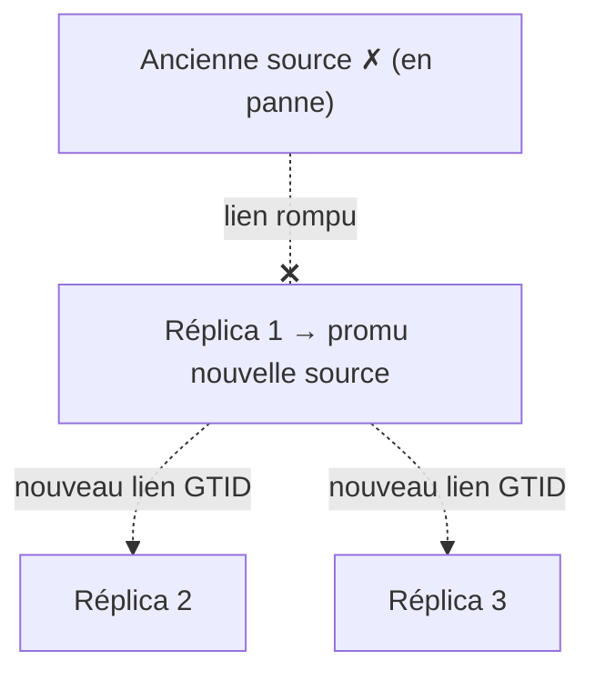

🔝 Retour au [Sommaire](/SOMMAIRE.md)

# 13.4.2 — Avantages pour failover

> **Chapitre 13 — Réplication › 13.4 GTID** · Version de référence : **MariaDB 12.3 LTS**

---

## Introduction

Le **failover** consiste à promouvoir un réplica au rang de source après la défaillance de la source ; le **switchover** en est la variante **planifiée et contrôlée**. Dans les deux cas, l'opération délicate n'est pas tant de promouvoir un serveur que de **raccrocher proprement les réplicas restants** au nouveau serveur source, sans perdre ni rejouer de transactions.

C'est précisément là que le **GTID transforme la donne**. Cette section explique **pourquoi** le GTID rend les bascules simples et fiables. La **procédure complète** de failover/switchover et les outils associés sont détaillés en **13.8**, et l'automatisation de la haute disponibilité au **chapitre 14**.

---

## 1. Rappel : pourquoi le failover par coordonnées est pénible

En réplication par coordonnées (13.3), une position `(fichier, offset)` n'a de sens que sur le serveur qui l'a produite. Lors d'une bascule, il faut donc, **pour chaque réplica restant**, retrouver sur le **nouveau serveur source** la coordonnée qui correspond *exactement* à l'endroit où ce réplica s'était arrêté.

Cette mise en correspondance est :

- **manuelle et fastidieuse** (autant de calculs que de réplicas) ;
- **sujette aux erreurs** : une coordonnée mal estimée provoque soit un **trou** (transactions manquées), soit des **doublons** (transactions rejouées) ;
- **lente**, au pire moment — pendant un incident.

---

## 2. Ce que change le GTID : le repositionnement automatique

Avec le GTID, **chaque transaction porte un identifiant global**, reconnu de façon identique par tous les serveurs. La position d'un réplica (`gtid_slave_pos`) signifie donc la **même chose partout**.

Raccrocher un réplica à un nouveau serveur source revient simplement à **changer l'adresse** de la source, **en conservant `MASTER_USE_GTID = slave_pos`** :

```sql
STOP REPLICA;
CHANGE MASTER TO MASTER_HOST = 'nouvelle_source';   -- la position GTID est conservée
START REPLICA;
```

Le réplica annonce sa position GTID, et le nouveau serveur source lui envoie **exactement les transactions manquantes** — **sans aucun recalcul de coordonnées**. Le risque de trou ou de doublon disparaît.



---

## 3. La bascule en GTID, en bref

> La procédure détaillée (sélection du réplica, gestion des écritures, automatisation) figure en **13.8**. En voici la logique d'ensemble.

- **Switchover (planifié)** : on **arrête les écritures** sur l'ancienne source, on **attend** que les réplicas aient tout appliqué, on en **promeut** un, puis on **raccroche** les autres (et l'ancienne source) au nouveau.
- **Failover (non planifié)** : la source est tombée ; on **promeut le réplica le plus à jour**, puis on raccroche les autres. Comme les positions sont globales, le réplica le plus avancé se repère facilement à sa position GTID.

Dans les deux cas, le raccrochage des réplicas se résume au `CHANGE MASTER TO MASTER_HOST = …` ci-dessus, la position GTID étant **préservée** d'un serveur source à l'autre.

---

## 4. Prérequis : un réplica réellement « promouvable »

Pour qu'un réplica puisse devenir source et **alimenter les autres réplicas**, son binary log doit **contenir les transactions répliquées**, avec leurs GTID d'origine. Cela suppose, **sur les réplicas candidats à la promotion** :

- le **binary log activé** (`log_bin`, cf. 13.2.1) ;
- **`log_slave_updates = ON`** (cf. 13.2.2), afin que les transactions reçues soient **réécrites dans son propre binlog** et donc servables à d'autres réplicas.

Sans cela, un réplica promu ne pourrait pas fournir aux autres le flux à la bonne position. *(Avec le binlog InnoDB de la 12.3, le GTID est de toute façon obligatoire, cf. 13.4.1.)*

---

## 5. Robustesse et cohérence

Le GTID n'apporte pas seulement de la simplicité, mais aussi de la **sûreté** lors des bascules :

- **`gtid_strict_mode = ON`** garantit des **binlogs identiques** entre serveurs et des séquences strictement croissantes par domaine : la promotion d'un réplica est d'autant plus sûre que tous les serveurs partagent le même ordre de transactions (cf. 13.4.1).
- Le suivi de position ***crash-safe*** (via la table `mysql.gtid_slave_pos`, cf. 13.2.2) assure qu'après un **arrêt brutal**, la position d'un réplica reste **cohérente avec ses données** : un failover déclenché après une panne soudaine repart d'un état fiable, sans doublon ni corruption.
- **`gtid_ignore_duplicates`** (cf. 13.4.1) permet aux topologies à **chemins redondants** (anneaux multi-maîtres) de tolérer qu'une même transaction arrive par plusieurs voies, en l'ignorant si elle a déjà été appliquée.

---

## 6. Réintégrer l'ancienne source comme réplica

Après une panne, l'ancienne source finit souvent par redémarrer : elle doit alors devenir **réplica** du nouveau serveur source. Le risque est qu'elle ait validé des transactions **jamais répliquées** avant de tomber (présentes dans son `gtid_binlog_pos`), créant une **divergence**.

Le GTID rend ce raccrochage possible :

- en l'absence de divergence, l'ancienne source se reconnecte simplement avec `MASTER_USE_GTID = slave_pos` ;
- **nouveauté 12.3** : avec le binlog InnoDB, l'option `CHANGE MASTER TO … MASTER_DEMOTE_TO_SLAVE = 1` **intègre les écritures locales** de l'ancienne source dans sa position GTID, facilitant sa rétrogradation en réplica sans re-clonage (cf. 13.4.1) ;
- en cas de divergence réelle (transactions locales irréconciliables), un **re-clonage** depuis le nouveau serveur source reste nécessaire (cf. 13.8 et chapitre 12).

---

## 7. Une base pour l'automatisation

Parce qu'il supprime le recalcul de coordonnées et offre des positions globales fiables, le GTID est le **socle des solutions de failover automatique**. Les orchestrateurs détectent la panne, élisent un nouveau serveur source et raccrochent les réplicas **automatiquement**, en s'appuyant sur les positions GTID :

- **MaxScale** avec le *MariaDB Monitor* (failover et switchover automatiques) ;
- **replication-manager**, **orchestrator** et solutions équivalentes.

Ces outils sont présentés en **13.8** (bascules) et au **chapitre 14** (haute disponibilité).

---

## Idées clés à retenir

- Le point dur d'une bascule est de **raccrocher les réplicas restants** ; le GTID le rend trivial.
- Grâce aux **positions globales**, raccrocher un réplica = **changer l'adresse de la source** (`MASTER_HOST`) en conservant `slave_pos` — **sans recalcul de coordonnées**.
- Un réplica **promouvable** doit avoir **`log_bin` + `log_slave_updates = ON`**.
- **`gtid_strict_mode`** (binlogs identiques) et le **suivi *crash-safe*** rendent les promotions sûres, même après une panne brutale.
- **12.3** : `MASTER_DEMOTE_TO_SLAVE = 1` facilite la **réintégration de l'ancienne source** en réplica (binlog InnoDB).
- Le GTID est le **fondement du failover automatique** (MaxScale, replication-manager…).

---

## Pour aller plus loin

- **13.8** — [Failover et switchover](08-failover-switchover.md) : la procédure complète et les outils.
- **13.4.1** — [Configuration GTID](04.1-configuration-gtid.md) : `gtid_strict_mode`, `MASTER_DEMOTE_TO_SLAVE`, `gtid_ignore_duplicates`.
- **13.2.2** — [Configuration du Replica](02.2-configuration-replica.md) : `log_slave_updates` et lecture seule.
- **Chapitre 14** — [Haute Disponibilité](../14-haute-disponibilite/README.md) : MaxScale et le failover automatique.
- **Chapitre 12** — [Sauvegarde et Restauration](../12-sauvegarde-restauration/README.md) : re-clonage d'un serveur divergent.

⏭️ [Réplication multi-source](/13-replication/05-replication-multi-source.md)
