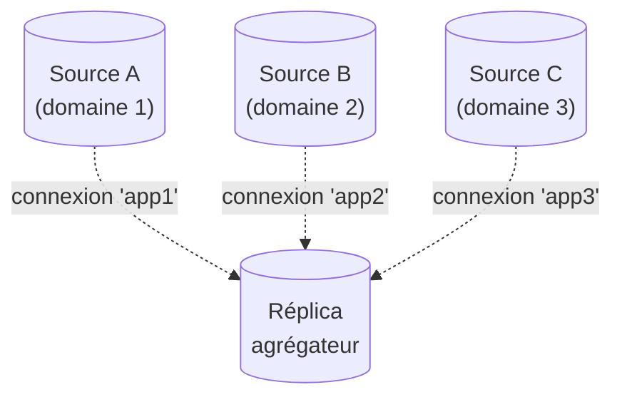

🔝 Retour au [Sommaire](/SOMMAIRE.md)

# 13.5 — Réplication multi-source

> **Chapitre 13 — Réplication** · Version de référence : **MariaDB 12.3 LTS**

---

## Introduction

La réplication **multi-source** permet à **un seul réplica** de répliquer depuis **plusieurs sources** simultanément. C'est le motif d'**agrégation** par excellence : consolider sur un serveur unique les données issues de plusieurs serveurs indépendants — pour le reporting, l'analytique ou la sauvegarde centralisée.

Techniquement, elle repose sur les **connexions nommées** : chaque source est rattachée par une connexion portant un **nom**, gérée par sa propre paire de threads IO/SQL. Un point capital à intégrer d'emblée : MariaDB **ne résout aucun conflit** entre sources — le modèle suppose que leurs données ne se chevauchent pas (voir §7).

---

## 1. Le principe : un réplica, plusieurs sources



- Chaque source est reliée par une **connexion nommée** (`app1`, `app2`, …).
- Chaque connexion active crée **deux threads** (IO + SQL), comme une réplication classique.
- Un réplica peut gérer jusqu'à **64 sources**.
- Toutes les sources doivent avoir un **`server_id` distinct** et, en GTID, un **`gtid_domain_id` distinct** (voir §5).

---

## 2. Cas d'usage

| Usage | Description |
|-------|-------------|
| **Consolidation analytique** | Rassembler les données de plusieurs bases métier sur un réplica unique pour le reporting/OLAP, sans charger les sources. |
| **Sauvegarde centralisée** | Centraliser les données de plusieurs serveurs sur un seul nœud, plus simple à sauvegarder (chapitre 12). |
| **Vue d'ensemble** | Offrir une base agrégée pour des recherches ou tableaux de bord transverses. |

> La multi-source **n'est pas** un mécanisme de répartition des écritures : ce n'est ni du sharding (15.11) ni du multi-maître à cohérence forte (Galera, chapitre 14). C'est un modèle d'**agrégation** descendant.

---

## 3. Les connexions nommées

La gestion de plusieurs sources s'appuie sur une syntaxe étendue :

```sql
CHANGE MASTER ['nom_de_connexion'] TO  …   -- crée ou modifie une connexion
RESET SLAVE  'nom_de_connexion' ALL        -- supprime définitivement une connexion
```

La variable **`default_master_connection`** désigne la connexion à laquelle s'appliquent les commandes et variables lorsqu'aucun nom n'est précisé (valeur par défaut : `''`, la connexion par défaut) :

```sql
SET @@default_master_connection = 'app1';
SHOW STATUS LIKE 'Slave_running';      -- concerne désormais la connexion 'app1'
```

- Certaines variables de réplication sont **locales à la connexion** (elles renvoient la valeur de `@@default_master_connection`), d'autres restent **globales**.
- Définir `@@default_master_connection` sur un nom **inexistant** est accepté **silencieusement** (la valeur est conservée, sans avertissement) ; c'est une **commande** ultérieure ciblant cette connexion (par ex. `START REPLICA`) qui échoue alors avec l'**erreur 1617** *There is no master connection 'nom'* — tandis que `SHOW REPLICA STATUS` renvoie simplement un résultat vide.
- À la différence de MySQL, **toutes les variables affichent toujours la valeur active correcte** pour la connexion ciblée.

---

## 4. Mettre en place une réplication multi-source

Pour chaque source, on crée une connexion nommée, puis on démarre l'ensemble.

```sql
-- Une connexion par source
CHANGE MASTER 'app1' TO
    MASTER_HOST     = '192.168.15.187',
    MASTER_USER     = 'repl',
    MASTER_PASSWORD = 'mot_de_passe_robuste',
    MASTER_USE_GTID = slave_pos;

CHANGE MASTER 'app2' TO
    MASTER_HOST     = '192.168.15.188',
    MASTER_USER     = 'repl',
    MASTER_PASSWORD = 'mot_de_passe_robuste',
    MASTER_USE_GTID = slave_pos;

-- Démarrer toutes les connexions d'un coup
START ALL SLAVES;

-- Vérifier l'ensemble
SHOW ALL SLAVES STATUS\G
```

> 💡 Chaque connexion doit pointer vers une source ayant un **`gtid_domain_id` propre** (configuré sur la source, cf. §5 et 13.4.1). Le réplica suivra alors **une position GTID par domaine**.

---

## 5. Le rôle déterminant des domaines GTID

Le **domaine GTID** est ce qui rend la multi-source robuste : en attribuant à **chaque source un `gtid_domain_id` distinct**, on garantit que leurs numéros de séquence **ne se télescopent pas** et que chaque flux reste indépendant.

La position du réplica contient alors **un GTID par domaine**, par exemple :

```
Gtid_Slave_Pos: 1-1-63,3-3-1
```

soit « domaine 1 jusqu'à 1-1-63 (source 1), domaine 3 jusqu'à 3-3-1 (source 3) ». Avantages :

- les transactions de **domaines différents** peuvent être appliquées **en parallèle et hors ordre** (réduction du lag) ;
- en cas de **chemins redondants**, l'option `gtid_ignore_duplicates` (13.4.1) évite d'appliquer deux fois une même transaction.

> ⚠️ Si vous devez fixer `gtid_slave_pos` manuellement, il faut le faire **pour tous les domaines (toutes les sources) en même temps**, puisque cette variable couvre l'ensemble des positions.

---

## 6. Gérer et superviser les connexions

| Action | Commande |
|--------|----------|
| Démarrer une connexion | `START REPLICA 'app1';` *(alias `START SLAVE 'app1'`)* |
| Arrêter une connexion | `STOP REPLICA 'app1';` |
| Démarrer / arrêter **toutes** les connexions | `START ALL SLAVES;` / `STOP ALL SLAVES;` |
| État de **toutes** les connexions | `SHOW ALL SLAVES STATUS\G` *(alias `SHOW ALL REPLICAS STATUS`)* |
| Supprimer une connexion | `RESET REPLICA 'app1' ALL;` |

Dans `SHOW ALL SLAVES STATUS`, **chaque connexion occupe une ligne**, dont la **première colonne est `Connection_name`**. Pour faciliter le diagnostic, les messages d'erreur d'une connexion sont **préfixés** dans le journal par `Master 'nom_de_connexion':`. L'interprétation du retard et des erreurs est traitée en 13.7.

---

## 7. Attention : aucune résolution de conflits

C'est la limite structurante de la multi-source : **MariaDB n'arbitre pas les conflits** entre sources. Le modèle **suppose qu'il n'y a pas de chevauchement** des données.

Bonnes pratiques pour éviter les conflits :

- faire en sorte que **chaque source alimente des bases ou tables distinctes** sur le réplica ;
- au besoin, appliquer des **filtres de réplication par connexion**, en préfixant la variable par le nom de connexion dans le fichier d'options :

```ini
[mariadb]
app1.replicate_do_db = ventes
app2.replicate_do_db = stocks
```

Si deux sources écrivent sur **les mêmes tables/lignes**, des conflits (doublons de clés, lignes introuvables) **briseront** la réplication. La conception du schéma d'agrégation doit donc cloisonner les écritures par source.

---

## 8. TLS partagé et configuration par connexion (12.3)

La multi-source multiplie les `CHANGE MASTER` : la **nouveauté 12.3** des défauts configurables pour `MASTER_SSL_*` (13.2.3) y prend tout son sens. Plutôt que de répéter les chemins de certificats sur chaque connexion, on définit une **configuration TLS centrale** (variables serveur `master_ssl_*`) et l'on écrit `MASTER_SSL = DEFAULT`, `MASTER_SSL_CA = DEFAULT`, etc. dans chaque connexion — voire on s'appuie directement sur les défauts hérités.

De même, les variables `replicate-*` peuvent être **préfixées par le nom de connexion** dans `my.cnf` pour une configuration ciblée, ce qui simplifie la gestion d'un grand nombre de sources.

---

## Exemple complet

### Côté sources (extrait `my.cnf`, un domaine distinct par source)

```ini
# Source A
[mariadb]
server_id      = 11
log_bin        = /var/log/mysql/mariadb-bin
gtid_domain_id = 1

# Source B
[mariadb]
server_id      = 22
log_bin        = /var/log/mysql/mariadb-bin
gtid_domain_id = 2
```

### Côté réplica agrégateur

```sql
CHANGE MASTER 'app1' TO
    MASTER_HOST = '192.168.15.187', MASTER_USER = 'repl',
    MASTER_PASSWORD = 'mot_de_passe_robuste', MASTER_USE_GTID = slave_pos;

CHANGE MASTER 'app2' TO
    MASTER_HOST = '192.168.15.188', MASTER_USER = 'repl',
    MASTER_PASSWORD = 'mot_de_passe_robuste', MASTER_USE_GTID = slave_pos;

START ALL SLAVES;
SHOW ALL SLAVES STATUS\G
```

---

## Idées clés à retenir

- La multi-source = **un réplica, plusieurs sources** (jusqu'à 64), pour l'**agrégation** (reporting, sauvegarde centralisée).
- Elle s'appuie sur des **connexions nommées** : `CHANGE MASTER 'nom' TO …`, `START/STOP ALL SLAVES`, `SHOW ALL SLAVES STATUS`, `RESET REPLICA 'nom' ALL`.
- `default_master_connection` cible la connexion par défaut des commandes et variables.
- **Chaque source doit avoir un `server_id` ET un `gtid_domain_id` distincts** ; le réplica suit une **position GTID par domaine**.
- **Aucune résolution de conflits** : cloisonner les écritures par source (bases/tables distinctes, filtres `replicate-*` par connexion).
- **12.3** : les défauts `MASTER_SSL_*` (mot-clé `DEFAULT`) évitent de répéter la configuration TLS sur chaque connexion.

---

## Pour aller plus loin

- **13.4** — [GTID](04-gtid.md) et **13.4.1** — [Configuration GTID](04.1-configuration-gtid.md) : domaines, `gtid_ignore_duplicates`.
- **13.2.3** — [CHANGE MASTER TO / CHANGE REPLICATION SOURCE](02.3-change-master-to.md) : options et défauts `MASTER_SSL_*`.
- **13.6** — [Réplication en cascade](06-replication-cascade.md) : une autre topologie dérivée.
- **13.7** — [Monitoring et troubleshooting](07-monitoring-troubleshooting.md) : superviser plusieurs connexions.
- **Chapitre 12** — [Sauvegarde et Restauration](../12-sauvegarde-restauration/README.md) : sauvegarde centralisée d'un agrégateur.

⏭️ [Réplication en cascade](/13-replication/06-replication-cascade.md)
