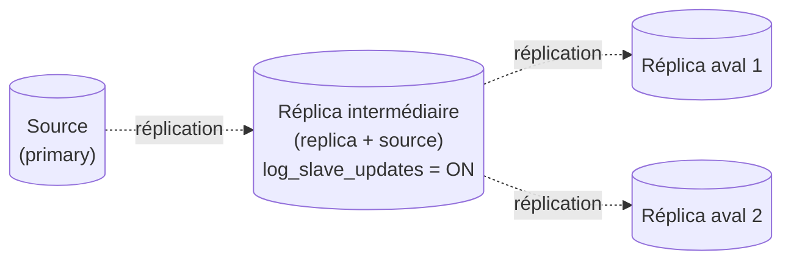

🔝 Retour au [Sommaire](/SOMMAIRE.md)

# 13.6 — Réplication en cascade

> **Chapitre 13 — Réplication** · Version de référence : **MariaDB 12.3 LTS**

---

## Introduction

La réplication **en cascade** (ou *chaînée*) organise les serveurs en **chaîne** plutôt qu'en étoile : une source alimente un **réplica intermédiaire**, qui alimente à son tour d'autres réplicas en aval. Ce réplica intermédiaire joue donc un **double rôle** — il est **réplica** du serveur situé au-dessus de lui et **source** pour ceux situés en dessous.

L'objectif est de **soulager la source principale** (qui n'a plus à servir directement tous les réplicas), de **monter en échelle** le nombre de réplicas, ou d'optimiser la **géo-distribution** en plaçant un relais par région.

---

## 1. Le principe : une chaîne de réplication



Là où une topologie **en étoile** (13.2) fait dépendre tous les réplicas directement de la source, la cascade **répartit la diffusion** : la source ne sert qu'un (ou quelques) réplica(s), le reste de l'arbre étant pris en charge par les intermédiaires. On peut enchaîner plusieurs niveaux pour former un véritable **arbre de réplication**.

---

## 2. Pourquoi une topologie en cascade ?

| Bénéfice | Détail |
|----------|--------|
| **Décharger la source** | La source crée un **thread de dump binlog par réplica connecté**. En cascade, elle n'en sert que quelques-uns ; les intermédiaires absorbent la diffusion vers les autres. |
| **Géo-distribution efficace** | Plutôt que N réplicas distants tirant chacun le flux à travers le WAN (N flux), **un seul relais régional** traverse le WAN, puis dessert les réplicas locaux en LAN — **économie de bande passante** considérable. |
| **Montée en échelle** | Servir un grand nombre de réplicas sans saturer la source en threads et en bande passante. |

---

## 3. Le rôle clé du serveur intermédiaire

Le serveur intermédiaire est **à la fois réplica et source**. Pour qu'il puisse **réémettre** vers l'aval les transactions qu'il reçoit, deux conditions sont **impératives** :

- **binary log activé** (`log_bin`, cf. 13.2.1) ;
- **`log_slave_updates = ON`** : sans cette option, l'intermédiaire **applique** les changements reçus mais **ne les écrit pas** dans son propre binlog — les réplicas en aval ne recevraient alors **rien**. Avec elle, chaque transaction répliquée est **réécrite dans le binlog** de l'intermédiaire (avec son GTID d'origine) et devient servable en aval.

L'intermédiaire reste par ailleurs un **réplica** : il doit donc être en **lecture seule** (`read_only` ; pour verrouiller aussi les comptes privilégiés, révoquer `READ ONLY ADMIN` — MariaDB n'a pas de `super_read_only`, cf. 13.2.2).

```ini
# Extrait my.cnf du serveur intermédiaire
[mariadb]
server_id          = 2                              # unique dans la topologie
log_bin            = /var/log/mysql/mariadb-bin     # binlog activé
log_slave_updates  = ON                             # CLÉ : réémet vers l'aval
relay_log          = /var/log/mysql/relay-bin
read_only          = ON                             # + révoquer READ ONLY ADMIN
gtid_strict_mode   = ON
```

---

## 4. GTID et cascade : des positions préservées

Le GTID est **particulièrement précieux** en cascade. Lorsqu'une transaction traverse un intermédiaire, **son GTID d'origine est préservé** (y compris le `server_id` du serveur qui l'a générée). Concrètement :

- les transactions répliquées apparaissent dans le **`gtid_binlog_pos`** de l'intermédiaire avec leur **GTID initial** ;
- un réplica en aval voit donc **le même GTID**, quel que soit le nombre de sauts dans la chaîne.

Cette propriété rend la chaîne **robuste à la reconfiguration** : si l'intermédiaire tombe, on peut **raccrocher** un réplica aval directement à la source principale (ou à un autre intermédiaire) avec `MASTER_USE_GTID = slave_pos`, **sans aucun recalcul de coordonnées**. Avec la réplication par coordonnées (13.3), au contraire, l'offset sur l'intermédiaire **diffère** de celui de la source : reconstruire la chaîne après une panne y serait laborieux.

---

## 5. Configuration (vue d'ensemble)

La cascade combine les configurations déjà vues, à chaque maillon :

1. **Source principale** : configuration de source standard (13.2.1).
2. **Réplica(s) intermédiaire(s)** : configuration de réplica (13.2.2) **plus** `log_bin` **et** `log_slave_updates = ON` ; le lien pointe vers la source principale.
3. **Réplicas en aval** : configuration de réplica standard, dont le lien pointe vers l'**intermédiaire** (et non vers la source principale).

```sql
-- Sur un réplica en aval : on pointe vers l'INTERMÉDIAIRE
CHANGE MASTER TO
    MASTER_HOST     = '192.168.1.20',   -- adresse de l'intermédiaire
    MASTER_USER     = 'repl',
    MASTER_PASSWORD = 'mot_de_passe_robuste',
    MASTER_USE_GTID = slave_pos;
START REPLICA;
```

> 💡 **Compatibilité de versions :** comme partout en réplication, chaque maillon en aval doit exécuter une version **identique ou plus récente** que celui en amont (cf. 13.2). Et avec le **binlog InnoDB** (12.3) sur un intermédiaire, le **GTID est obligatoire** (cf. 13.4.1).

---

## 6. Compromis et points de vigilance

- **Lag cumulé** : une transaction doit d'abord être **appliquée** sur l'intermédiaire avant d'atteindre l'aval. Le retard s'**additionne** le long de la chaîne ; plus elle est profonde, plus l'aval peut être en retard sur la source.
- **Maillon critique** : si un intermédiaire s'arrête, **tous ses réplicas en aval** cessent de progresser jusqu'à un raccrochage — heureusement facile en GTID (§4).
- **Supervision plus complexe** : il faut suivre le retard **à chaque niveau** de la chaîne (cf. 13.7), et pas seulement au sommet.

---

## 7. Variante : topologies circulaires (anneau)

Une **réplication circulaire** (anneau multi-maître) est une cascade refermée sur elle-même : chaque nœud réplique du suivant. Elle exige des précautions particulières :

- un **`gtid_domain_id` distinct** par nœud écrivain et des réglages `auto_increment_increment` / `auto_increment_offset` pour éviter les **collisions de clés** ;
- la gestion des **boucles** : par défaut un serveur ignore les événements portant son propre `server_id` ; la variable **`replicate_same_server_id`** (devenue variable système en 12.3) intervient dans certaines configurations, le GTID permettant la déduplication.

> ⚠️ Les anneaux multi-maîtres sont **fragiles** (risques de conflits et de divergence). Pour un véritable besoin **multi-maître**, on préférera **Galera Cluster** (chapitre 14), à cohérence forte.

---

## Idées clés à retenir

- La cascade chaîne les serveurs : un **intermédiaire** est **réplica en amont** et **source en aval**.
- Elle **décharge la source principale**, optimise la **géo-distribution** (un seul flux WAN par région) et permet de monter en échelle.
- L'intermédiaire **doit** avoir **`log_bin` + `log_slave_updates = ON`** pour réémettre vers l'aval (et rester en lecture seule).
- Le **GTID préserve la position d'origine** à travers la chaîne : raccrochage après panne **sans recalcul de coordonnées**.
- Inconvénients : **lag cumulé**, **maillon critique**, supervision multi-niveaux.
- Pour du **multi-maître**, préférer **Galera** (chapitre 14) aux anneaux circulaires.

---

## Pour aller plus loin

- **13.2.1 / 13.2.2** — [Configuration du Primary](02.1-configuration-primary.md) / [du Replica](02.2-configuration-replica.md) : `log_slave_updates`, binlog, lecture seule.
- **13.4** — [GTID](04-gtid.md) : positions globales préservées dans la chaîne.
- **13.7** — [Monitoring et troubleshooting](07-monitoring-troubleshooting.md) : suivre le lag à chaque niveau.
- **13.8** — [Failover et switchover](08-failover-switchover.md) : raccrocher l'aval après la panne d'un intermédiaire.
- **Chapitre 14** — [Haute Disponibilité](../14-haute-disponibilite/README.md) : Galera Cluster pour le multi-maître.

⏭️ [Monitoring et troubleshooting](/13-replication/07-monitoring-troubleshooting.md)
