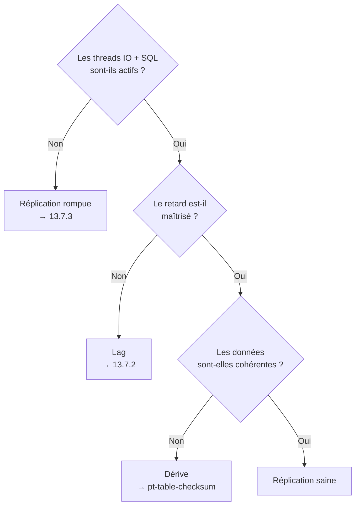

🔝 Retour au [Sommaire](/SOMMAIRE.md)

# 13.7 — Monitoring et troubleshooting

> **Chapitre 13 — Réplication** · Version de référence : **MariaDB 12.3 LTS**

---

## Introduction

La réplication étant **asynchrone par défaut** (13.1), elle peut **prendre du retard**, **se rompre** ou **diverger silencieusement** sans que l'application s'en aperçoive : un réplica peut cesser de répliquer pendant que les lectures continuent de renvoyer des données de plus en plus **périmées**. Surveiller activement la réplication n'est donc pas une option, mais une nécessité pour garantir la cohérence des lectures et la sûreté des bascules.

Cette section **cadre** ce qu'il faut surveiller et avec quels outils. Les approfondissements suivent dans les sous-sections : la commande de diagnostic centrale (13.7.1), la mesure du retard (13.7.2) et la résolution des erreurs courantes (13.7.3).

---

## 1. Pourquoi surveiller la réplication ?

- Un réplica **rompu** sert des données figées, de plus en plus anciennes — et un *failover* vers un tel nœud entraînerait une **perte de données**.
- Le **retard** (*lag*) dégrade la cohérence des lectures (*read-your-writes*) et **élargit la fenêtre de perte** en cas de bascule.
- Une **divergence** (données qui ne correspondent plus à la source) peut s'installer **sans aucune erreur** visible.

D'où l'importance d'une surveillance **proactive**, assortie d'**alertes**, plutôt que d'une vérification manuelle ponctuelle.

---

## 2. Les trois questions essentielles

Tout le monitoring de réplication se ramène à trois questions, qui structurent aussi le diagnostic :

| Question | Dimension | Approfondi en |
|----------|-----------|---------------|
| La réplication **tourne**-t-elle ? | Santé (threads IO + SQL) | 13.7.1 / 13.7.3 |
| **Suit**-elle le rythme ? | Retard (*lag*) | 13.7.2 |
| Les données sont-elles **cohérentes** ? | Intégrité (dérive) | §3 (outils) |

---

## 3. Panorama des outils de diagnostic

### `SHOW REPLICA STATUS` — le point de départ

La commande **`SHOW REPLICA STATUS`** (alias `SHOW SLAVE STATUS`) est l'outil de diagnostic de première intention : elle expose l'état des threads, la position, le retard et les dernières erreurs. En multi-source, **`SHOW ALL REPLICAS STATUS`** affiche une ligne par connexion (13.5). Son détail fait l'objet de **13.7.1**.

### Variables d'état

`SHOW STATUS LIKE 'Slave%'` et `SHOW STATUS LIKE 'Rpl%'` complètent le tableau (transactions répliquées, état semi-synchrone…). En multi-source, on cible une connexion via `default_master_connection`.

### Performance Schema

Les tables de réplication du **Performance Schema** (telles que `replication_connection_configuration` et `replication_applier_status` — MariaDB en implémente un **sous-ensemble**, et le Performance Schema doit être **activé**, `performance_schema = ON`) offrent une vue **structurée et requêtable** de l'état de la réplication, pratique pour l'automatisation et l'intégration aux outils de supervision.

### Le journal d'erreurs

Le **journal d'erreurs** consigne les arrêts des threads IO et SQL. En multi-source, les messages sont **préfixés** par `Master 'nom_de_connexion':`, ce qui localise immédiatement l'origine d'une erreur (13.5).

### Outils externes

- **pt-heartbeat** (Percona Toolkit) : mesure du retard **fiable**, indépendante des limites de `Seconds_Behind_Master` (voir 13.7.2).
- **pt-table-checksum** / **pt-table-sync** : détection — et réparation — d'une **divergence** de données entre source et réplica (à exécuter hors heures de pointe, car coûteux).
- **Prometheus + `mysqld_exporter` + Grafana** : métriques et tableaux de bord (chapitre 16).
- **MaxScale** avec le *MariaDB Monitor* : suivi de l'état des nœuds et **failover** automatique (chapitre 14).

---

## 4. Les grandes catégories de problèmes

| Catégorie | Symptôme typique | Où approfondir |
|-----------|------------------|----------------|
| **Retard** | Le réplica accumule du *lag* mais reste sain. | 13.7.2 |
| **Réplication rompue** | Un thread (IO ou SQL) s'est arrêté sur erreur. | 13.7.3 |
| **Divergence** | Données différentes sans erreur signalée. | pt-table-checksum (§3) |
| **Connexion** | Erreurs réseau/authentification, ou binlog réclamé absent (ex. erreur 1236, binlogs purgés trop tôt). | 13.7.3 ; rétention en 13.2.1 |

> 💡 La plupart des ruptures de **connexion** par binlog manquant proviennent d'une **rétention trop courte** sur la source : `binlog_expire_logs_seconds` doit toujours dépasser le retard maximal d'un réplica (cf. 13.2.1).

---

## 5. Vers une surveillance proactive

Plutôt que de lancer `SHOW REPLICA STATUS` à la main, on met en place des **alertes** sur les indicateurs critiques :

- `Slave_IO_Running` ou `Slave_SQL_Running` **≠ Yes** (réplication arrêtée) ;
- `Seconds_Behind_Master` au-delà d'un **seuil** acceptable ;
- présence d'une valeur dans `Last_IO_Error` / `Last_SQL_Error`.

La collecte et la visualisation de ces métriques dans la durée (tendances de lag, disponibilité des threads) sont détaillées au **chapitre 16** (Prometheus/Grafana) et appuyées par les requêtes de l'**annexe C.2**.

---

## Plan de la section

- **13.7.1** — [SHOW SLAVE STATUS / SHOW REPLICA STATUS](07.1-show-slave-status.md) : lecture détaillée des champs clés.
- **13.7.2** — [Seconds_Behind_Master et lag](07.2-seconds-behind-master.md) : mesurer et interpréter le retard.
- **13.7.3** — [Erreurs courantes et résolution](07.3-erreurs-courantes.md) : diagnostiquer et réparer une réplication rompue.

---

## Idées clés à retenir

- La réplication asynchrone peut **retarder, rompre ou diverger** silencieusement : la **surveillance proactive** est indispensable.
- Tout se ramène à trois questions : **tourne-t-elle ?** (santé), **suit-elle ?** (lag), **est-elle cohérente ?** (intégrité).
- Outils : **`SHOW REPLICA STATUS`** (et `SHOW ALL REPLICAS STATUS`), variables d'état, **Performance Schema**, **journal d'erreurs**, plus **pt-heartbeat**, **pt-table-checksum**, Prometheus/Grafana et MaxScale.
- Beaucoup de ruptures viennent d'une **rétention de binlog trop courte** (cf. 13.2.1).
- Mettre en place des **alertes** sur l'arrêt des threads, le seuil de lag et les dernières erreurs.

---

## Pour aller plus loin

- **13.1** — [Concepts de réplication](01-concepts-replication.md) : threads IO/SQL et asynchronisme.
- **13.5** — [Réplication multi-source](05-replication-multi-source.md) : superviser plusieurs connexions.
- **Chapitre 16** — [DevOps et Automatisation](../16-devops-automatisation/README.md) : monitoring avec Prometheus/Grafana et `mysqld_exporter`.
- **Chapitre 14** — [Haute Disponibilité](../14-haute-disponibilite/README.md) : MaxScale et le failover automatique.
- **Annexe C.2** — [Requêtes de monitoring](../annexes/c-requetes-sql-reference/02-requetes-monitoring.md) : requêtes prêtes à l'emploi (réplication incluse).

⏭️ [SHOW SLAVE STATUS / SHOW REPLICA STATUS](/13-replication/07.1-show-slave-status.md)
