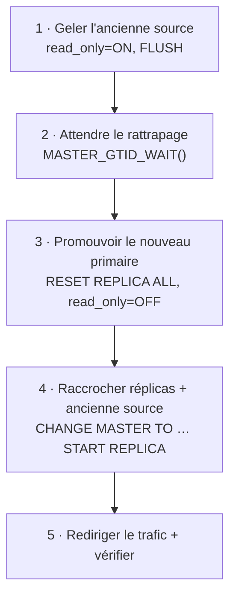

🔝 Retour au [Sommaire](/SOMMAIRE.md)

# 13.8 — Failover et switchover

> **Chapitre 13 — Réplication** · Version de référence : **MariaDB 12.3 LTS**

---

## Introduction

Deux opérations permettent de **changer de serveur source** dans une topologie de réplication :

- le **switchover** — bascule **planifiée et contrôlée** (maintenance, mise à jour, rééquilibrage) ;
- le **failover** — bascule **non planifiée**, déclenchée par la **panne** de la source.

L'objectif est de **rétablir le service** (ou de déplacer le rôle de source) avec un minimum d'interruption et, idéalement, **sans perte de données**. Le **GTID** est le fondement qui rend ces bascules simples et fiables (le « pourquoi » est traité en 13.4.2) ; cette section en détaille les **procédures**. La mise en œuvre **outillée et automatisée** (MaxScale, VIP, proxies) est approfondie au **chapitre 14**.

---

## 1. Switchover vs failover

| Critère | **Switchover** (planifié) | **Failover** (non planifié) |
|---------|---------------------------|------------------------------|
| Déclencheur | Décision opérateur | Panne de la source |
| Écritures pendant l'opération | **Gelées** sur l'ancienne source | La source est déjà indisponible |
| Perte de données | **Aucune** (réplicas rattrapés au préalable) | **Possible** (= fenêtre de lag) |
| Sûreté | Plus sûr | Plus risqué |

> ⚠️ **Failover = perte possible.** En réplication asynchrone, si la source tombe **avant** d'avoir transmis ses dernières transactions à au moins un réplica, **ces transactions sont perdues**. La fenêtre de perte correspond au **lag** (13.7.2). On la réduit avec la **semi-synchrone** (13.1, 13.9) et en promouvant **le réplica le plus à jour**.

---

## 2. Prérequis communs

- **Réplication GTID** : indispensable à une bascule sûre et automatisable. En coordonnées (13.3), le raccrochage des réplicas est laborieux et les outils refusent souvent d'opérer.
- **`gtid_strict_mode = ON`** : binlogs identiques entre serveurs (13.4.1), gage de promotions cohérentes.
- **Réplicas promouvables** : **`log_bin` + `log_slave_updates = ON`** pour qu'un réplica promu puisse alimenter les autres (13.4.2).
- **Réplicas en lecture seule** (`read_only`, complété au besoin par la révocation de `READ ONLY ADMIN`) : pas d'événements locaux parasites, qui compliqueraient une promotion (13.2.2).
- **Une couche de redirection du trafic** (VIP/keepalived, ProxySQL, MaxScale) pour que les applications suivent le nouveau primaire (chapitre 14).

---

## 3. La procédure de switchover (planifié)

Le switchover suit une séquence précise — la même que celle qu'**automatise MaxScale**.



**Étape 1 — geler les écritures sur l'ancienne source :**

```sql
SET GLOBAL read_only = ON;
FLUSH TABLES;
FLUSH LOGS;
```

**Étape 2 — attendre que le futur primaire ait tout appliqué :**

```sql
-- Sur le futur primaire : attendre d'avoir rejoint la position de l'ancienne source
SELECT MASTER_GTID_WAIT('<gtid_binlog_pos de l''ancienne source>');
```

`MASTER_GTID_WAIT()` bloque jusqu'à ce que le serveur ait appliqué toutes les transactions jusqu'à la position GTID indiquée — garantissant **zéro perte**.

**Étape 3 — promouvoir le nouveau primaire :**

```sql
STOP REPLICA;
RESET REPLICA ALL;          -- ce serveur n'est plus un réplica
SET GLOBAL read_only = OFF; -- il accepte désormais les écritures
```

**Étape 4 — raccrocher les autres réplicas (et l'ancienne source devenue réplica) :**

```sql
-- Sur chaque réplica restant
STOP REPLICA;
CHANGE MASTER TO MASTER_HOST = '<nouveau primaire>', MASTER_USE_GTID = slave_pos;
START REPLICA;
```

**Étape 5 — rediriger le trafic applicatif** vers le nouveau primaire (VIP/proxy) et **vérifier** que tous les réplicas reçoivent les nouveaux GTID (`SHOW REPLICA STATUS`, 13.7.1).

Parce que les écritures ont été gelées et les réplicas rattrapés **avant** la promotion, le switchover est **sans perte**.

---

## 4. La procédure de failover (non planifié)

La source est tombée : on ne peut ni geler les écritures, ni garantir le rattrapage.

1. **Détecter** la panne (source injoignable, threads IO en erreur sur les réplicas).
2. **Choisir le réplica le plus à jour** en comparant les positions GTID (`Gtid_IO_Pos` de `SHOW REPLICA STATUS`).
3. **Promouvoir** ce réplica :
   ```sql
   STOP REPLICA;
   RESET REPLICA ALL;
   SET GLOBAL read_only = OFF;
   ```
4. **Raccrocher** les réplicas restants au nouveau primaire :
   ```sql
   STOP REPLICA;
   CHANGE MASTER TO MASTER_HOST = '<nouveau primaire>', MASTER_USE_GTID = slave_pos;
   START REPLICA;
   ```
5. **Rediriger** le trafic applicatif.
6. **Traiter l'ancienne source** à son retour (§6).

> ⚠️ Toute transaction validée sur l'ancienne source mais **non répliquée** avant la panne est **perdue**. C'est pourquoi on promeut **le réplica le plus avancé** et, pour les données critiques, on recourt à la **semi-synchrone** (13.9).

---

## 5. Éviter le split-brain

Le **split-brain** est le scénario redouté : l'ancienne source **réapparaît** et accepte des écritures **pendant** que le nouveau primaire est déjà actif → **deux sources divergent**, et la réconciliation devient très difficile.

Parades :

- **Clôturer (fencing)** l'ancienne source avant/pendant la bascule : la forcer en `read_only`, l'**isoler** du réseau, voire l'arrêter (STONITH) ;
- ne **jamais** laisser l'application écrire sur **deux** serveurs à la fois ;
- s'appuyer sur un mécanisme de **quorum** pour décider quel nœud est le primaire légitime.

La gestion du **split-brain et du quorum** est détaillée au **chapitre 14.3**.

---

## 6. Réintégrer l'ancienne source (rejoin)

Après réparation, l'ancienne source doit redevenir **réplica** du nouveau primaire :

- **sans divergence** : simple raccrochage avec `MASTER_USE_GTID = slave_pos` ;
- **nouveauté 12.3** : avec le binlog InnoDB, `CHANGE MASTER TO … MASTER_DEMOTE_TO_SLAVE = 1` **intègre les écritures locales** de l'ancienne source dans sa position GTID, facilitant sa rétrogradation sans re-clonage (cf. 13.4.1) ;
- **en cas de divergence** (transactions locales non répliquées avant la panne) : **re-clonage** depuis le nouveau primaire (13.7.3, chapitre 12).

---

## 7. Manuel ou automatisé ?

| | **Manuel** | **Automatisé** |
|---|-----------|----------------|
| Contrôle | Total | Délégué à l'outil |
| Rapidité | Lent (dépend de la disponibilité d'un DBA) | **Rapide** (réaction immédiate) |
| Fiabilité | Sujet aux erreurs sous pression | **Testé et reproductible** |

L'outil de référence côté MariaDB est le **MariaDB Monitor de MaxScale** (module `mariadbmon`), qui réalise :

- **failover** : remplacer une source défaillante par un réplica (automatique via `auto_failover=true`, ou manuel) ;
- **switchover** : permuter une source active avec un réplica (manuel ou `async-switchover`) — plus sûr car il **gèle les écritures** pendant l'opération ;
- **rejoin** : réintégrer un serveur revenu, ou rediriger un réplica vers le bon primaire (automatique via `auto_rejoin`, ou manuel).

Ces opérations exigent une **réplication GTID**, une **topologie simple** (1 primaire, N réplicas, **un seul niveau**) et `gtid_strict_mode`. D'autres solutions existent (**replication-manager**, **orchestrator**). Leur configuration est traitée au **chapitre 14** (14.4 MaxScale, 14.6 failover automatique, 14.7 VIP/keepalived).

---

## 8. Points de vigilance

- **Le failover peut perdre des événements** (fenêtre de lag) — promouvoir le réplica le plus à jour, envisager la semi-synchrone.
- MaxScale **ne peut pas** orchestrer un failover s'il a démarré **après** la chute de la source (il lui manque l'information de topologie/domaine), sauf `enforce_simple_topology=1`.
- Le **domaine GTID** ne doit **pas changer** pendant un switchover/failover.
- Les réplicas ne doivent **pas** avoir d'événements locaux supplémentaires (→ lecture seule).
- **Tester régulièrement** les bascules (*game days*) : une procédure jamais exécutée échoue le jour de l'incident.

---

## Idées clés à retenir

- **Switchover** = planifié et **sans perte** (écritures gelées + rattrapage) ; **failover** = non planifié et **avec perte possible** (= lag).
- Séquence de switchover : **geler** l'ancienne source → **attendre** (`MASTER_GTID_WAIT`) → **promouvoir** (`RESET REPLICA ALL`, `read_only=OFF`) → **raccrocher** (`CHANGE MASTER TO … slave_pos`) → **rediriger**.
- Le failover promeut **le réplica le plus à jour** (`Gtid_IO_Pos`), puis raccroche les autres.
- **Prévenir le split-brain** par le *fencing* de l'ancienne source et un quorum (14.3).
- **Réintégrer** l'ancienne source par rejoin (ou `MASTER_DEMOTE_TO_SLAVE=1` en 12.3, ou re-clonage si divergence).
- **Automatiser** avec MaxScale (`mariadbmon` : failover/switchover/rejoin, GTID + topologie simple) — détails au chapitre 14.

---

## Pour aller plus loin

- **13.4.2** — [Avantages pour failover](04.2-avantages-failover.md) : pourquoi le GTID simplifie les bascules.
- **13.4.1** — [Configuration GTID](04.1-configuration-gtid.md) : `gtid_strict_mode`, `MASTER_DEMOTE_TO_SLAVE`.
- **13.7.1** — [SHOW REPLICA STATUS](07.1-show-slave-status.md) et **13.7.2** — [lag](07.2-seconds-behind-master.md) : choisir le réplica le plus à jour.
- **13.9** — [Réplication semi-synchrone](09-replication-semi-synchrone.md) : réduire la perte au failover.
- **Chapitre 14** — [Haute Disponibilité](../14-haute-disponibilite/README.md) : MaxScale (14.4), failover automatique (14.6), VIP/keepalived (14.7), split-brain et quorum (14.3).

⏭️ [Réplication semi-synchrone](/13-replication/09-replication-semi-synchrone.md)
