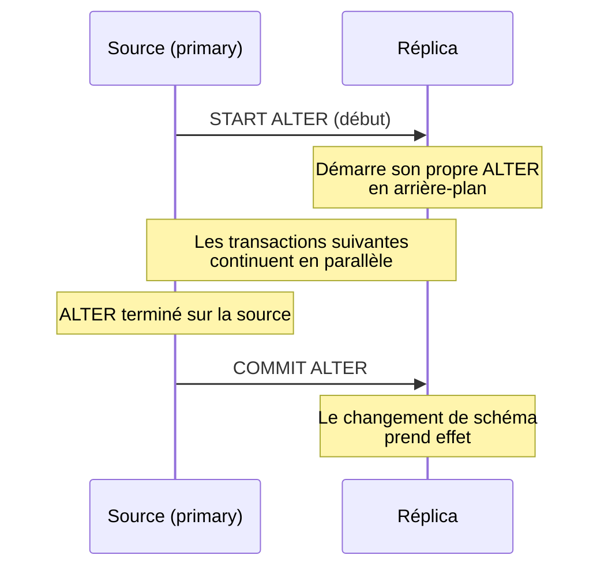

🔝 Retour au [Sommaire](/SOMMAIRE.md)

# 13.10 — Optimistic ALTER TABLE pour réduction du lag

> **Chapitre 13 — Réplication** · Version de référence : **MariaDB 12.3 LTS**

---

## Introduction

Les **modifications de schéma** (`ALTER TABLE`) volumineuses peuvent durer **des heures** sur de grosses tables. Répliquées, elles deviennent l'une des **premières causes de lag massif** : le réplica applique l'`ALTER` comme une **opération sérielle bloquante**, figeant toutes les transactions qui la suivent. L'**Optimistic ALTER TABLE pour la réplication** résout ce problème en **scindant** l'`ALTER` en deux phases, de sorte que le réplica le déroule **en arrière-plan**, en parallèle du trafic courant.

---

## 1. Le problème : les DDL longs et le lag

La réplication étant asynchrone, le **lag est proportionnel à la durée des transactions** (13.7.2) : une transaction courte ajoute un retard minime, mais un `ALTER TABLE` de plusieurs heures peut induire **plusieurs heures de lag**.

Sur le réplica, le thread SQL applique normalement l'`ALTER` comme **un seul événement bloquant** : tant qu'il n'est pas terminé, **rien d'autre ne progresse**. Et même en **réplication parallèle**, un DDL constitue une **barrière dure** : il ne peut **pas** être appliqué de façon optimiste, car un DDL **ne peut pas être annulé (rollback)** en cas de conflit. Le DDL long reste donc un point de sérialisation incompressible.

---

## 2. Pourquoi l'Online ALTER (OSC) ne suffit pas

L'**Online ALTER TABLE / OSC** (18.11) permet de **continuer les écritures (DML) pendant l'`ALTER` sur le primaire** — précieux, mais cela **ne règle pas le lag du réplica**.

La raison : seules les opérations validées dans le **même group commit** s'appliquent en parallèle sur le réplica. Les DML effectuées **concurremment** à l'`ALTER` sur le primaire **arrivent et s'exécutent sur le réplica avant** l'`ALTER` lui-même, qui reste ensuite un goulot sériel. Le réplica subit donc **toute la durée** de l'`ALTER` sous forme de retard, même quand le primaire, lui, est resté disponible.

---

## 3. La solution : l'`ALTER` en deux phases

L'Optimistic ALTER TABLE découpe la modification de schéma en **deux événements** au niveau du binlog : **START ALTER** (début) et **COMMIT** (ou **ROLLBACK**) **ALTER** (fin).



Déroulé :

1. Au lancement de l'`ALTER` sur le primaire, une commande **START ALTER** est envoyée au réplica, qui **démarre aussitôt son propre `ALTER`** — **en arrière-plan**, pendant que les transactions suivantes continuent de s'appliquer.
2. Combiné à l'**OSC**, le primaire garde la table **disponible pour les DML** durant cette phase.
3. Lorsque l'`ALTER` se **termine** sur le primaire, une commande **COMMIT ALTER** est envoyée, et le **changement de schéma prend effet** sur le réplica.

Résultat : la longue reconstruction de la table **chevauche** le trafic normal sur le réplica, au lieu de le bloquer → le **lag est drastiquement réduit**.

---

## 4. Configuration

La fonctionnalité s'active **sur la source** via la variable `binlog_alter_two_phase` :

```ini
[mariadb]
binlog_alter_two_phase = ON      # recommandé pour les ALTER longs
```

Elle est aussi réglable **dynamiquement** :

```sql
SET GLOBAL binlog_alter_two_phase = ON;
```

Pour que le réplica puisse réellement dérouler l'`ALTER` **en parallèle** du trafic, la **réplication parallèle** doit être active sur lui (`slave_parallel_threads > 0`, cf. 13.2.2). En pratique, on **combine** :

- `binlog_alter_two_phase = ON` (source) — pour scinder l'`ALTER` ;
- la **réplication parallèle** (réplica) — pour appliquer le DDL en arrière-plan tout en avançant sur le reste ;
- l'**Online ALTER / OSC** (18.11) — pour la disponibilité côté primaire.

---

## 5. Le contexte : réplication parallèle optimiste

Cette fonctionnalité s'inscrit dans la logique de la **réplication parallèle optimiste** (`slave_parallel_mode = optimistic` ou `aggressive`, cf. 13.2.2), où le réplica applique les transactions **en parallèle** en présumant l'absence de conflit (avec rollback + retry si nécessaire).

Mais, justement, **un DDL ne peut pas être appliqué de façon optimiste** (impossible à annuler). Le découpage en deux phases est la réponse à cette contrainte : plutôt que d'appliquer le DDL « optimistiquement » (dangereux), on lance la **phase longue de reconstruction** en arrière-plan, et l'on ne place le **basculement effectif du schéma** (COMMIT ALTER) qu'au bon point de l'ordre de réplication.

---

## 6. La 12.3 va plus loin : le binlog InnoDB

Le nouveau **binlog intégré à InnoDB** (13.2.1) généralise cette idée au-delà des seuls `ALTER`. Avec lui, une **grosse transaction n'est plus écrite en un seul bloc** au moment du commit : elle peut être **journalisée par morceaux au fil de son exécution**. Cela ouvre la voie à des réplicas qui **répliquent ces morceaux de façon optimiste, en parallèle**, **pendant que la transaction tourne encore** sur le primaire — avec un fort potentiel de réduction du lag induit par les **transactions longues** en général (pas seulement les DDL).

---

## 7. Points de vigilance

- L'Optimistic ALTER **réduit le lag**, mais l'`ALTER` **consomme toujours des ressources** (CPU, I/O, espace) sur le réplica pendant sa reconstruction.
- Pour une opération **pleinement en ligne**, combiner avec l'**OSC** côté primaire (disponibilité DML) et la **réplication parallèle** côté réplica.
- **Surveiller** le déroulé (lag, threads) pendant l'opération (13.7).

---

## Idées clés à retenir

- Un `ALTER TABLE` long est une **cause majeure de lag** : sur le réplica, il bloque normalement tout ce qui le suit (un DDL ne peut **pas** s'appliquer de façon optimiste).
- L'**OSC seul ne corrige pas** le lag du réplica : l'`ALTER` y reste un point de sérialisation.
- L'**Optimistic ALTER TABLE** scinde l'opération en **START ALTER** / **COMMIT ALTER** : le réplica déroule l'`ALTER` **en arrière-plan**, en parallèle du trafic → **lag fortement réduit**.
- Activation : **`binlog_alter_two_phase = ON`** sur la source, à combiner avec la **réplication parallèle** (réplica) et l'**OSC** (primaire).
- **12.3** : le **binlog InnoDB** permet de répliquer les **grosses transactions par morceaux, en parallèle**, étendant le bénéfice au-delà des DDL.

---

## Pour aller plus loin

- **13.2.2** — [Configuration du Replica](02.2-configuration-replica.md) : réplication parallèle (`slave_parallel_threads`, `slave_parallel_mode`).
- **13.7.2** — [Seconds_Behind_Master et lag](07.2-seconds-behind-master.md) : mesurer le lag induit par les DDL.
- **18.11** — [Online Schema Change (ALTER TABLE non-bloquant)](../18-fonctionnalites-avancees/11-online-schema-change.md) : disponibilité DML côté primaire.
- **13.2.1** — [Configuration du Primary](02.1-configuration-primary.md) : le binlog InnoDB (12.3).
- **Chapitre 16.8** — [Gestion des migrations](../16-devops-automatisation/08-gestion-migrations.md) : gh-ost / pt-online-schema-change comme alternatives.

⏭️ [Réplication parallèle entre clusters Galera (slave_parallel_threads)](/13-replication/11-replication-parallele-galera.md)
