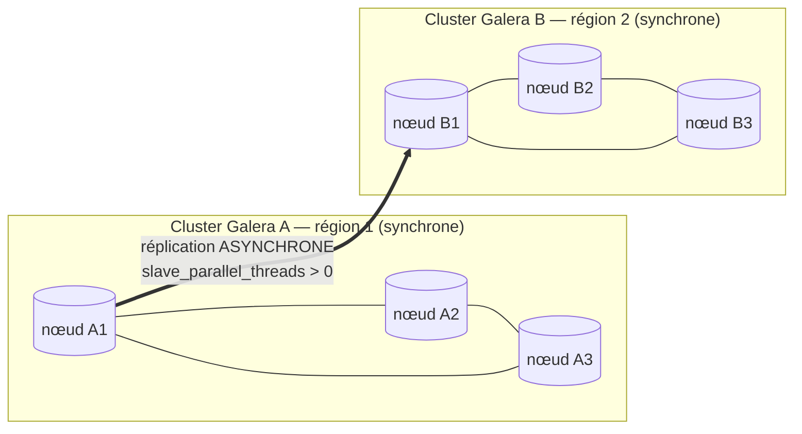

🔝 Retour au [Sommaire](/SOMMAIRE.md)

# 13.11 — Réplication parallèle entre clusters Galera (`slave_parallel_threads`) 🆕

> **Chapitre 13 — Réplication** · Version de référence : **MariaDB 12.3 LTS**

---

## Introduction

On relie souvent **deux clusters Galera** (situés dans des régions différentes) par une **réplication asynchrone**, pour la **géo-distribution** et la **reprise après sinistre**. Jusqu'ici, le nœud Galera qui **recevait** ce flux asynchrone était contraint de l'appliquer **en mono-thread**, ce qui en faisait un goulot d'étranglement et creusait le **retard entre clusters**.

**Nouveauté de la série 12.x** : depuis **MariaDB 12.1.1** (donc disponible en **12.3**), ce nœud peut désormais appliquer le flux asynchrone **en parallèle** (`slave_parallel_threads > 0`), réduisant nettement le lag inter-clusters.

---

## 1. Le contexte : relier deux clusters Galera

Galera assure une réplication **synchrone** à cohérence forte **à l'intérieur** d'un cluster (chapitre 14). Mais cette synchronie est **inadaptée aux longues distances** : la latence d'un lien WAN rendrait chaque transaction prohibitive. La solution consiste à connecter les clusters par une **réplication asynchrone** classique (13.2) : un nœud du cluster A sert de **source** binlog, un nœud du cluster B agit comme **réplica** asynchrone.



L'asynchronisme du lien inter-clusters **ne perturbe pas** la réplication synchrone **interne** de chaque cluster — c'est précisément ce qui en fait une bonne solution pour la géo-distribution et le *disaster recovery*.

---

## 2. Deux notions de « threads » à ne pas confondre

Ce point est essentiel pour comprendre la nouveauté :

| Variable | Rôle |
|----------|------|
| **`wsrep_slave_threads`** | Threads **Galera** qui appliquent les *write sets* reçus des **autres nœuds du même cluster** (réplication **synchrone interne**). Parallèles de longue date. |
| **`slave_parallel_threads`** | Threads SQL de la **réplication asynchrone classique**, utilisés quand le nœud est **réplica d'une source externe** (ici, l'autre cluster). |

Cette section concerne **`slave_parallel_threads`** — le parallélisme du **flux asynchrone inter-clusters**, et non le parallélisme interne de Galera (`wsrep_slave_threads`). Le SOMMAIRE le précise d'ailleurs dans le titre.

---

## 3. La limitation historique (avant 12.1)

Avant MariaDB 12.1.1, un nœud Galera servant de **réplica asynchrone** devait obligatoirement fonctionner en **mono-thread** (`slave_parallel_threads = 0`). Activer le parallélisme provoquait des **deadlocks**, en raison d'un **conflit d'ordonnancement** entre :

- le **Binary Log Group Commit (BGC)** de la réplication asynchrone, et
- l'**ordre de pré-commit interne** de Galera.

Conséquence : le flux entrant ne pouvait être appliqué que **séquentiellement**, et le cluster récepteur pouvait **accumuler du retard** sur un cluster source chargé.

---

## 4. La nouveauté 12.x : le flux inter-clusters en parallèle 🆕

Depuis **MariaDB 12.1.1**, ce conflit d'ordonnancement est **résolu**. On peut désormais, **sur un nœud Galera agissant comme réplica asynchrone**, fixer `slave_parallel_threads` à une valeur **> 0** : le flux asynchrone entrant est **appliqué en parallèle**, ce qui **améliore son débit** et **réduit le lag entre clusters**.

> ℹ️ **Périmètre de version :** ce correctif est **spécifique à 12.1.1 et aux versions ultérieures** (dont 12.3). Il **n'a pas été rétroporté** vers les séries 10.5, 10.6, 10.11 ni 11.4 — c'est donc une **véritable nouveauté 12.x**. Sur ces versions antérieures, il faut conserver `slave_parallel_threads = 0` sur un nœud Galera réplica, sous peine de deadlocks.

---

## 5. Configuration

### Prérequis (sur tous les nœuds des deux clusters)

La réplication entre clusters Galera suppose une configuration cohérente (cf. la documentation Galera, chapitre 14) :

```ini
[mariadb]
log_slave_updates    = ON          # indispensable : réémet les write sets dans le binlog
wsrep_gtid_mode      = ON
wsrep_gtid_domain_id = 1           # DISTINCT par cluster (ex. 1 pour A, 2 pour B)
server_id            = 11          # unique par nœud
log_bin              = /var/log/mysql/mariadb-bin
binlog_format        = ROW
```

- **`log_slave_updates = ON`** sur **tous** les nœuds : sans cela, les write sets reçus d'un autre nœud du cluster ne seraient **pas écrits dans le binlog** et ne pourraient pas être répliqués vers l'autre cluster.
- **`wsrep_gtid_mode = ON`** et un **`wsrep_gtid_domain_id` distinct par cluster** : garantissent des **GTID cohérents** pour le trafic du cluster, indispensables au raccrochage et au parallélisme (13.4).

### Sur le nœud récepteur (réplica asynchrone du cluster B)

```sql
STOP REPLICA;
SET GLOBAL slave_parallel_threads = 4;          -- 12.1.1+ : désormais autorisé sur un nœud Galera
SET GLOBAL slave_parallel_mode    = 'optimistic';
CHANGE MASTER TO
    MASTER_HOST     = '<nœud source du cluster A>',
    MASTER_USER     = 'repl',
    MASTER_PASSWORD = 'mot_de_passe_robuste',
    MASTER_USE_GTID = slave_pos;
START REPLICA;
```

L'amorçage initial (instantané) se fait typiquement avec **Mariabackup**, la position GTID étant reprise depuis ses métadonnées (cf. 13.2.2, chapitre 12).

---

## 6. Points de vigilance

- **Version impérative** : n'activer `slave_parallel_threads > 0` sur un nœud Galera réplica **qu'à partir de 12.1.1** ; sur les versions antérieures, **risque de deadlocks** (§3).
- **Reprise après rejoin** : le réplica asynchrone étant un **nœud Galera**, activer **`wsrep_restart_slave`** pour qu'il **relance ses threads de réplication** lorsqu'il rejoint son cluster.
- **GTID recommandé** : facilite le re-raccrochage du cluster « réplica » et le parallélisme (13.4).
- **Supervision** : suivre le **lag inter-clusters** (13.7) ; ajuster `slave_parallel_threads` selon la charge et les CPU disponibles.

---

## Idées clés à retenir

- On relie des **clusters Galera** distants par une **réplication asynchrone** (géo-distribution, DR), sans perturber leur synchronie interne.
- Ne pas confondre **`wsrep_slave_threads`** (parallélisme **interne** Galera) et **`slave_parallel_threads`** (parallélisme du **flux asynchrone** inter-clusters) — c'est ce dernier qui change.
- **Avant 12.1** : un nœud Galera réplica devait rester **mono-thread** (`slave_parallel_threads = 0`), sous peine de **deadlocks** (BGC vs ordre Galera).
- **Nouveauté 12.x (depuis 12.1.1, en 12.3)** : `slave_parallel_threads > 0` est **autorisé** → flux inter-clusters **parallélisé**, **lag réduit**. **Non rétroporté** aux séries antérieures.
- Prérequis : **`log_slave_updates = ON`** partout, **`wsrep_gtid_mode`** et **`wsrep_gtid_domain_id` distinct** par cluster, GTID et `wsrep_restart_slave`.

---

## Pour aller plus loin

- **Chapitre 14** — [Haute Disponibilité](../14-haute-disponibilite/README.md) : architecture, déploiement et configuration de Galera Cluster.
- **13.2.2** — [Configuration du Replica](02.2-configuration-replica.md) : `slave_parallel_threads` / `slave_parallel_mode`.
- **13.4** — [GTID](04-gtid.md) : positions GTID, domaines et `wsrep_gtid_mode`.
- **13.7** — [Monitoring et troubleshooting](07-monitoring-troubleshooting.md) : suivre le lag inter-clusters.
- **Chapitre 12** — [Sauvegarde et Restauration](../12-sauvegarde-restauration/README.md) : amorçage par Mariabackup.

⏭️ [Tables temporaires en réplication : prévisibilité (create_tmp_table_binlog_formats)](/13-replication/12-tables-temporaires-replication.md)
