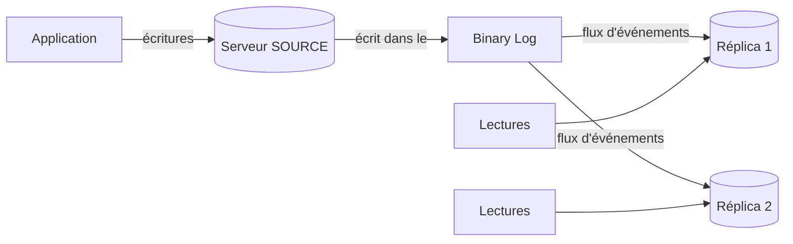

🔝 Retour au [Sommaire](/SOMMAIRE.md)

# Chapitre 13 — Réplication

> **Partie 6 : Réplication et Haute Disponibilité (DBA/DevOps)**  
> Version de référence : **MariaDB 12.3 LTS** (GA fin mai 2026, support jusqu'en juin 2029)

---

## Introduction

La **réplication** est le mécanisme par lequel les modifications appliquées sur un serveur MariaDB — le **serveur source** (historiquement appelé *master*) — sont propagées automatiquement vers un ou plusieurs autres serveurs : les **réplicas** (historiquement *slaves*). Chaque réplica rejoue le flux des changements reçus afin de maintenir une copie cohérente des données.

C'est l'une des briques les plus structurantes de tout déploiement MariaDB en production. Elle ne sert pas seulement à dupliquer des données : elle conditionne la **haute disponibilité**, la **répartition de la charge de lecture**, les **sauvegardes sans impact**, la **géo-distribution** et de nombreuses **stratégies de migration sans interruption de service**.

Ce chapitre pose les fondations de la réplication MariaDB, des concepts asynchrone/semi-synchrone jusqu'aux topologies avancées (multi-source, cascade), en passant par les GTID, le monitoring, le *failover* et les optimisations récentes de la série 12.x. Il prépare directement le **chapitre 14 (Haute Disponibilité)**, qui s'appuie sur ces mécanismes pour bâtir des architectures résilientes (Galera, MaxScale, *failover* automatique).

---

## Objectifs pédagogiques

À l'issue de ce chapitre, vous serez capable de :

- distinguer la réplication **asynchrone** de la réplication **semi-synchrone**, et choisir le mode adapté à vos contraintes de cohérence et de performance ;
- configurer une **topologie source-réplica** de bout en bout (activation du binlog côté source, paramétrage du réplica, établissement du lien de réplication) ;
- comprendre le positionnement par **coordonnées binlog** ainsi que les **GTID** (Global Transaction Identifier), et savoir lequel privilégier ;
- mettre en œuvre des topologies avancées : **multi-source** et **en cascade** ;
- **surveiller** l'état de la réplication, **mesurer et diagnostiquer le lag** (retard du réplica), et résoudre les erreurs les plus fréquentes ;
- réaliser un **failover** (basculement non planifié) ou un **switchover** (basculement contrôlé) en limitant l'indisponibilité ;
- tirer parti des **optimisations récentes** : réplication parallèle, *Optimistic ALTER TABLE* et gestion prévisible des tables temporaires.

---

## Prérequis

Avant d'aborder ce chapitre, il est recommandé d'être à l'aise avec :

- les **transactions et la concurrence** (chapitre 6) — la réplication s'appuie sur la notion de transaction et sur les propriétés ACID d'InnoDB ;
- les **binary logs** (chapitre 11.5) — le binlog est le journal qui alimente l'ensemble du flux de réplication ; sa configuration et ses formats (`STATEMENT`, `ROW`, `MIXED`) sont déterminants ;
- les bases de l'**administration et de la configuration** (chapitre 11) : fichiers `my.cnf`, variables système, gestion des logs.

---

## Pourquoi répliquer ?

La réplication répond à plusieurs besoins, souvent combinés :

| Objectif | Comment la réplication y répond |
|----------|----------------------------------|
| **Haute disponibilité** | Un réplica à jour peut être promu en cas de panne de la source (*failover*), réduisant fortement l'indisponibilité. |
| **Montée en charge en lecture** | Les requêtes de lecture sont réparties sur plusieurs réplicas, soulageant la source qui conserve les écritures. |
| **Sauvegardes sans impact** | Les sauvegardes (logiques ou physiques) peuvent être déléguées à un réplica dédié, sans pénaliser la production. |
| **Reporting et analytique** | Une charge OLAP/reporting peut être isolée sur un réplica, sans concurrencer la charge OLTP de la source. |
| **Géo-distribution** | Des réplicas situés dans différentes régions rapprochent les données des utilisateurs et servent de base à un plan de reprise. |
| **Migrations sans interruption** | La réplication permet de basculer progressivement vers une nouvelle version ou une nouvelle infrastructure (*zero-downtime*, cf. chapitre 19). |

> ⚠️ **À garder en tête :** la réplication n'est **pas** une sauvegarde. Une erreur logique (un `DELETE` ou un `DROP TABLE` accidentel) est répliquée fidèlement vers tous les réplicas. La réplication protège contre la **perte d'un serveur**, pas contre une **erreur humaine ou applicative** : elle se combine donc toujours avec une vraie stratégie de sauvegarde (chapitre 12).

---

## Concepts clés en un coup d'œil

Avant d'entrer dans le détail, quelques notions transversales à l'ensemble du chapitre.

### Le flux de base

Dans sa forme la plus simple, la réplication MariaDB suit le schéma suivant :

La source consigne chaque modification dans son **binary log**. Chaque réplica récupère ce flux d'événements, le stocke localement dans son **relay log**, puis l'applique sur ses propres données.

### Asynchrone vs semi-synchrone

- En réplication **asynchrone** (le défaut), la source valide une transaction sans attendre le moindre accusé de réception des réplicas. C'est le plus performant, mais un réplica peut accuser un retard (*lag*) et un *failover* peut entraîner une perte de transactions non encore propagées.
- En réplication **semi-synchrone**, la source attend qu'au moins un réplica ait **reçu** (et journalisé) la transaction avant de la confirmer au client. La fenêtre de perte se réduit, au prix d'une latence accrue. *(Détaillé en 13.1 et 13.9.)*

### Positionnement : coordonnées binlog vs GTID

Un réplica doit savoir « où il en est » dans le flux de la source. Deux approches coexistent :

- le **positionnement par coordonnées** (nom de fichier binlog + offset) : simple, mais fragile lors d'un changement de source ;
- le **GTID** (Global Transaction Identifier) : chaque transaction reçoit un identifiant global unique, ce qui rend les *failover* et les reconfigurations de topologie beaucoup plus robustes. Sous MariaDB, le GTID prend la forme `domaine-serveur-séquence` (par ex. `0-1-1000`), un format propre à MariaDB. *(Détaillé en 13.3 et 13.4.)*

### Note de terminologie : *Master/Slave* → *Source/Replica*

L'industrie a fait évoluer son vocabulaire de *master/slave* vers **source/replica** (ou *primary/replica*). MariaDB accompagne **partiellement** ce changement en proposant, pour plusieurs **commandes**, des alias dans le vocabulaire moderne :

| Ancien (toujours valide) | Alias *replica* (MariaDB) |
|--------------------------|---------------------------|
| `SHOW SLAVE STATUS` | `SHOW REPLICA STATUS` |
| `START SLAVE` / `STOP SLAVE` | `START REPLICA` / `STOP REPLICA` |
| `RESET SLAVE` | `RESET REPLICA` |

> ⚠️ **Exception importante.** La **configuration du lien reste `CHANGE MASTER TO`** (options `MASTER_*`). Contrairement à MySQL, MariaDB **ne dispose pas** de la commande `CHANGE REPLICATION SOURCE TO` (options `SOURCE_*`) : tentée sur MariaDB 12.3, elle renvoie une **erreur de syntaxe** (vérifié sur 12.3.2). De même, les **colonnes** renvoyées par `SHOW REPLICA STATUS` conservent leurs noms historiques (`Slave_IO_Running`, `Seconds_Behind_Master`…). Ce support emploie de préférence « source/réplica » dans le texte, tout en utilisant les **commandes réelles** de MariaDB.

---

## Plan du chapitre

- **13.1** — [Concepts de réplication : Asynchrone vs Semi-synchrone](01-concepts-replication.md)
- **13.2** — [Réplication Master-Slave (Source-Replica)](02-replication-master-slave.md)
  - 13.2.1 — [Configuration du Primary (binlog)](02.1-configuration-primary.md)
  - 13.2.2 — [Configuration du Replica](02.2-configuration-replica.md)
  - 13.2.3 — [CHANGE MASTER TO / CHANGE REPLICATION SOURCE](02.3-change-master-to.md)
- **13.3** — [Réplication basée sur les positions (binlog coordinates)](03-replication-positions.md)
- **13.4** — [GTID (Global Transaction Identifier)](04-gtid.md)
  - 13.4.1 — [Configuration GTID](04.1-configuration-gtid.md)
  - 13.4.2 — [Avantages pour failover](04.2-avantages-failover.md)
- **13.5** — [Réplication multi-source](05-replication-multi-source.md)
- **13.6** — [Réplication en cascade](06-replication-cascade.md)
- **13.7** — [Monitoring et troubleshooting](07-monitoring-troubleshooting.md)
  - 13.7.1 — [SHOW SLAVE STATUS / SHOW REPLICA STATUS](07.1-show-slave-status.md)
  - 13.7.2 — [Seconds_Behind_Master et lag](07.2-seconds-behind-master.md)
  - 13.7.3 — [Erreurs courantes et résolution](07.3-erreurs-courantes.md)
- **13.8** — [Failover et switchover](08-failover-switchover.md)
- **13.9** — [Réplication semi-synchrone](09-replication-semi-synchrone.md)
- **13.10** — [Optimistic ALTER TABLE pour réduction du lag](10-optimistic-alter-table.md)
- **13.11** — [Réplication parallèle entre clusters Galera](11-replication-parallele-galera.md) 🆕
- **13.12** — [Tables temporaires en réplication : prévisibilité](12-tables-temporaires-replication.md) 🆕

---

## Nouveautés 12.x à connaître pour ce chapitre 🆕

La série 12.x apporte plusieurs évolutions qui touchent directement la réplication :

- **Binlog réécrit et intégré à InnoDB** (cf. 11.5.4) : la suppression de la synchronisation entre le binlog et le moteur transactionnel améliore très nettement le débit en écriture. Comme tout le flux de réplication part du binlog, c'est une amélioration de fond pour les charges fortement transactionnelles.
- **Réplication parallèle entre clusters Galera** (13.11) : possibilité d'appliquer en parallèle les transactions entre clusters Galera reliés par réplication (`slave_parallel_threads`), pour réduire le lag inter-clusters.
- **Tables temporaires en réplication plus prévisibles** (13.12) : la variable `create_tmp_table_binlog_formats` rend le comportement de journalisation des tables temporaires plus déterministe.
- **Valeurs par défaut `MASTER_SSL_*` configurables** (13.2.3) : simplifie la mise en place d'une réplication chiffrée par défaut.

> 🔁 **Migration 11.8 → 12.3 :** la 11.8 LTS reste largement déployée et sert de point de comparaison tout au long de cette formation. Les changements de comportement de la 12.3 (binlog, variables retirées, etc.) sont récapitulés au chapitre 19.10 et dans l'annexe F.

---

## Pour aller plus loin

- **Chapitre 14 — [Haute Disponibilité](../14-haute-disponibilite/README.md)** : Galera Cluster, MaxScale et *failover* automatique, construits sur les fondations de ce chapitre.
- **Chapitre 12 — [Sauvegarde et Restauration](../12-sauvegarde-restauration/README.md)** : complément indispensable de la réplication.
- **Chapitre 19 — [Migration et Compatibilité](../19-migration-compatibilite/README.md)** : la réplication au service des migrations sans interruption de service.

⏭️ [Concepts de réplication : Asynchrone vs Semi-synchrone](/13-replication/01-concepts-replication.md)
