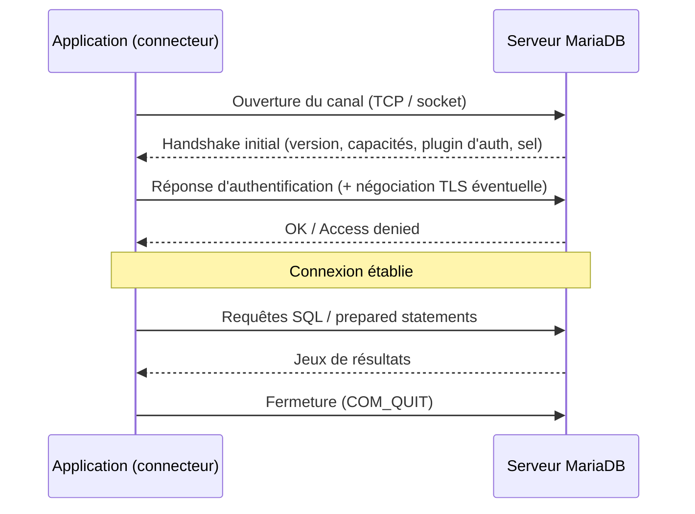

🔝 Retour au [Sommaire](/SOMMAIRE.md)

# 17.1 Connexion depuis différents langages

Quel que soit le langage employé, se connecter à MariaDB repose sur le **même protocole** et les **mêmes principes**. Avant de plonger dans les particularités de PHP, Python, Java, Node.js, Go ou .NET, cette section pose le socle commun : ce qu'est un connecteur, comment s'établit une connexion, quels paramètres la décrivent, et comment l'authentification, le chiffrement et le jeu de caractères entrent en jeu. Les sous-sections 17.1.1 à 17.1.6 s'appuieront ensuite sur ces notions sans les répéter.

---

## Le modèle client/serveur

MariaDB est un serveur : il écoute les connexions entrantes et répond aux requêtes. Une application n'accède jamais directement aux fichiers de données ; elle dialogue avec le serveur via un **protocole réseau**. Ce protocole est compatible avec le protocole client/serveur de MySQL (auquel MariaDB ajoute ses propres extensions), ce qui explique qu'un grand nombre de pilotes conçus à l'origine pour MySQL fonctionnent avec MariaDB.

Le rôle d'un **connecteur** (ou *pilote*, *driver*) est de masquer ce protocole derrière une API confortable dans le langage hôte. Concrètement, un connecteur :

- ouvre et maintient la connexion réseau (TCP, socket Unix, named pipe) ;
- mène la phase d'**authentification** (négociation du plugin, transmission des identifiants) ;
- met éventuellement en place le **chiffrement TLS** ;
- sérialise les requêtes SQL dans le format attendu par le serveur et désérialise les résultats ;
- expose des objets familiers : connexion, curseur ou *statement*, jeu de résultats.

---

## Anatomie d'une connexion

Tous les connecteurs réclament peu ou prou les mêmes informations. Les noms d'options varient (`host`/`server`, `user`/`uid`, `database`/`dbname`…), mais la sémantique est identique.

| Paramètre | Rôle | Valeur usuelle |
|-----------|------|----------------|
| **Hôte** | Adresse du serveur | `localhost`, `127.0.0.1`, ou un nom DNS |
| **Port** | Port d'écoute TCP | `3306` (défaut MariaDB) |
| **Utilisateur** | Compte de connexion | défini via `CREATE USER` (voir chap. 10) |
| **Mot de passe** | Secret d'authentification | — |
| **Base par défaut** | Schéma sélectionné à l'ouverture | optionnel, équivaut à un `USE` initial |
| **Jeu de caractères** | Encodage de la session | `utf8mb4` recommandé |
| **Socket** | Chemin du socket Unix | ex. `/run/mysqld/mysqld.sock` |
| **Options TLS** | Activation et paramètres du chiffrement | voir §10.7 |
| **Délai de connexion** | *Timeout* d'établissement | quelques secondes |

Beaucoup de connecteurs acceptent ces paramètres soit sous forme d'arguments nommés, soit condensés dans une **chaîne de connexion** (DSN, *connection string* ou URL). Ces deux formes sont équivalentes ; le choix dépend des conventions du langage et du framework.

> ⚠️ Une chaîne de connexion contient des secrets. Elle ne doit jamais être codée en dur ni versionnée : on la fournit via des variables d'environnement, un fichier de configuration hors dépôt, ou un gestionnaire de secrets.

---

## Modes de connexion

Trois canaux sont possibles selon la plateforme et la localisation du client :

- **TCP/IP** — le mode universel, utilisé dès que le client et le serveur ne sont pas sur la même machine. C'est aussi le seul mode pertinent en conteneur ou dans le cloud. Port `3306` par défaut.
- **Socket Unix** — disponible lorsque l'application tourne sur le même hôte que le serveur (Linux/macOS). Plus rapide et plus sûr que TCP en local, car il évite la pile réseau. La plupart des connecteurs y basculent automatiquement quand l'hôte vaut `localhost`.
- **Named pipe / mémoire partagée** — équivalents Windows du socket local, plus rarement employés.

---

## Le cycle de vie d'une connexion

L'établissement d'une connexion suit toujours la même chorégraphie : ouverture du canal, *handshake* d'authentification, puis échange de requêtes jusqu'à la fermeture.

Le point essentiel à retenir : **ouvrir une connexion coûte cher** (aller-retours réseau, authentification, éventuelle poignée de main TLS). On évite donc d'en ouvrir une par requête. La réponse à ce besoin — le **connection pooling** — fait l'objet de la section 17.2.

---

## Authentification

Le plugin d'authentification utilisé est défini côté serveur, par compte (chap. 10). Le connecteur doit savoir le gérer. Les principaux plugins rencontrés :

- **`mysql_native_password`** (§10.5.1) — historique, pris en charge par tous les connecteurs ; en recul pour des raisons de sécurité.
- **`ed25519`** (§10.5.2) — l'authentification moderne de MariaDB, bien supportée par les connecteurs MariaDB.
- **`caching_sha2_password`** (§10.5.5) — plugin par défaut de MySQL 8, désormais pris en charge par MariaDB 12.3. Il facilite la connexion des pilotes orientés MySQL.
- **PARSEC** (§10.6) — plugin récent propre à MariaDB ; sa prise en charge dépend de la version du connecteur.
- **PAM / LDAP** (§10.5.3) et **GSSAPI/Kerberos** (§10.5.4) — pour l'intégration à un annuaire d'entreprise.

> 💡 La règle pratique : associez un plugin moderne à un connecteur récent. Un pilote ancien peut ne pas connaître `ed25519`, `caching_sha2_password` ou PARSEC et échouer à la connexion avec une erreur d'authentification peu explicite.

---

## Connexions chiffrées (TLS)

En production, le trafic entre l'application et le serveur doit être chiffré pour protéger identifiants et données en transit. Depuis MariaDB 11.8, le serveur active un **TLS « zéro-configuration »** : un certificat auto-signé est généré au premier démarrage, si bien qu'une connexion peut être chiffrée sans paramétrage manuel (voir §10.7.3). Les connecteurs exposent des options pour activer TLS, vérifier le certificat du serveur, fournir des certificats clients (authentification mutuelle) ou imposer une version minimale du protocole. La configuration détaillée — certificats, autorité de certification, clés protégées par passphrase — est traitée au §10.7.

---

## Jeu de caractères et fuseau horaire

Deux réglages de session, faciles à oublier, évitent des bugs classiques :

- **Jeu de caractères** — toujours travailler en `utf8mb4`, qui couvre l'intégralité d'Unicode (émojis compris). Depuis la 11.8, c'est le charset par défaut du serveur, avec les collations UCA 14.0.0 (voir §11.11) ; on s'assure néanmoins que le connecteur ouvre bien la session en `utf8mb4` pour éviter tout encodage hérité.
- **Fuseau horaire** — la session peut différer du fuseau du serveur. Pour des applications distribuées, il est souvent plus sûr de raisonner en UTC côté serveur et de gérer l'affichage local côté application.

---

## Deux grandes familles de connecteurs

Sur le plan technique, les connecteurs se répartissent en deux familles, ce qui a des conséquences concrètes sur le déploiement :

- **Implémentations natives au langage** — écrites entièrement dans le langage hôte (pur Java, pur Go, pur JavaScript, pur C#, ou pur Python). Aucune dépendance externe à compiler : le déploiement est simple et portable. C'est le modèle dominant pour Java (Connector/J), Go (`go-sql-driver/mysql`), Node.js (`mariadb`, `mysql2`) et .NET (`MySqlConnector`).
- **Liaisons sur une bibliothèque C** — le connecteur s'appuie sur une bibliothèque cliente compilée, principalement **MariaDB Connector/C (`libmariadb`)** (ou, côté PHP, `mysqlnd`). Ces liaisons peuvent être très performantes et suivre au plus près les fonctionnalités du serveur, mais imposent la présence de la bibliothèque native. On les retrouve dans certaines options PHP et Python.

Comprendre à quelle famille appartient un connecteur aide à anticiper ses contraintes d'installation (présence d'un compilateur ou d'une lib système) et son support des fonctionnalités récentes du serveur.

---

## Les langages couverts dans cette section

Les sous-sections qui suivent déclinent ces principes communs sur les écosystèmes les plus répandus. Pour chacun, on présente les connecteurs de référence et leur configuration.

| Sous-section | Langage | Connecteurs présentés |
|--------------|---------|------------------------|
| [17.1.1](01.1-php-mysqli-pdo.md) | **PHP** | mysqli, PDO |
| [17.1.2](01.2-python-connectors.md) | **Python** | mysql-connector, PyMySQL, SQLAlchemy |
| [17.1.3](01.3-java-jdbc.md) | **Java** | JDBC, MariaDB Connector/J |
| [17.1.4](01.4-nodejs-connectors.md) | **Node.js** | mysql2, mariadb |
| [17.1.5](01.5-go-connector.md) | **Go** | go-sql-driver/mysql |
| [17.1.6](01.6-dotnet-connectors.md) | **.NET** | MySqlConnector, MySql.Data, ADO.NET |

---

## Ce qu'il faut retenir

- Tous les connecteurs parlent le même protocole compatible MySQL/MariaDB ; ils ne diffèrent que par leur API et leur mode d'installation.
- Une connexion se décrit par un petit ensemble de paramètres stables (hôte, port, utilisateur, base, charset, TLS), exprimés en arguments ou en chaîne de connexion — jamais codés en dur.
- Ouvrir une connexion est coûteux : ce constat motive le *pooling* (§17.2).
- Le plugin d'authentification et les options TLS doivent être cohérents entre le serveur (chap. 10) et un connecteur suffisamment récent.
- Travailler systématiquement en `utf8mb4` prévient les problèmes d'encodage.

⏭️ [PHP : mysqli et PDO](/17-integration-developpement/01.1-php-mysqli-pdo.md)
