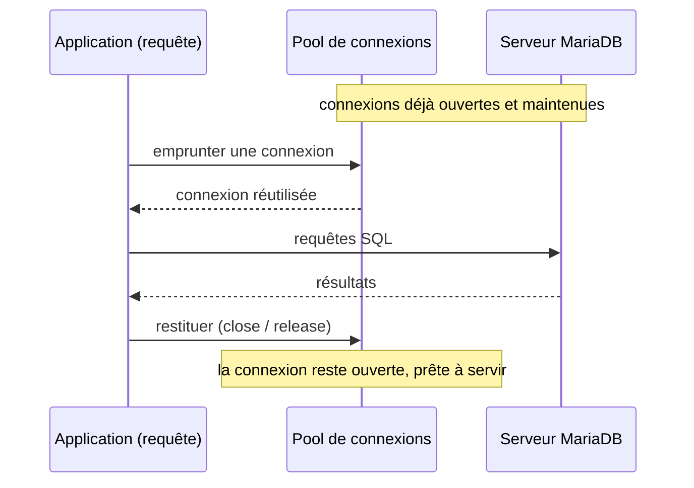

🔝 Retour au [Sommaire](/SOMMAIRE.md)

# 17.2 Connection pooling

Toutes les sections sur les connecteurs (§17.1) ont convergé vers le même constat : **ouvrir une connexion coûte cher**. Établir un canal TCP, mener l'authentification, négocier éventuellement TLS — autant d'allers-retours réseau et de calculs qui se chiffrent en millisecondes. À l'échelle d'une seule requête, c'est négligeable ; sous une charge de centaines ou de milliers de requêtes par seconde, ouvrir et fermer une connexion à chaque fois devient intenable, tant pour l'application que pour le serveur. Le **pool de connexions** est la réponse standard à ce problème.

Cette section pose les principes communs. Les deux grandes manières de mettre en œuvre un pool sont ensuite détaillées : **côté application** (§17.2.1) et via un **proxy externe** comme ProxySQL (§17.2.2).

---

## Qu'est-ce qu'un pool de connexions ?

Un pool est un **ensemble de connexions déjà ouvertes et maintenues**, que l'application emprunte puis restitue. Plutôt que de créer une connexion à chaque requête, le code en **emprunte** une au pool, l'utilise, puis la **rend**. La connexion n'est alors pas détruite : elle reste ouverte, disponible pour la prochaine demande.

C'est précisément pourquoi, dans les sections précédentes, on a insisté sur le fait que `close()` / `release()` **rend la connexion au pool** plutôt que de la fermer physiquement. Le coût d'établissement n'est payé qu'une fois par connexion, puis amorti sur des milliers de requêtes.

Le pool apporte aussi une **limite** : il borne le nombre de connexions simultanées, protégeant le serveur d'une surcharge incontrôlée lors des pics de trafic. Quand toutes les connexions sont occupées, les demandes supplémentaires patientent (jusqu'à un délai) au lieu d'ouvrir indéfiniment de nouvelles connexions.

---

## Les paramètres essentiels

Quel que soit l'outil, un pool s'ajuste autour des mêmes leviers :

| Paramètre | Rôle | Conséquence d'un mauvais réglage |
|-----------|------|----------------------------------|
| **Taille maximale** | Nombre max de connexions simultanées | Trop haut : sature le serveur ; trop bas : files d'attente, latence |
| **Connexions inactives / taille min** | Connexions maintenues au repos | Trop haut : gaspillage de ressources ; trop bas : latence à la montée en charge |
| **Délai d'acquisition** | Attente max quand le pool est saturé | Trop court : erreurs prématurées ; trop long : requêtes figées |
| **Durée d'inactivité** (*idle timeout*) | Ferme les connexions trop longtemps inutilisées | Connexions inactives qui s'accumulent |
| **Durée de vie maximale** (*max lifetime*) | Recycle périodiquement chaque connexion | Sans elle : risque de connexions périmées |
| **Validation / *pre-ping*** | Teste la santé d'une connexion avant de la prêter | Sans elle : risque de prêter une connexion morte |

---

## Dimensionner le pool : plus gros n'est pas mieux

L'erreur la plus répandue consiste à régler une taille de pool énorme « pour être tranquille ». C'est contre-productif. Au-delà d'un certain point, ajouter des connexions ne fait qu'augmenter la contention sur le serveur (verrous, planification des threads, mémoire) sans améliorer le débit, et peut le dégrader.

Le bon réflexe est de dimensionner le pool selon la **capacité du serveur à effectuer du travail en parallèle**, et non selon le nombre de threads de l'application. Une heuristique de départ souvent citée situe la taille utile à l'ordre de **(2 × nombre de cœurs) + nombre de disques** — un point de départ à valider par la mesure (§17.6, chap. 15), jamais une vérité absolue.

Surtout, la **somme des connexions de tous les pools** (toutes les instances applicatives confondues) doit rester sous la limite du serveur, abordée ci-dessous.

---

## Le lien avec le serveur : `max_connections`

Côté MariaDB, la variable **`max_connections`** plafonne le nombre de connexions clientes simultanées (administration au chap. 11). Chaque connexion consomme des ressources serveur : un thread et plusieurs tampons par session (tri, jointure, lecture…). Un `max_connections` très élevé associé à de gros tampons par session peut épuiser la mémoire du serveur.

Deux règles en découlent :

- la somme des tailles maximales de tous les pools doit rester **en deçà de `max_connections`**, en gardant une marge pour les connexions d'administration et de supervision (sans quoi un DBA peut se retrouver incapable de se connecter à un serveur saturé) ;
- mieux vaut un petit nombre de connexions bien utilisées qu'un grand nombre de connexions majoritairement inactives.

---

## Pooling ≠ Thread Pool

Une confusion fréquente mérite d'être levée : le **pool de connexions** et le **Thread Pool** de MariaDB sont deux mécanismes distincts et complémentaires.

- Le **pool de connexions** est **côté client** : il réutilise les connexions ouvertes entre l'application et le serveur, et fait l'objet de cette section.
- Le **Thread Pool** est une fonctionnalité **côté serveur** (§11.10, §18.8) : il découple les connexions des threads d'exécution, de sorte qu'un grand nombre de connexions n'impose pas un nombre équivalent de threads système.

Les deux peuvent — et doivent souvent — coexister : le pool client limite et réutilise les connexions, tandis que le Thread Pool serveur gère efficacement leur exécution.

---

## Où placer le pool ?

Le pool peut résider à deux endroits, traités dans les sous-sections suivantes :

- **Côté application** (§17.2.1) — le pool est intégré au pilote ou à la bibliothèque applicative : HikariCP en Java, le pool intégré de `database/sql` en Go, le *pooling* natif d'ADO.NET en .NET, les pools de mysql2 / du connecteur `mariadb` en Node.js, ou le pool de SQLAlchemy en Python. C'est l'approche la plus courante et la plus simple à mettre en place.
- **Via un proxy externe** (§17.2.2) — un intermédiaire tel que **ProxySQL** (ou MaxScale, chap. 14) maintient le pool entre lui et le serveur, et le partage entre de multiples clients. Cette approche prend tout son sens lorsque de **nombreuses instances** applicatives se connectent (microservices, fonctions *serverless* à durée de vie courte), où des pools applicatifs indépendants multiplieraient les connexions au serveur.

Les deux ne s'excluent pas : on rencontre des architectures combinant un pool applicatif modeste et un *pooler* central.

---

## Pièges courants

- **Fuites de connexions** — une connexion empruntée mais jamais restituée (oubli de `close`/`release`, exception non gérée) reste indéfiniment occupée. Quelques fuites suffisent à épuiser le pool. D'où l'importance des mécanismes de fermeture automatique (`try-with-resources`, `using`, `defer`, gestionnaires de contexte) vus au §17.1.
- **Sur-dimensionnement** — un pool trop grand dégrade le serveur sans gain de débit (voir plus haut).
- **Connexions périmées** — un pare-feu ou le serveur (variable `wait_timeout`) peut fermer une connexion restée inactive. Si le pool la prête sans la vérifier, la requête échoue. La **durée de vie maximale** et la **validation/*pre-ping*** préviennent ce cas.
- **Saturation sous charge** — quand le pic dépasse durablement la capacité du pool, les requêtes s'accumulent en file. Mieux vaut une erreur rapide (délai d'acquisition court) et une mise à l'échelle maîtrisée qu'un empilement silencieux qui fige l'application.

---

## Ce qu'il faut retenir

- Le *pooling* amortit le **coût élevé** d'ouverture des connexions en les réutilisant ; `close`/`release` **rend** la connexion, ne la détruit pas.
- Les leviers communs : taille max, connexions inactives, délai d'acquisition, durée d'inactivité, **durée de vie maximale** et **validation**.
- **Dimensionner petit et juste** : selon la capacité du serveur, pas le nombre de threads applicatifs ; somme des pools **sous `max_connections`**, avec une marge d'administration.
- Ne pas confondre **pool de connexions** (client, cette section) et **Thread Pool** (serveur, §11.10/§18.8) — ils sont complémentaires.
- Deux emplacements : **côté application** (§17.2.1) et **via un proxy** comme ProxySQL (§17.2.2).
- Surveiller les **fuites**, les **connexions périmées** et la **saturation** : fermeture automatique, validation, délais courts.

⏭️ [Pool côté application](/17-integration-developpement/02.1-pool-application.md)
