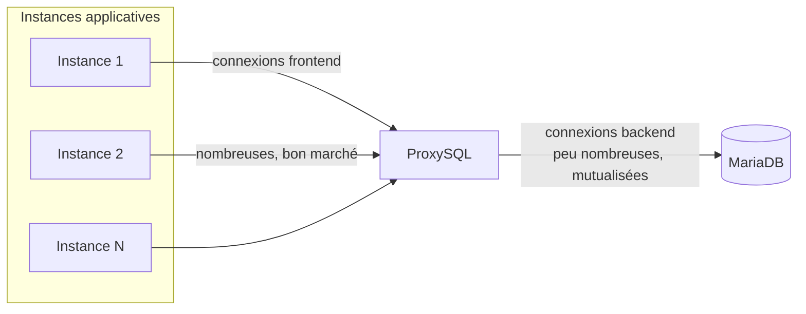

🔝 Retour au [Sommaire](/SOMMAIRE.md)

# 17.2.2 ProxySQL comme pooler

Le §17.2.1 s'est conclu sur la limite du pool applicatif : **chaque instance possède son propre pool**, et le total des connexions au serveur croît avec le nombre d'instances. **ProxySQL** apporte la réponse classique à ce problème. C'est un proxy haute performance qui s'intercale entre l'application et MariaDB, et qui **parle le protocole MySQL/MariaDB** : les applications s'y connectent comme s'il s'agissait d'un serveur MariaDB, sans changer de connecteur ni de code — il suffit de pointer l'hôte et le port (cf. §17.1) vers ProxySQL.

ProxySQL fait bien plus que du *pooling* (routage, séparation lecture/écriture, cache de requêtes, pare-feu). Ces aspects relèvent de la haute disponibilité et sont traités au chap. 14 (notamment §14.9). Cette section se concentre sur son rôle de **pooler**.

---

## Le principe : le multiplexage de connexions

La fonctionnalité clé pour notre usage est le **multiplexage** (*connection multiplexing*). ProxySQL distingue deux types de connexions :

- les **connexions *frontend*** — entre les instances applicatives et ProxySQL. Elles peuvent être très nombreuses ;
- les **connexions *backend*** — entre ProxySQL et MariaDB. Elles sont **mutualisées et maintenues en petit nombre**.

ProxySQL n'attribue une connexion *backend* à une connexion *frontend* que **le temps d'une requête (ou d'une transaction)**, puis la rend au pool. Une connexion *backend* sert ainsi successivement de nombreux clients. Résultat : on **découple le nombre de connexions clientes du nombre de connexions serveur**. Des milliers de connexions *frontend* peuvent être servies par quelques dizaines de connexions *backend*.



C'est exactement ce qui manque au pool applicatif : un point central qui **plafonne** les connexions réellement ouvertes vers le serveur, indépendamment du nombre d'instances.

---

## Pourquoi un pooler externe ?

ProxySQL en tant que pooler prend tout son sens dans plusieurs situations :

- **Fonctions *serverless* (FaaS)** — des fonctions à durée de vie très courte ne peuvent pas entretenir un pool persistant ; ProxySQL, lui, conserve le pool *backend* de façon durable, en amont des fonctions.
- **PHP** — le modèle par requête (§17.2.1) ne fournit pas de vrai pool ; ProxySQL apporte le *pooling* que PHP n'a pas nativement.
- **Microservices à grande échelle** et ***autoscaling*** — quand des dizaines ou centaines d'instances ouvriraient chacune leur pool, ProxySQL ramène le total des connexions *backend* sous `max_connections`.

---

## La limite du multiplexage : l'affinité de session

Point essentiel à comprendre pour ne pas surestimer le gain : le multiplexage **n'est pas toujours actif**. Dès qu'une connexion *frontend* entre dans un état qui exige une continuité, ProxySQL **épingle** (réserve) une connexion *backend* pour elle jusqu'à ce que cet état soit levé. C'est le cas notamment :

- pendant une **transaction** ouverte ;
- en présence de **variables utilisateur** (`@variable`) ou de `SET` modifiant l'état de session ;
- avec des **tables temporaires**, `LOCK TABLES`, ou des verrous utilisateur (`GET_LOCK`) ;
- dans certains cas liés aux ***prepared statements*** (la prise en charge s'est améliorée, mais peut influer sur le multiplexage).

La conséquence pratique : le multiplexage donne son **plein rendement sur des requêtes sans état, en autocommit**. Une application qui maintient de longues transactions ou s'appuie fortement sur l'état de session bénéficiera moins du partage des connexions *backend*. Concevoir des accès courts et sans état maximise l'efficacité du pooler.

---

## Configuration (vue d'ensemble)

ProxySQL se configure via une **interface d'administration** accessible par le protocole MySQL (port `6032` par défaut ; le trafic applicatif passe par `6033`). La configuration est stockée dans des tables (SQLite) — `mysql_servers`, `mysql_users`, `global_variables`, `mysql_query_rules` — et s'applique **à chaud** grâce à un système de couches *mémoire → runtime → disque*.

À titre d'illustration, les réglages liés au *pooling* :

```sql
-- Sur l'interface d'administration (port 6032)

-- Serveur MariaDB, avec plafond de connexions backend (= taille du pool)
INSERT INTO mysql_servers (hostgroup_id, hostname, port, max_connections)
VALUES (0, '10.0.0.10', 3306, 50);

-- Utilisateur applicatif
INSERT INTO mysql_users (username, password, default_hostgroup)
VALUES ('app_user', '...', 0);

-- Variables de pooling
UPDATE global_variables SET variable_value='2000'
    WHERE variable_name='mysql-max_connections';        -- connexions frontend acceptées
UPDATE global_variables SET variable_value='true'
    WHERE variable_name='mysql-multiplexing';            -- multiplexage actif (défaut)
UPDATE global_variables SET variable_value='900000'
    WHERE variable_name='mysql-connection_max_age_ms';   -- recyclage des connexions backend

-- Appliquer puis persister
LOAD MYSQL SERVERS TO RUNTIME;   SAVE MYSQL SERVERS TO DISK;
LOAD MYSQL USERS TO RUNTIME;     SAVE MYSQL USERS TO DISK;
LOAD MYSQL VARIABLES TO RUNTIME; SAVE MYSQL VARIABLES TO DISK;
```

L'idée tient dans le contraste de cet exemple : ProxySQL peut accepter jusqu'à **2000 connexions *frontend*** tout en n'ouvrant **au plus 50 connexions *backend*** vers MariaDB. C'est précisément ce plafonnement qui protège `max_connections` (§17.2). Le `mysql-connection_max_age_ms` joue le rôle de durée de vie maximale côté *backend* (à caler sous le `wait_timeout` du serveur, comme pour un pool applicatif).

---

## Déploiement : sidecar ou tier central

Deux topologies dominent :

- **En *sidecar*** — une instance de ProxySQL par hôte ou par *pod* applicatif (fréquent sous Kubernetes). L'application dialogue avec un ProxySQL **local** (latence minimale), qui se connecte aux *backends*. Cela multiplie les instances de ProxySQL, mais chacune reste légère et proche de l'application.
- **En *tier* central** — des nœuds ProxySQL dédiés, généralement en paire pour la disponibilité. La mutualisation est maximale, au prix d'un saut réseau supplémentaire et d'un composant qui devient critique : il doit alors être lui-même hautement disponible (chap. 14).

---

## Superviser le pooling

ProxySQL expose des tables de statistiques qui permettent d'observer l'efficacité du pool. La plus utile ici, **`stats_mysql_connection_pool`**, indique par serveur *backend* les connexions utilisées (`ConnUsed`), libres (`ConnFree`), établies avec succès (`ConnOK`) ou en erreur (`ConnERR`), ainsi que le volume de requêtes. Surveiller le rapport entre connexions *frontend* et *backend* confirme le bénéfice du multiplexage. Ces métriques s'intègrent à la supervision applicative (§17.6) et à l'observabilité globale (chap. 16).

---

## ProxySQL ou pool applicatif ?

Les deux approches ne s'opposent pas frontalement :

- le **pool applicatif** (§17.2.1) reste le choix par défaut : simple, local, sans infrastructure, suffisant pour un monolithe ou un nombre modéré d'instances ;
- **ProxySQL** s'impose quand les instances se multiplient, en *serverless*, en PHP, ou lorsqu'on veut **borner globalement** les connexions *backend* et profiter des fonctions additionnelles (routage, cache, pare-feu — chap. 14) ;
- on rencontre aussi des architectures **combinées** : de petits pools applicatifs en amont d'un ProxySQL central.

Pour mémoire, ProxySQL n'est pas la seule option : **MaxScale**, le proxy de MariaDB (§14.4, §14.5), assure également du *pooling*, tandis que **HAProxy** opère au niveau TCP (niveau 4) sans connaissance du protocole et donc sans multiplexage (§14.9).

---

## Ce qu'il faut retenir

- ProxySQL est un proxy parlant le protocole MariaDB : les applications s'y connectent **sans changement de code** (§17.1), via les connecteurs habituels.
- Son **multiplexage** découple les connexions clientes des connexions serveur : des milliers de connexions *frontend* pour quelques dizaines de connexions *backend*, ce qui **plafonne** la charge sur `max_connections`.
- Cas d'usage privilégiés : ***serverless***, **PHP**, **microservices à grande échelle**.
- Limite majeure : le multiplexage est **suspendu** en cas d'état de session (transaction, `@variables`, tables temporaires, verrous…) — il rend le plus sur des **accès courts en autocommit**.
- Configuration **à chaud** via l'admin (port 6032) ; le `max_connections` du *backend* fixe la taille du pool, à recycler sous le `wait_timeout` serveur.
- Déploiement en ***sidecar*** ou en ***tier* central** (à rendre HA) ; supervision via `stats_mysql_connection_pool`.
- Complémentaire du pool applicatif ; alternatives **MaxScale** et **HAProxy** au chap. 14.

⏭️ [ORM et frameworks](/17-integration-developpement/03-orm-frameworks.md)
