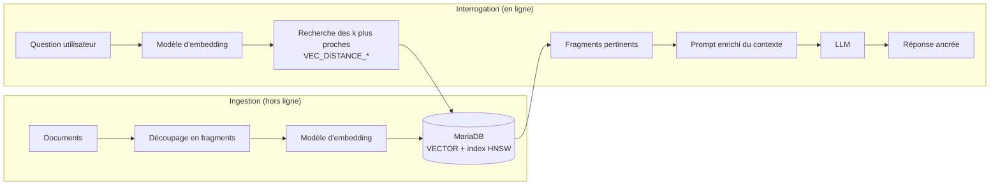

🔝 Retour au [Sommaire](/SOMMAIRE.md)

[← Retour au chapitre 18](README.md)

# 18.10 MariaDB Vector : Recherche vectorielle pour l'IA/RAG

> **Version de référence** : MariaDB 12.3 LTS — fonctionnalité native du serveur, GA depuis la 11.8 LTS.

MariaDB Vector est la fonctionnalité qui transforme MariaDB en *base de données vectorielle relationnelle* : elle permet de stocker des **vecteurs** (les *embeddings* produits par des modèles d'IA) directement dans des tables, puis d'y effectuer des recherches de similarité performantes. Concrètement, on cesse de raisonner uniquement en termes d'égalité ou de correspondance de mots-clés (« trouve les lignes où `nom = 'X'` ») pour pouvoir poser des questions de *sens* : « trouve les documents qui parlent du même sujet », « trouve les produits visuellement proches », « trouve les questions formulées différemment mais qui veulent dire la même chose ».

Cette capacité est au cœur des applications d'IA modernes — recherche sémantique, moteurs de recommandation, détection d'anomalies et surtout le **RAG** (*Retrieval-Augmented Generation*), que nous détaillons plus bas.

## Pourquoi la recherche vectorielle ?

Les outils SQL classiques (`WHERE col = …`, `LIKE`, voire les index `FULLTEXT`) répondent très bien à des recherches *exactes* ou *lexicales* : ils retrouvent des lignes qui contiennent précisément une valeur ou un mot. Mais ils sont aveugles au **sens**. Pour une recherche `FULLTEXT`, « voiture » et « automobile » sont deux mots sans rapport, et « comment réinitialiser mon mot de passe ? » ne ressemble en rien à « j'ai oublié mes identifiants ».

La recherche vectorielle résout ce problème en s'appuyant sur les modèles d'IA. Un modèle transforme un contenu (texte, image, audio…) en un **vecteur** : une représentation numérique de sa signification. La propriété clé est que **deux contenus proches par le sens produisent deux vecteurs proches dans l'espace**. Rechercher revient alors à un problème géométrique : trouver les vecteurs *les plus proches* d'un vecteur de requête.

## Qu'est-ce qu'un vecteur (embedding) ?

Un *embedding* (ou plongement vectoriel) est une liste ordonnée de nombres à virgule flottante — typiquement de quelques centaines à quelques milliers de dimensions selon le modèle (par exemple 384, 768 ou 1536). On peut le voir comme l'« empreinte numérique » du sens d'un contenu : chaque dimension capture une facette apprise par le modèle.

Deux points sont essentiels à retenir dès maintenant :

- La **distance** entre deux vecteurs mesure leur *dissemblance* sémantique : plus elle est faible, plus les contenus se ressemblent.
- Le **même modèle d'embedding** doit être utilisé à l'indexation et à la recherche. Des vecteurs produits par des modèles différents (ou de dimensions différentes) ne sont pas comparables entre eux.

MariaDB ne *fabrique* pas ces vecteurs : il les **stocke** et les **recherche**. La génération des embeddings reste à la charge d'un modèle externe (voir §18.10.6).

## Recherche du plus proche voisin (k-NN et ANN)

L'opération fondamentale est la recherche des *k plus proches voisins* (*k-Nearest Neighbors*) : étant donné un vecteur de requête, on veut les **k** vecteurs stockés les plus proches selon une fonction de distance (euclidienne ou cosinus, voir §18.10.3).

Effectuée de façon *exacte*, cette recherche oblige à comparer la requête à **toutes** les lignes de la table : un coût linéaire `O(n)` qui ne passe pas à l'échelle sur des millions de vecteurs. La solution consiste à accepter une approximation — la recherche **ANN** (*Approximate Nearest Neighbor*) — à l'aide d'un index spécialisé. MariaDB implémente pour cela une version modifiée de l'algorithme **HNSW** (*Hierarchical Navigable Small Worlds*), qui offre un excellent compromis vitesse/précision, ajustable par configuration (§18.10.2).

## Le RAG en bref

Le **RAG** (*Retrieval-Augmented Generation*) est le cas d'usage emblématique de MariaDB Vector. Il répond à deux limites bien connues des grands modèles de langage (LLM) : ils *hallucinent* (produisent des réponses plausibles mais fausses) et ils ne connaissent ni vos données privées ni les informations postérieures à leur entraînement.

Le principe : plutôt que d'interroger le LLM « à froid », on lui **fournit le contexte pertinent** extrait de vos propres données, puis on lui demande de répondre *en s'appuyant sur ce contexte*. La recherche vectorielle est précisément la pièce qui permet de retrouver ce contexte par le sens.

Le flux se décompose en deux temps :

1. **Ingestion (hors ligne)** : on découpe les documents en fragments (*chunks*), on les transforme en vecteurs via un modèle d'embedding, puis on les stocke dans MariaDB avec leur texte d'origine.
2. **Interrogation (en ligne)** : la question de l'utilisateur est elle-même vectorisée ; MariaDB renvoie les fragments les plus proches (recherche ANN) ; ceux-ci sont injectés dans le *prompt* du LLM, qui produit une réponse ancrée dans vos données.

D'autres usages reposent sur la même mécanique : recherche sémantique, recommandation, recherche d'images ou de documents similaires, détection d'anomalies. Ils sont développés au chapitre 20 (§20.9 à §20.11).

## L'approche MariaDB : le vecteur dans la base relationnelle

La spécificité de MariaDB tient à un choix d'architecture : le type `VECTOR` et l'index vectoriel sont **intégrés nativement** au moteur, présents dans toutes les distributions du serveur. Ce **n'est pas un greffon** (à la différence de `pgvector`, qui est une extension de PostgreSQL) ni un système séparé (à la différence des bases vectorielles dédiées comme Pinecone, Milvus, Qdrant ou Weaviate).

Ce choix a des conséquences pratiques importantes :

- **Recherche hybride** : on combine, dans **une seule requête SQL**, la similarité vectorielle et les filtres relationnels habituels (`WHERE`, jointures, agrégats). On peut par exemple chercher « les produits les plus proches de celui-ci, *en stock* et *à moins de 50 €* » — une requête impossible à exprimer simplement lorsque vecteurs et données métier vivent dans deux systèmes distincts.
- **Un seul système à exploiter** : pas de base vectorielle annexe à déployer, sécuriser, sauvegarder et tenir synchronisée avec la base principale. La complexité opérationnelle et les coûts diminuent d'autant.
- **Garanties transactionnelles** : les vecteurs bénéficient des propriétés ACID, des transactions, de tous les niveaux d'isolation et des accès concurrents lecture/écriture, comme n'importe quelle donnée InnoDB.
- **Réutilisation de l'existant** : pilotes, ORM, réplication, haute disponibilité (Galera), sauvegardes et compétences SQL s'appliquent tels quels.

Enfin, MariaDB Vector est **agnostique vis-à-vis du modèle d'IA** : vous pouvez y stocker les embeddings produits par OpenAI, Anthropic (Claude), des modèles ouverts type LLaMA ou tout autre fournisseur. Le LLM et le modèle d'embedding restent externes et interchangeables (§18.10.6).

## Disponibilité et versions

MariaDB Vector a suivi une montée en maturité rapide :

| Étape | Version | Période | Statut |
|-------|---------|---------|--------|
| Aperçu développeur | branche de préversion | 2024 | expérimental |
| Arrivée dans le serveur | 11.7 (rolling) | début 2025 | fonctionnel |
| **Première LTS avec Vector** | **11.8 LTS** | juin 2025 | **GA** |
| **Socle de cette formation** | **12.3 LTS** | mai 2026 | **mature + optimisations** |

Autrement dit, dans la 12.3, MariaDB Vector n'est plus une nouveauté à proprement parler : c'est une fonctionnalité **stable et standard**, héritée de la 11.8 LTS. La 12.3 y ajoute en revanche des **optimisations de performance** notables — calcul de distance par extrapolation et rapprochement du calcul au niveau du moteur de stockage — détaillées en **§18.10.7** (et côté tuning au §15.16).

Le réglage fin de l'index s'appuie par ailleurs sur une petite famille de variables système préfixées `mhnsw_` (le « m » se lit *MariaDB* ou *Modified* HNSW, au choix), que nous présenterons avec l'index en §18.10.2.

## Les briques de MariaDB Vector

Les sous-sections qui suivent décomposent la fonctionnalité, de la définition des données jusqu'à l'intégration avec les modèles d'IA :

| Section | Sujet | En bref |
|---------|-------|---------|
| [§18.10.1](10.1-type-donnees-vector.md) | Type de données `VECTOR` | Déclarer et stocker des embeddings |
| [§18.10.2](10.2-index-hnsw.md) | Index HNSW | Rendre la recherche ANN rapide à grande échelle |
| [§18.10.3](10.3-fonctions-distance.md) | Fonctions de distance | `VEC_DISTANCE_EUCLIDEAN`, `VEC_DISTANCE_COSINE` |
| [§18.10.4](10.4-fonctions-conversion.md) | Fonctions de conversion | `VEC_FromText`, `VEC_ToText` (texte ↔ binaire) |
| [§18.10.5](10.5-optimisations-simd.md) | Optimisations SIMD | AVX2, AVX-512, ARM, IBM Power10 |
| [§18.10.6](10.6-integration-llms.md) | Intégration avec les LLM | OpenAI, Claude, LLaMA… |
| [§18.10.7](10.7-optimisations-12-3.md) | Optimisations 12.3 | Distance par extrapolation, calcul au niveau du moteur |

## À retenir

- MariaDB Vector fait de MariaDB une base **relationnelle *et* vectorielle**, sans système ni greffon supplémentaire.
- Il **stocke** des *embeddings* et **recherche** les plus proches voisins par une distance (euclidienne ou cosinus), via un index **HNSW** modifié pour une recherche **approximative** (ANN) rapide.
- Son intérêt majeur est la **recherche hybride** : croiser similarité sémantique et SQL classique dans une même requête, avec toutes les garanties ACID.
- Le cas d'usage phare est le **RAG**, qui ancre les réponses d'un LLM dans vos propres données.
- La fonctionnalité est **GA depuis la 11.8 LTS** et constitue désormais un acquis **standard et optimisé en 12.3 LTS**.

⏭️ [Type de données VECTOR](/18-fonctionnalites-avancees/10.1-type-donnees-vector.md)
