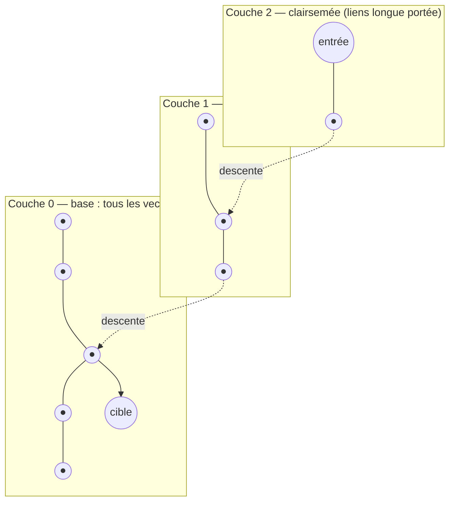

🔝 Retour au [Sommaire](/SOMMAIRE.md)

[← Retour au chapitre 18](README.md) · [↑ Section 18.10](10-mariadb-vector.md)

# 18.10.2 Index HNSW (Hierarchical Navigable Small Worlds)

> **Version** : disponible depuis MariaDB 11.7, GA en 11.8 LTS, standard en 12.3 LTS (optimisations Vector en 12.3, §18.10.7).

Le type `VECTOR` stocke les embeddings (§18.10.1) ; l'**index HNSW** est ce qui rend leur recherche rapide. Sans index, retrouver les *k* plus proches voisins d'un vecteur impose de calculer la distance avec **toutes** les lignes de la table — un balayage complet de coût `O(n)`, rédhibitoire sur des millions de vecteurs. L'index vectoriel de MariaDB s'appuie sur l'algorithme HNSW pour résoudre ce problème de façon *approximative* (ANN, *Approximate Nearest Neighbor*) mais très performante.

## Le principe de HNSW

HNSW (*Hierarchical Navigable Small Worlds*, « petits mondes navigables hiérarchiques ») est un index fondé sur un **graphe à plusieurs couches** :

- Chaque vecteur est un **nœud** relié à ses voisins les plus proches par des **arêtes**.
- Les nœuds sont répartis en couches empilées. La couche du bas (couche 0) contient **tous** les vecteurs et est densément connectée ; les couches supérieures, de plus en plus **clairsemées**, ne contiennent qu'un sous-ensemble de nœuds et servent de « raccourcis » longue distance — c'est la propriété de *petit monde* : peu de sauts suffisent pour traverser tout le graphe.

La recherche procède **de haut en bas** : on part d'un point d'entrée dans la couche supérieure, on se déplace de proche en proche (algorithme glouton) vers le nœud le plus proche du vecteur recherché, puis on descend d'une couche et on recommence, jusqu'à affiner le résultat dans la couche 0.



Cette navigation évite de comparer la requête à l'ensemble des vecteurs : sa complexité est de l'ordre **logarithmique** plutôt que linéaire. En contrepartie, le résultat est **approximatif** : il peut arriver, rarement, que le plus proche voisin exact soit manqué. Pour les usages d'IA (recherche sémantique, RAG…), ce compromis est presque toujours acceptable, et la précision se règle finement (voir plus bas).

MariaDB implémente une **variante** de HNSW — d'où le préfixe `mhnsw_` des variables associées, le « m » se lisant *MariaDB* ou *Modified* — et stocke les composantes de l'index en `int16` quantifié plutôt qu'en `float32`, ce qui réduit de moitié l'empreinte mémoire de l'index sans perte notable de précision (§18.10.1). La version 12.3 y ajoute des optimisations du calcul de distance (§18.10.7).

## Créer un index vectoriel

L'index se déclare avec `VECTOR INDEX`, le plus souvent dès la création de la table (il peut aussi être ajouté ensuite via `ALTER TABLE`). La colonne indexée doit être `NOT NULL` (§18.10.1) :

```sql
CREATE TABLE documents (
    doc_id    BIGINT UNSIGNED PRIMARY KEY,
    embedding VECTOR(1536) NOT NULL,
    VECTOR INDEX (embedding) M=8 DISTANCE=cosine
);
```

Deux options paramètrent l'index :

| Option | Rôle | Valeurs | Défaut |
|--------|------|---------|--------|
| `M` | Nombre maximal de connexions (arêtes) par nœud dans le graphe | entier de 3 à 200 | `mhnsw_default_m` (6) |
| `DISTANCE` | Métrique de distance utilisée pour construire l'index | `euclidean` ou `cosine` | `mhnsw_default_distance` (euclidean) |

Le paramètre `M` arbitre directement le compromis qualité/coût : un `M` élevé densifie le graphe — recherche plus précise, mais index plus volumineux, insertions et recherches plus lentes — tandis qu'un `M` faible fait l'inverse.

## Choisir la métrique de distance

Le choix de `DISTANCE` dépend de la nature des embeddings :

- **`euclidean`** (distance L2, par défaut) mesure la distance « à vol d'oiseau » entre deux points. Elle est sensible à la magnitude des vecteurs et convient lorsque celle-ci porte du sens.
- **`cosine`** mesure la similarité d'orientation (l'angle entre deux vecteurs) en ignorant leur magnitude. C'est le choix habituel pour les embeddings de texte et la recherche sémantique.

Pour des vecteurs **normalisés**, les deux métriques classent les résultats à l'identique et sont, dans l'implémentation optimisée de MariaDB, aussi rapides l'une que l'autre. (MariaDB n'expose volontairement pas de distance par produit scalaire : ce n'est pas une vraie distance, et elle n'apporterait ici aucun gain de performance.)

Point essentiel : **la fonction de distance utilisée à l'interrogation doit correspondre à celle qui a construit l'index**. Un index `euclidean` se requête avec `VEC_DISTANCE_EUCLIDEAN`, un index `cosine` avec `VEC_DISTANCE_COSINE` ; la fonction générique `VEC_DISTANCE` s'adapte automatiquement au type de l'index. Le détail de ces fonctions est traité en §18.10.3.

## Interroger via l'index

L'index n'accélère qu'un schéma de requête précis : récupérer les *k* vecteurs les plus proches, c'est-à-dire un `ORDER BY` sur l'appel `VEC_DISTANCE_*(colonne, vecteur)` trié en ordre **croissant**, assorti d'un `LIMIT` :

```sql
SELECT doc_id
FROM documents
ORDER BY VEC_DISTANCE_COSINE(embedding, VEC_FromText('[...]'))
LIMIT 5;
```

L'optimiseur n'emploie l'index vectoriel que si ces conditions sont réunies : appel littéral à `VEC_DISTANCE_*(colonne, vecteur)` (ou son alias) dans le `ORDER BY`, tri ascendant et présence d'un `LIMIT`. À défaut (pas de `LIMIT`, tri descendant, expression non reconnue), MariaDB calcule la distance sur toutes les lignes — un résultat **exact**, mais au prix d'un balayage complet.

Deux points méritent attention en pratique :

- **Précision de la recherche** : la variable `mhnsw_ef_search` fixe le nombre minimal de candidats explorés dans l'index. L'augmenter améliore le rappel (résultats plus proches de l'exact) au prix de la vitesse ; la diminuer fait l'inverse. C'est le principal levier de réglage *au moment de la requête*, sans reconstruction de l'index.
- **Recherche hybride et `LIMIT`** : lorsqu'on combine le `ORDER BY … LIMIT` vectoriel avec un filtre `WHERE`, le `LIMIT` agit comme un **plafond strict** sur le nombre de lignes que l'index renvoie *avant* l'application du filtre. Des lignes qui satisferaient le `WHERE` mais se classent au-delà du `LIMIT` dans l'ordre vectoriel peuvent donc être silencieusement écartées. Quand on filtre, il faut prévoir un `LIMIT` généreux.

## Régler l'index : les variables système `mhnsw_`

Le comportement de l'index est gouverné par quatre variables système préfixées `mhnsw_`. Deux servent de valeurs par défaut aux options de création (`M`, `DISTANCE`), une règle la précision à la requête, la dernière borne le cache mémoire :

| Variable | Rôle | Portée | Défaut |
|----------|------|--------|--------|
| `mhnsw_default_m` | Valeur de `M` si l'option n'est pas précisée à la création | construction | 6 |
| `mhnsw_default_distance` | Métrique par défaut si `DISTANCE` n'est pas précisé | construction | `euclidean` |
| `mhnsw_ef_search` | Nombre minimal de candidats explorés pour une requête `ORDER BY VEC_DISTANCE_* … LIMIT N` | requête (dynamique) | 20 |
| `mhnsw_max_cache_size` | Taille maximale (en octets) du cache mémoire d'un index vectoriel | mémoire | 16 777 216 (16 Mio) |

La distinction est importante : **`M` se fige à la construction** de l'index (le modifier impose de le reconstruire), tandis que **`mhnsw_ef_search` se règle à la volée**, requête par requête ou session par session. On dimensionne donc `M` une fois pour la qualité structurelle du graphe, puis on ajuste `mhnsw_ef_search` selon le compromis vitesse/précision recherché. Garder l'index en mémoire (cache suffisant) est par ailleurs déterminant pour la latence des recherches.

## À retenir

- L'index **HNSW** transforme la recherche des plus proches voisins en une navigation dans un **graphe multi-couches**, de complexité quasi logarithmique au lieu d'un balayage linéaire.
- La recherche est **approximative** (ANN) : très rapide, au prix d'un rappel réglable.
- À la création : `VECTOR INDEX (col) M=… DISTANCE=euclidean|cosine` ; `M` ∈ [3, 200], `DISTANCE` par défaut `euclidean`. La colonne doit être `NOT NULL`.
- La **fonction de distance de la requête doit correspondre** à celle de l'index (ou utiliser `VEC_DISTANCE`).
- L'index ne sert qu'au motif `ORDER BY VEC_DISTANCE_*(col, vec)` **croissant** avec `LIMIT`.
- On règle la qualité via **`M`** (à la construction) et **`mhnsw_ef_search`** (à la requête) ; attention au `LIMIT`, plafond strict en recherche hybride.

⏭️ [Fonctions de distance (VEC_DISTANCE_EUCLIDEAN, VEC_DISTANCE_COSINE)](/18-fonctionnalites-avancees/10.3-fonctions-distance.md)
