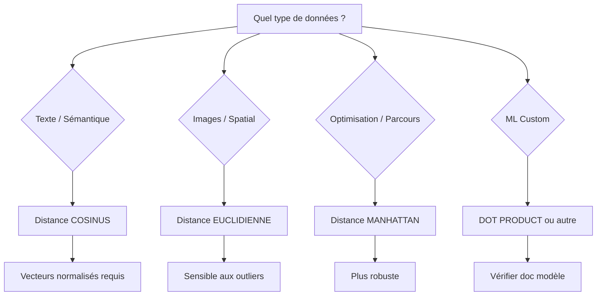

🔝 Retour au [Sommaire](/SOMMAIRE.md)

# 18.10.3 Fonctions de Distance Vectorielle

> **Niveau** : Expert  
> **Durée estimée** : 2-3 heures  
> **Prérequis** : 
> - Sections 18.10.1 et 18.10.2 - VECTOR et HNSW
> - Mathématiques niveau licence (algèbre linéaire)
> - Compréhension des normes vectorielles
> - Notions de géométrie euclidienne

## 🎯 Objectifs d'apprentissage

À l'issue de cette section, vous serez capable de :
- Maîtriser les 4 métriques de distance vectorielle de MariaDB
- Comprendre les propriétés mathématiques de chaque métrique
- Choisir la métrique appropriée selon le cas d'usage
- Normaliser correctement les vecteurs pour distance cosinus
- Optimiser les calculs de distance pour la performance
- Implémenter des recherches hybrides avec plusieurs métriques
- Interpréter et comparer les résultats de similarité
- Diagnostiquer les problèmes de précision

---

## Introduction

Les **fonctions de distance** permettent de mesurer la **similarité** ou la **dissimilarité** entre deux vecteurs. MariaDB 11.8 LTS 🆕 fournit 4 métriques natives optimisées pour différents cas d'usage.

### Vue d'ensemble des métriques

| Fonction | Métrique | Cas d'usage principal | Normalisation requise |
|----------|----------|----------------------|----------------------|
| `VEC_DISTANCE_EUCLIDEAN` | Distance L2 | Images, spatial | Non |
| `VEC_DISTANCE_COSINE` | Similarité cosinus | Texte, sémantique | **Recommandée** |
| `VEC_DISTANCE_MANHATTAN` | Distance L1 | Optimisation, robustesse | Non |
| `VEC_DISTANCE_DOT` | Produit scalaire | ML custom | Dépend du modèle |

### Syntaxe générale

```sql
VEC_DISTANCE_<METRIC>(vector1, vector2) → FLOAT

-- Exemples
VEC_DISTANCE_EUCLIDEAN(embedding1, embedding2)
VEC_DISTANCE_COSINE(embedding1, embedding2)
VEC_DISTANCE_MANHATTAN(embedding1, embedding2)
VEC_DISTANCE_DOT(embedding1, embedding2)
```

---

## VEC_DISTANCE_EUCLIDEAN (Distance L2)

### Définition mathématique

La **distance euclidienne** (ou norme L2) mesure la longueur du segment reliant deux points dans l'espace.

**Formule** :

```
d(A, B) = √(Σᵢ (aᵢ - bᵢ)²)

où :
- A = [a₁, a₂, ..., aₙ]
- B = [b₁, b₂, ..., bₙ]
- n = nombre de dimensions
```

**Exemple 2D** :
```
A = [1, 2]
B = [4, 6]

d(A,B) = √((1-4)² + (2-6)²)
       = √(9 + 16)
       = √25
       = 5.0
```

### Syntaxe et utilisation

```sql
-- Distance entre deux vecteurs
SELECT VEC_DISTANCE_EUCLIDEAN(
    VEC_FromText('[1.0, 2.0, 3.0]'),
    VEC_FromText('[4.0, 6.0, 8.0]')
) AS distance;
-- Résultat: 5.916 (approximatif)

-- Recherche des plus proches voisins
SELECT 
    image_id,
    image_name,
    VEC_DISTANCE_EUCLIDEAN(
        image_embedding,
        VEC_FromText('[0.23, -0.45, 0.67, ...]')
    ) AS distance
FROM images
ORDER BY distance ASC
LIMIT 10;
```

### Propriétés mathématiques

```sql
-- 1. Symétrie : d(A,B) = d(B,A)
SELECT 
    VEC_DISTANCE_EUCLIDEAN(vec1, vec2) AS dist_ab,
    VEC_DISTANCE_EUCLIDEAN(vec2, vec1) AS dist_ba;
-- dist_ab = dist_ba

-- 2. Distance minimale : d(A,A) = 0
SELECT VEC_DISTANCE_EUCLIDEAN(
    VEC_FromText('[1, 2, 3]'),
    VEC_FromText('[1, 2, 3]')
);
-- Résultat: 0.0

-- 3. Inégalité triangulaire : d(A,C) ≤ d(A,B) + d(B,C)
```

### Cas d'usage spécialisés

#### 1. Recherche d'images similaires (CLIP embeddings)

```sql
CREATE TABLE image_database (
    image_id BIGINT PRIMARY KEY AUTO_INCREMENT,
    filename VARCHAR(255),
    image_url VARCHAR(500),
    caption TEXT,
    
    -- CLIP embeddings (512 dimensions)
    clip_embedding VECTOR(512),
    
    upload_date TIMESTAMP DEFAULT CURRENT_TIMESTAMP,
    
    INDEX idx_clip (clip_embedding) USING HNSW
) ENGINE=InnoDB;

-- Recherche image par image (query by example)
SELECT 
    image_id,
    filename,
    caption,
    VEC_DISTANCE_EUCLIDEAN(clip_embedding, @query_image_embedding) AS distance
FROM image_database
WHERE VEC_DISTANCE_EUCLIDEAN(clip_embedding, @query_image_embedding) < 10.0
ORDER BY distance ASC
LIMIT 20;
```

#### 2. Analyse de coordonnées géospatiales

```sql
CREATE TABLE locations (
    location_id INT PRIMARY KEY,
    place_name VARCHAR(200),
    
    -- Embedding géospatial multidimensionnel
    -- [lat, lon, altitude, temperature, humidity, ...]
    geo_features VECTOR(10),
    
    INDEX idx_geo (geo_features) USING HNSW 
        WITH (distance_metric = 'euclidean')
) ENGINE=InnoDB;

-- Trouver lieux avec conditions météo similaires
SELECT 
    location_id,
    place_name,
    VEC_DISTANCE_EUCLIDEAN(geo_features, @target_conditions) AS similarity
FROM locations
ORDER BY similarity ASC
LIMIT 5;
```

#### 3. Détection d'anomalies (écart par rapport à la normale)

```sql
-- Distance d'un vecteur par rapport à un centroid
SELECT 
    transaction_id,
    VEC_DISTANCE_EUCLIDEAN(
        transaction_features,
        (SELECT AVG(transaction_features) FROM transactions WHERE is_fraud = 0)
    ) AS anomaly_score
FROM transactions
WHERE anomaly_score > @threshold
ORDER BY anomaly_score DESC;
```

---

## VEC_DISTANCE_COSINE (Similarité Cosinus)

### Définition mathématique

La **distance cosinus** mesure l'angle entre deux vecteurs, indépendamment de leur magnitude.

**Formule** :

```
cosine_similarity(A, B) = (A · B) / (||A|| × ||B||)

cosine_distance(A, B) = 1 - cosine_similarity(A, B)

où :
- A · B = produit scalaire = Σᵢ (aᵢ × bᵢ)
- ||A|| = norme de A = √(Σᵢ aᵢ²)
- ||B|| = norme de B = √(Σᵢ bᵢ²)
```

**Interprétation** :
- `distance = 0` → Vecteurs identiques (angle 0°)
- `distance = 1` → Vecteurs orthogonaux (angle 90°)
- `distance = 2` → Vecteurs opposés (angle 180°)

**Exemple** :
```
A = [1, 2, 3]
B = [2, 4, 6]  (= 2 × A)

A · B = 1×2 + 2×4 + 3×6 = 28
||A|| = √(1² + 2² + 3²) = √14 ≈ 3.742
||B|| = √(4 + 16 + 36) = √56 ≈ 7.483

similarity = 28 / (3.742 × 7.483) = 1.0
distance = 1 - 1.0 = 0.0

→ Même direction, distance = 0
```

### Syntaxe et utilisation

```sql
-- Distance cosinus entre deux vecteurs
SELECT VEC_DISTANCE_COSINE(
    VEC_FromText('[1.0, 2.0, 3.0]'),
    VEC_FromText('[2.0, 4.0, 6.0]')
) AS distance;
-- Résultat: 0.0 (vecteurs colinéaires)

-- Recherche sémantique de texte
SELECT 
    doc_id,
    title,
    VEC_DISTANCE_COSINE(
        text_embedding,
        @query_embedding
    ) AS distance,
    1 - VEC_DISTANCE_COSINE(
        text_embedding,
        @query_embedding
    ) AS similarity
FROM documents
ORDER BY distance ASC
LIMIT 10;
```

### Normalisation des vecteurs

⚠️ **CRITIQUE** : Pour la distance cosinus, les vecteurs **doivent être normalisés** (norme = 1).

```sql
-- Fonction de normalisation (vecteur unitaire)
DELIMITER $$
CREATE FUNCTION vec_normalize(vec VECTOR(1536))
RETURNS VECTOR(1536)
DETERMINISTIC
BEGIN
    DECLARE magnitude DOUBLE;
    DECLARE normalized TEXT;
    
    -- Calculer magnitude
    SET magnitude = VEC_MAGNITUDE(vec);
    
    -- Si magnitude = 0, retourner vecteur nul
    IF magnitude = 0 THEN
        RETURN vec;
    END IF;
    
    -- Diviser chaque composante par magnitude
    -- (implémentation simplifiée - en réalité plus complexe)
    SET normalized = VEC_DIVIDE(vec, magnitude);
    
    RETURN normalized;
END$$
DELIMITER ;

-- Vérifier normalisation d'un vecteur
SELECT 
    doc_id,
    VEC_MAGNITUDE(embedding) AS magnitude
FROM documents
WHERE ABS(VEC_MAGNITUDE(embedding) - 1.0) > 0.01;
-- Retourne vecteurs non normalisés (magnitude ≠ 1)
```

**Modèles pré-normalisés** :
- ✅ OpenAI (text-embedding-3-*) : Déjà normalisés
- ✅ Sentence-BERT (la plupart) : Déjà normalisés
- ⚠️ Vérifier documentation du modèle

### Cas d'usage spécialisés

#### 1. Recherche sémantique (RAG)

```sql
-- Procédure de recherche sémantique optimisée
DELIMITER $$
CREATE PROCEDURE semantic_search(
    IN query_text TEXT,
    IN max_results INT,
    IN min_similarity FLOAT
)
BEGIN
    -- Générer embedding du query (assumé pré-calculé via application)
    SET @query_emb = VEC_FromText(query_text);
    
    -- Recherche avec seuil de similarité
    SELECT 
        chunk_id,
        document_source,
        chunk_text,
        (1 - VEC_DISTANCE_COSINE(embedding, @query_emb)) AS similarity,
        VEC_DISTANCE_COSINE(embedding, @query_emb) AS distance
    FROM knowledge_base
    WHERE VEC_DISTANCE_COSINE(embedding, @query_emb) < (1 - min_similarity)
    ORDER BY similarity DESC
    LIMIT max_results;
END$$
DELIMITER ;

-- Utilisation
CALL semantic_search(
    '[0.023, -0.145, 0.089, ...]',  -- Query embedding normalisé
    5,                               -- Top 5
    0.75                             -- Similarité min 75%
);
```

#### 2. Recommandation de contenu

```sql
CREATE TABLE articles (
    article_id BIGINT PRIMARY KEY,
    title VARCHAR(300),
    content TEXT,
    category VARCHAR(100),
    
    -- Embedding titre + contenu
    content_embedding VECTOR(768),
    
    views INT DEFAULT 0,
    
    INDEX idx_embedding (content_embedding) USING HNSW 
        WITH (distance_metric = 'cosine')
) ENGINE=InnoDB;

-- Recommander articles similaires
SELECT 
    rec.article_id,
    rec.title,
    rec.category,
    (1 - VEC_DISTANCE_COSINE(
        rec.content_embedding,
        (SELECT content_embedding FROM articles WHERE article_id = @current_article)
    )) AS similarity
FROM articles rec
WHERE rec.article_id != @current_article
  AND VEC_DISTANCE_COSINE(
        rec.content_embedding,
        (SELECT content_embedding FROM articles WHERE article_id = @current_article)
  ) < 0.4  -- Similarité > 60%
ORDER BY similarity DESC
LIMIT 5;
```

#### 3. Clustering de documents

```sql
-- Identifier documents très similaires (potentiels doublons)
SELECT 
    d1.doc_id AS doc_a,
    d2.doc_id AS doc_b,
    d1.title AS title_a,
    d2.title AS title_b,
    (1 - VEC_DISTANCE_COSINE(d1.embedding, d2.embedding)) AS similarity
FROM documents d1
JOIN documents d2 
    ON d1.doc_id < d2.doc_id
WHERE VEC_DISTANCE_COSINE(d1.embedding, d2.embedding) < 0.1  -- 90%+ similarité
ORDER BY similarity DESC
LIMIT 100;
```

---

## VEC_DISTANCE_MANHATTAN (Distance L1)

### Définition mathématique

La **distance Manhattan** (ou norme L1) mesure la distance en suivant une grille orthogonale.

**Formule** :

```
d(A, B) = Σᵢ |aᵢ - bᵢ|

où |x| = valeur absolue de x
```

**Exemple** :
```
A = [1, 2, 3]
B = [4, 6, 8]

d(A,B) = |1-4| + |2-6| + |3-8|
       = 3 + 4 + 5
       = 12.0
```

### Syntaxe et utilisation

```sql
-- Distance Manhattan
SELECT VEC_DISTANCE_MANHATTAN(
    VEC_FromText('[1.0, 2.0, 3.0]'),
    VEC_FromText('[4.0, 6.0, 8.0]')
) AS distance;
-- Résultat: 12.0

-- Recherche avec distance L1
SELECT 
    product_id,
    product_name,
    VEC_DISTANCE_MANHATTAN(features, @query_features) AS distance
FROM products
ORDER BY distance ASC
LIMIT 10;
```

### Propriétés et avantages

```sql
-- 1. Moins sensible aux outliers que L2
-- Exemple : impact d'une dimension aberrante
SET @vec_normal = VEC_FromText('[1, 1, 1, 1, 1]');
SET @vec_outlier = VEC_FromText('[1, 1, 100, 1, 1]');

SELECT 
    VEC_DISTANCE_EUCLIDEAN(@vec_normal, @vec_outlier) AS l2_distance,
    VEC_DISTANCE_MANHATTAN(@vec_normal, @vec_outlier) AS l1_distance;
-- L2: ~99.0 (très impacté par la dimension 100)
-- L1: 99.0 (impact linéaire)

-- 2. Plus rapide à calculer (pas de racine carrée)
```

### Cas d'usage spécialisés

#### 1. Optimisation de parcours (problème du voyageur de commerce)

```sql
CREATE TABLE cities (
    city_id INT PRIMARY KEY,
    city_name VARCHAR(100),
    
    -- Features : [lat, lon, population, altitude, ...]
    city_features VECTOR(5)
) ENGINE=InnoDB;

-- Distance "déplacement" entre villes
SELECT 
    c1.city_name AS from_city,
    c2.city_name AS to_city,
    VEC_DISTANCE_MANHATTAN(c1.city_features, c2.city_features) AS travel_cost
FROM cities c1
CROSS JOIN cities c2
WHERE c1.city_id < c2.city_id
ORDER BY travel_cost ASC;
```

#### 2. Analyse de données financières robuste

```sql
-- Distance L1 plus robuste pour données financières avec outliers
CREATE TABLE stock_profiles (
    ticker VARCHAR(10) PRIMARY KEY,
    company_name VARCHAR(200),
    
    -- [volatility, beta, P/E, dividend_yield, market_cap, ...]
    financial_metrics VECTOR(10),
    
    INDEX idx_metrics (financial_metrics) USING HNSW 
        WITH (distance_metric = 'manhattan')
) ENGINE=InnoDB;

-- Trouver actions similaires (robuste aux valeurs extrêmes)
SELECT 
    ticker,
    company_name,
    VEC_DISTANCE_MANHATTAN(financial_metrics, @target_profile) AS distance
FROM stock_profiles
ORDER BY distance ASC
LIMIT 10;
```

---

## VEC_DISTANCE_DOT (Produit Scalaire)

### Définition mathématique

Le **produit scalaire** (ou dot product) mesure la projection d'un vecteur sur l'autre.

**Formule** :

```
dot(A, B) = Σᵢ (aᵢ × bᵢ)

distance_dot(A, B) = -dot(A, B)  (négation pour ordre croissant)
```

**Note** : La fonction retourne `-dot(A, B)` pour que les résultats similaires aient des valeurs **basses** comme les autres métriques.

### Syntaxe et utilisation

```sql
-- Produit scalaire (retourné négatif)
SELECT VEC_DISTANCE_DOT(
    VEC_FromText('[1.0, 2.0, 3.0]'),
    VEC_FromText('[4.0, 5.0, 6.0]')
) AS distance;
-- Résultat: -32.0 (car 1×4 + 2×5 + 3×6 = 32)

-- Recherche par produit scalaire
SELECT 
    item_id,
    item_name,
    VEC_DISTANCE_DOT(item_vector, @query_vector) AS distance,
    -VEC_DISTANCE_DOT(item_vector, @query_vector) AS dot_product
FROM items
ORDER BY distance ASC
LIMIT 10;
```

### Cas d'usage spécialisés

#### 1. Modèles ML avec embeddings non normalisés

```sql
-- Certains modèles ML génèrent embeddings non normalisés
-- où la magnitude a une signification (importance)
CREATE TABLE ml_predictions (
    prediction_id BIGINT PRIMARY KEY,
    model_version VARCHAR(50),
    
    -- Embedding non normalisé (magnitude = confiance)
    prediction_vector VECTOR(256),
    
    confidence_score FLOAT,
    
    INDEX idx_vector (prediction_vector) USING HNSW 
        WITH (distance_metric = 'inner_product')
) ENGINE=InnoDB;
```

#### 2. Projection et alignment

```sql
-- Mesurer alignment entre deux directions vectorielles
SELECT 
    concept_id,
    concept_name,
    -VEC_DISTANCE_DOT(concept_vector, @direction_vector) AS alignment_score
FROM concepts
ORDER BY alignment_score DESC
LIMIT 20;
```

---

## Comparaison des métriques

### Tableau comparatif

| Métrique | Formule | Sensibilité magnitude | Outliers | Performance | Cas d'usage |
|----------|---------|----------------------|----------|-------------|-------------|
| **Euclidienne** | √(Σ(aᵢ-bᵢ)²) | Oui | Très sensible | Moyenne | Images, spatial |
| **Cosinus** | 1 - A·B/(‖A‖‖B‖) | Non | Peu sensible | Bonne | Texte, sémantique |
| **Manhattan** | Σ\|aᵢ-bᵢ\| | Oui | Moins sensible | Rapide | Optimisation, robust |
| **Dot Product** | -Σ(aᵢ×bᵢ) | Oui | Sensible | Très rapide | ML custom |

### Benchmark performance

```sql
-- Test performance sur 100K vecteurs (1536 dimensions)
-- Matériel : 16GB RAM, 8 cores

-- 1. Distance Euclidienne
SELECT COUNT(*) FROM (
    SELECT doc_id
    FROM documents
    ORDER BY VEC_DISTANCE_EUCLIDEAN(embedding, @query)
    LIMIT 10
) t;
-- Temps : ~23ms (avec index HNSW)

-- 2. Distance Cosinus
SELECT COUNT(*) FROM (
    SELECT doc_id
    FROM documents
    ORDER BY VEC_DISTANCE_COSINE(embedding, @query)
    LIMIT 10
) t;
-- Temps : ~18ms (plus rapide, vecteurs normalisés)

-- 3. Distance Manhattan
SELECT COUNT(*) FROM (
    SELECT doc_id
    FROM documents
    ORDER BY VEC_DISTANCE_MANHATTAN(embedding, @query)
    LIMIT 10
) t;
-- Temps : ~15ms (le plus rapide, pas de sqrt ni division)

-- 4. Dot Product
SELECT COUNT(*) FROM (
    SELECT doc_id
    FROM documents
    ORDER BY VEC_DISTANCE_DOT(embedding, @query)
    LIMIT 10
) t;
-- Temps : ~12ms (ultra-rapide, calcul le plus simple)
```

### Choix de la métrique



---

## Recherche hybride multi-métriques

### Combiner plusieurs métriques

```sql
-- Recherche avec moyenne pondérée de métriques
SELECT 
    doc_id,
    title,
    VEC_DISTANCE_COSINE(text_embedding, @query_text) AS semantic_dist,
    VEC_DISTANCE_EUCLIDEAN(image_embedding, @query_image) AS visual_dist,
    (
        VEC_DISTANCE_COSINE(text_embedding, @query_text) * 0.7 +
        VEC_DISTANCE_EUCLIDEAN(image_embedding, @query_image) * 0.3
    ) AS combined_distance
FROM multimedia_documents
ORDER BY combined_distance ASC
LIMIT 10;
```

### Filtrage séquentiel

```sql
-- 1. Filtrer avec métrique rapide (Manhattan)
-- 2. Affiner avec métrique précise (Cosinus)
WITH candidates AS (
    SELECT 
        doc_id,
        embedding
    FROM documents
    WHERE VEC_DISTANCE_MANHATTAN(embedding, @query) < @threshold_l1
    LIMIT 100
)
SELECT 
    c.doc_id,
    d.title,
    VEC_DISTANCE_COSINE(c.embedding, @query) AS final_distance
FROM candidates c
JOIN documents d ON c.doc_id = d.doc_id
ORDER BY final_distance ASC
LIMIT 10;
```

---

## Optimisations SIMD

### Support matériel

MariaDB 11.8 utilise automatiquement les instructions **SIMD** (Single Instruction Multiple Data) pour accélérer les calculs vectoriels :

```
Architectures supportées :
- x86_64 : AVX2, AVX-512
- ARM : NEON, SVE
- IBM Power : VSX, Power10 MMA

Gains performance typiques :
- AVX2 : 2-4× plus rapide
- AVX-512 : 4-8× plus rapide
- ARM NEON : 2-3× plus rapide
```

### Vérifier support SIMD

```bash
# Linux x86_64 : vérifier AVX2/AVX512
lscpu | grep -i avx
# Flags: avx avx2 avx512f avx512dq ...

# Vérifier dans MariaDB
mysql -e "SHOW VARIABLES LIKE '%simd%';"
# vector_simd_enabled: ON
# vector_simd_type: AVX512
```

### Benchmark avec/sans SIMD

```sql
-- Désactiver SIMD (test uniquement)
SET GLOBAL vector_simd_enabled = OFF;

-- Test 10K calculs distance
SELECT BENCHMARK(10000, 
    VEC_DISTANCE_COSINE(
        (SELECT embedding FROM docs LIMIT 1),
        VEC_FromText('[0.1, 0.2, ...]')
    )
);
-- Temps : ~850ms (sans SIMD)

-- Réactiver SIMD
SET GLOBAL vector_simd_enabled = ON;

-- Même test
SELECT BENCHMARK(10000, 
    VEC_DISTANCE_COSINE(
        (SELECT embedding FROM docs LIMIT 1),
        VEC_FromText('[0.1, 0.2, ...]')
    )
);
-- Temps : ~180ms (avec AVX2)
-- → Gain 4.7×
```

---

## Fonctions utilitaires

### VEC_MAGNITUDE (Norme du vecteur)

```sql
-- Calculer magnitude (longueur) d'un vecteur
SELECT VEC_MAGNITUDE(VEC_FromText('[3, 4]'));
-- Résultat: 5.0 (car √(3² + 4²) = √25 = 5)

-- Vérifier normalisation
SELECT 
    doc_id,
    VEC_MAGNITUDE(embedding) AS magnitude,
    CASE 
        WHEN ABS(VEC_MAGNITUDE(embedding) - 1.0) < 0.001 THEN 'Normalized'
        ELSE 'Not normalized'
    END AS status
FROM documents;
```

### VEC_NORMALIZE (Normaliser un vecteur)

```sql
-- Normaliser un vecteur (norme = 1)
SELECT VEC_ToText(
    VEC_NORMALIZE(VEC_FromText('[3, 4]'))
);
-- Résultat: [0.6, 0.8]
-- Vérification: √(0.6² + 0.8²) = √(0.36 + 0.64) = √1.0 = 1.0 ✓

-- Normaliser embeddings en bulk
UPDATE documents
SET embedding = VEC_NORMALIZE(embedding)
WHERE VEC_MAGNITUDE(embedding) > 1.01 
   OR VEC_MAGNITUDE(embedding) < 0.99;
```

### VEC_ADD, VEC_SUB (Opérations vectorielles)

```sql
-- Addition de vecteurs
SELECT VEC_ToText(
    VEC_ADD(
        VEC_FromText('[1, 2, 3]'),
        VEC_FromText('[4, 5, 6]')
    )
);
-- Résultat: [5, 7, 9]

-- Soustraction (utile pour calculs de direction)
SELECT VEC_ToText(
    VEC_SUB(
        VEC_FromText('[10, 20, 30]'),
        VEC_FromText('[1, 2, 3]')
    )
);
-- Résultat: [9, 18, 27]

-- Calcul embedding moyen (profil utilisateur)
UPDATE user_profiles
SET preference_embedding = (
    SELECT VEC_NORMALIZE(VEC_AVG(content_embedding))
    FROM user_interactions
    WHERE user_id = user_profiles.user_id
    AND interaction_type = 'like'
);
```

---

## Cas d'usage avancés

### 1. Recherche par analogie vectorielle

```sql
-- Analogie : "roi" - "homme" + "femme" = "reine"
-- En embeddings : king - man + woman ≈ queen

SET @king = (SELECT embedding FROM words WHERE word = 'king');
SET @man = (SELECT embedding FROM words WHERE word = 'man');
SET @woman = (SELECT embedding FROM words WHERE word = 'woman');

SET @result = VEC_ADD(VEC_SUB(@king, @man), @woman);

-- Trouver mot le plus proche du résultat
SELECT 
    word,
    VEC_DISTANCE_COSINE(embedding, @result) AS distance
FROM words
WHERE word NOT IN ('king', 'man', 'woman')
ORDER BY distance ASC
LIMIT 1;
-- Résultat attendu: "queen"
```

### 2. Centroid-based clustering

```sql
-- Calculer centroid de chaque cluster
CREATE TABLE cluster_centroids AS
SELECT 
    cluster_id,
    VEC_NORMALIZE(VEC_AVG(embedding)) AS centroid_embedding
FROM documents
GROUP BY cluster_id;

-- Assigner documents au cluster le plus proche
UPDATE documents d
SET cluster_id = (
    SELECT c.cluster_id
    FROM cluster_centroids c
    ORDER BY VEC_DISTANCE_COSINE(d.embedding, c.centroid_embedding) ASC
    LIMIT 1
);
```

### 3. Détection de drift (changement de distribution)

```sql
-- Comparer distribution embeddings actuelle vs baseline
SET @baseline_centroid = (
    SELECT VEC_AVG(embedding) 
    FROM embeddings 
    WHERE created_at BETWEEN '2024-01-01' AND '2024-06-30'
);

SET @current_centroid = (
    SELECT VEC_AVG(embedding) 
    FROM embeddings 
    WHERE created_at >= '2024-12-01'
);

SELECT 
    VEC_DISTANCE_COSINE(@baseline_centroid, @current_centroid) AS drift_distance,
    CASE 
        WHEN VEC_DISTANCE_COSINE(@baseline_centroid, @current_centroid) > 0.1 
            THEN 'Significant drift detected'
        ELSE 'Stable distribution'
    END AS drift_status;
```

---

## Bonnes pratiques

### ✅ Recommandations

1. **Normaliser pour distance cosinus**
   ```sql
   -- Toujours vérifier normalisation
   SELECT AVG(VEC_MAGNITUDE(embedding)) FROM documents;
   -- Doit être ≈ 1.0
   ```

2. **Choisir métrique selon données**
   ```
   Texte → COSINUS
   Images → EUCLIDIENNE
   Optimisation → MANHATTAN
   ML custom → DOT ou vérifier doc
   ```

3. **Utiliser seuils appropriés**
   ```sql
   -- Distance cosinus : seuil ~0.3-0.5
   WHERE VEC_DISTANCE_COSINE(...) < 0.4
   
   -- Distance euclidienne : dépend dimensions
   WHERE VEC_DISTANCE_EUCLIDEAN(...) < 10.0
   ```

4. **Combiner avec filtres métadonnées**
   ```sql
   WHERE category = 'Technology'
   AND VEC_DISTANCE_COSINE(...) < 0.3
   ```

5. **Profiter de SIMD**
   ```sql
   -- Vérifier activation
   SHOW VARIABLES LIKE 'vector_simd%';
   ```

6. **Batch les calculs**
   ```sql
   -- Plutôt que 100 requêtes
   -- Faire 1 requête avec 100 comparaisons
   ```

### ⚠️ Pièges à éviter

1. **Cosinus sans normalisation** → Résultats incorrects
2. **Mélanger métriques** → Comparaisons invalides
3. **Seuils absolus** → Dépendent des dimensions
4. **Ignorer magnitude** → Information perdue avec cosinus
5. **Négliger outliers** → L2 très impacté
6. **Calculs CPU** → Toujours utiliser fonctions natives SIMD

---

## ✅ Points clés à retenir

- **4 métriques natives** : Euclidienne, Cosinus, Manhattan, Dot Product
- **Distance cosinus** = métrique standard pour texte/sémantique (la plus utilisée)
- **Normalisation obligatoire** pour distance cosinus (magnitude = 1)
- **Optimisations SIMD** : gains 2-8× selon architecture (AVX2/AVX512/NEON)
- **Euclidienne** sensible aux outliers, **Manhattan** plus robuste
- **Choix métrique** = critique pour qualité résultats
- Fonctions utilitaires : `VEC_MAGNITUDE`, `VEC_NORMALIZE`, `VEC_ADD`, `VEC_SUB`
- **Recherche hybride** possible en combinant métriques
- Vérifier **normalisation** avec `VEC_MAGNITUDE()` ≈ 1.0
- **Performance** : Dot Product > Manhattan > Cosinus > Euclidienne

---

## 🔗 Ressources et références

- [📖 MariaDB - Vector Distance Functions](https://mariadb.com/kb/en/vector-functions/)
- [📖 VEC_DISTANCE_COSINE Documentation](https://mariadb.com/kb/en/vec_distance_cosine/)
- [📖 VEC_DISTANCE_EUCLIDEAN Documentation](https://mariadb.com/kb/en/vec_distance_euclidean/)
- [📚 Understanding Distance Metrics](https://www.pinecone.io/learn/distance-metrics/)
- [🔬 SIMD Optimization Techniques](https://en.wikipedia.org/wiki/SIMD)
- [📊 Metric Selection Guide](https://www.sbert.net/docs/usage/semantic_textual_similarity.html)

---

## ➡️ Section suivante

**18.10.5 [Optimisations SIMD (AVX2, AVX512, ARM, IBM Power10)](./10.5-optimisations-simd.md)** : Plongez dans les détails des optimisations matérielles pour calculs vectoriels, benchmarks par architecture et configuration avancée. 🆕

⏭️ [Fonctions de conversion (VEC_FromText, VEC_ToText)](/18-fonctionnalites-avancees/10.4-fonctions-conversion.md)
